# Learning Software Engineering Through `mdexplore`

## A Case-Study Course for Junior to Mid-Level Python Developers

`mdexplore` is a desktop application for browsing Markdown files in a directory tree and rendering rich previews with search, persistent highlighting, multiple views, diagrams, mathematics, PDF export, and copy workflows. It is an unusually useful teaching repository because it combines a real Python GUI, browser-side JavaScript, HTML templates, background workers, JSON configuration, filesystem persistence, shell launchers, performance optimizations, and a broad regression suite.

This course uses the repository as a living case study. The goal is not merely to explain what the code does. The goal is to teach how to investigate an existing application, preserve behavior while making changes, design testable components, diagnose asynchronous failures, and gradually improve a codebase without destabilizing it.

The course assumes familiarity with Python syntax, functions, classes, exceptions, files, and basic Git. Prior knowledge of PySide6, Qt WebEngine, browser DOM programming, or advanced testing is not required.

---

## Learning outcomes

By the end of this course, you should be able to:

1. Orient yourself in a mature repository before editing it.
2. Distinguish product behavior, architectural constraints, and implementation details.
3. Read a large Python module without trying to understand every line at once.
4. Recognize boundaries between pure logic, stateful services, GUI code, workers, and browser code.
5. Apply incremental modularization to a monolithic application.
6. Understand Qt event-driven programming and worker-thread patterns.
7. Reason about asynchronous pipelines and race conditions.
8. Design cache keys and invalidation rules.
9. Work safely with externalized JavaScript and HTML assets.
10. Write unit, regression, contract, integration, and source-structure tests.
11. Test timing-related bugs without creating flaky tests.
12. Preserve compatibility and user-visible invariants during refactoring.
13. Use configuration, environment variables, and fallback paths responsibly.
14. Create a disciplined change-and-verification workflow.

---

## How to use this course

Each module contains four kinds of material:

- **Concepts** explain reusable software-engineering ideas.
- **Repository study** points to concrete `mdexplore` files and behavior.
- **Exercises** ask you to investigate or modify the project.
- **Review questions** help verify understanding.

Do not begin by reading all of `mdexplore.py` linearly. It is the main application module and remains large by design. Instead, move from documentation to maps, from maps to narrow call paths, and from narrow call paths to tests.

A productive study loop is:

1. Read the documented behavior.
2. Find the smallest implementation boundary responsible for it.
3. Find tests that encode the expected behavior.
4. Run or inspect those tests.
5. Trace one example through the system.
6. Make one narrowly scoped change.
7. Re-run focused tests, then broader tests.

---

# Part I — Repository orientation and engineering constraints

## Module 1 — Start with behavior, not code

### Why repository orientation matters

A common junior-developer mistake is to open the largest source file, search for a likely function name, and immediately begin editing. This is risky because mature applications contain hidden contracts:

- controls users expect to remain in a specific location;
- persistence formats that older installations must still read;
- asynchronous sequencing requirements;
- cache invalidation rules;
- fallback behavior for missing dependencies;
- tests that protect non-obvious edge cases.

`mdexplore` makes many of these contracts explicit in Markdown files:

- `README.md` is primarily user-facing and explains features, configuration, setup, operation, troubleshooting, and project structure.
- `AGENTS.md` is a compact maintenance checklist of behavior that must be preserved.
- `DEVELOPERS-AGENTS.md` is the detailed architecture and behavior guide. It includes repository maps, runtime assumptions, rendering rules, formal invariants, decision tables, debugging guidance, and verification procedures.
- `USER-GUIDE.md` presents the product from a workflow-oriented user perspective.
- `UML.md` and the Markdown files in `test/` serve as documentation and rendering fixtures.

The first engineering lesson is:

> Documentation is part of the executable design of a project, even when the computer does not execute it directly.

A change can be locally correct yet product-level wrong. For example, simplifying the Recent-menu code might accidentally remove its split ordering: the first ten entries are recency ordered, followed by a separator, followed by older entries in alphabetical order. That behavior is not obvious from the vague requirement “show recent directories,” but it is an explicit product contract.

### Three layers of truth

When investigating a feature, separate three layers:

1. **Product truth** — what the user should observe.
2. **Architectural truth** — which subsystem owns the behavior and which invariants constrain it.
3. **Implementation truth** — the exact classes, methods, fields, and scripts currently used.

Product truth should be stable. Architectural truth should change slowly and deliberately. Implementation truth can change more frequently.

For example:

- Product truth: opening a Markdown file shows a rendered preview.
- Architectural truth: Python prepares a document shell while browser-side JavaScript completes parts of the interactive rendering lifecycle.
- Implementation truth: the current path involves `MarkdownRenderer`, template assets, JavaScript asset rendering, `QWebEnginePage`, cache entries, and completion callbacks.

Tests should usually protect product and architectural truth rather than incidental implementation details. Source-structure tests are justified when the structure itself prevents a known regression or enforces a deliberate boundary.

### Repository-reading exercise

Read the headings of `README.md`, `AGENTS.md`, and `DEVELOPERS-AGENTS.md`. Build a table like this:

| Feature | User-visible contract | Owning area | Relevant test |
| --- | --- | --- | --- |
| Recent roots | Split recency/alphabetical presentation | window/config persistence | `tests/test_recent_root_history.py` |
| Search | Searches visible tree scope and reruns on scope change | search helpers, workers, window | search tests |
| BASE64 images | Inline images render reliably and copy/export preserves rules | renderer, worker, JS hydration | hydration and JS asset tests |
| PDF export | Current preview exports with layout and links preserved | PDF orchestration and helpers | PDF tests |

Add at least five more rows.

### Review questions

1. Why is a feature list insufficient as a maintenance guide?
2. What is the difference between a product invariant and an implementation detail?
3. Why should documentation be read before the largest source module?
4. Which file would you consult first when changing a UI control?


---

## Module 2 — Map the architecture before tracing details

### The main architectural shape

The project currently uses a hybrid architecture:

- `mdexplore.py` remains the main entrypoint and primary application module.
- `mdexplore_app/` contains lower-risk extracted support modules.
- `assets/js/` contains externalized browser scripts.
- `assets/templates/` contains HTML document templates.
- `tests/` contains automated regression tests.
- `test/` contains manual Markdown and PDF fixtures.
- `mdexplore.sh` manages environment setup and launch behavior.
- `mdexplore.settings.json` externalizes many tuning values.

The major repository areas cooperate in this shape:

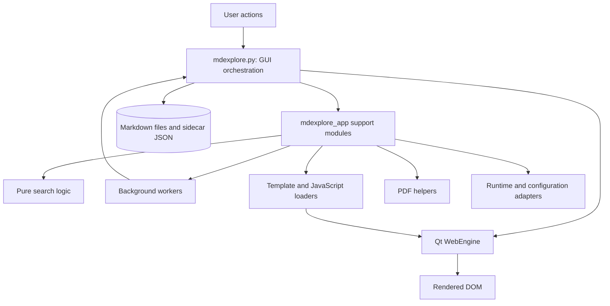

This is not a textbook-clean architecture, which is precisely why it is educational. Real applications often evolve from a working prototype into a larger system. The engineering challenge is to improve boundaries while preserving behavior.

### Incremental modularization

The repository documentation describes `mdexplore_app/` as a first-stage modularization. This resembles the **strangler pattern**: separable behavior is gradually moved behind clearer interfaces while the old core remains operational.

Examples of extracted responsibilities include:

- `search.py`: tokenization, Boolean/NEAR parsing, regex compilation, and hit counting;
- `workers.py`: background `QRunnable` tasks and their signals;
- `templates.py`: loading and rendering HTML templates;
- `js.py`: loading and rendering JavaScript assets;
- `pdf.py`: PDF-specific transformations and helpers;
- `runtime.py`: configuration paths and graphics/runtime decisions;
- `icons.py`: icon generation, recoloring, and caching;
- `tree.py`, `file_tree.py`, and `tabs.py`: reusable UI model/delegate components;
- `fast_base64.py`: accelerated encoding/decoding with validation and fallback.

The important practice is **extracting seams, not merely moving lines**. A useful extraction creates a boundary with a focused responsibility, explicit inputs and outputs, and independent tests.

### Dependency direction

A maintainable dependency direction is:

```text
GUI orchestration
    -> application services and workers
        -> pure helpers and adapters
            -> standard library / third-party libraries
```

Pure helpers should not import the main window. Worker modules should not need to know the entire GUI. Asset renderers should receive replacement values rather than reaching into global window state.

Whenever a lower-level module imports a higher-level one, investigate whether the dependency direction has become inverted.

### Architectural inventory exercise

For every file in `mdexplore_app/`, classify it as one or more of:

- pure domain logic;
- infrastructure adapter;
- GUI component;
- worker/concurrency component;
- asset loader;
- persistence helper;
- performance optimization.

Then answer:

1. Which modules can be tested without constructing a Qt application?
2. Which modules require Qt types but not a visible window?
3. Which modules are mostly integration boundaries?
4. Which extraction would most reduce the cognitive load of `mdexplore.py`?

Do not choose an extraction only because it is long. Prefer a cohesive behavior with a clear contract and existing regression coverage.

---

## Module 3 — Reading a large application safely

### Use landmarks

The top-level landmarks in `mdexplore.py` include:

- `_PreviewLogicalTextExtractor`;
- `MarkdownRenderer`;
- `PreviewPage`;
- `MdExploreWindow`;
- `main()`.

These landmarks imply distinct concerns: text extraction, Markdown rendering, browser-page customization, window orchestration, and process startup.

Do not read the file as one continuous program. Treat each large class as a subsystem and build a method map.

Useful investigations include:

```bash
grep -nE '^(class|def) ' mdexplore.py
grep -n 'inline_data_image' mdexplore.py
grep -n 'runJavaScript' mdexplore.py
grep -n 'QThreadPool\|QRunnable' mdexplore.py
```

Then inspect narrow ranges around the results.

### Trace by scenario

Choose a user scenario and trace only the relevant path. For example:

> The user selects a Markdown file containing embedded BASE64 images.

Questions to answer:

1. Which event identifies the selected path?
2. How is the file signature calculated?
3. When is cached output reused?
4. Which worker performs expensive rendering?
5. How are inline image payloads deduplicated?
6. When is HTML loaded into the web view?
7. Which JavaScript applies resolved image sources?
8. How does Python learn which sources were actually applied?
9. What happens if JavaScript runs before the placeholder exists?
10. Which tests reproduce the failure mode?

### Build a call-path notebook

For every feature you investigate, record:

```text
Trigger:
Owning class:
Primary methods:
Worker or async boundary:
Browser boundary:
Persistent state:
Cache keys:
Completion signal:
Failure behavior:
Tests:
```

A developer who maintains such maps will debug faster than one who repeatedly rediscovers the same architecture.

### Review questions

1. Why is linear reading inefficient for a large application module?
2. What makes a user scenario a useful tracing unit?
3. Which boundaries in the BASE64-image scenario are asynchronous?
4. Why should completion and failure paths be recorded explicitly?


---

# Part II — Python design and application structure

## Module 4 — Pure functions as islands of certainty

### Why pure logic is valuable

A pure function computes a result from its inputs without reading or mutating hidden external state. Pure functions are easier to understand, reuse, test, and optimize.

`mdexplore_app/search.py` is a strong case study. It contains functions for:

- removing embedded image payloads before search;
- tokenizing queries;
- extracting terms and NEAR groups;
- compiling regular expressions;
- selecting matching windows;
- counting highlighted ranges;
- compiling predicates and hit counters.

Search behavior is complex, but most of it does not need a window, filesystem model, or web view. Extracting it into a focused module makes it possible to test syntax and matching semantics directly.

### Functional core, imperative shell

A useful architecture pattern is:

- **functional core**: pure transformations and decisions;
- **imperative shell**: I/O, UI events, file access, threads, and side effects.

For search, the imperative shell surrounds a pure decision-making core:

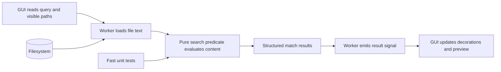

The more complicated the application shell becomes, the more valuable a predictable functional core becomes.

### Designing a pure helper

A good pure helper should have:

- a descriptive name;
- explicit inputs;
- a stable return type;
- documented edge cases;
- no dependency on global UI state;
- tests for normal, boundary, and malformed input.

Avoid extracting helpers that merely hide one line without improving the conceptual model.

### Exercise: search semantics

Inspect `tokenize_match_query`, `extract_near_term_groups`, `compile_match_predicate`, and `compile_match_hit_counter`.

Create a truth table for queries involving:

- one plain term;
- a quoted phrase;
- negation;
- OR alternatives;
- `NEAR(a, b)`;
- `NEAR(a, b, c, d, e, f)`;
- malformed NEAR expressions;
- the legacy `CLOSE(...)` alias.

For each case, describe whether the parser should accept it, what content should match, and how hit counting should behave.

### Refactoring exercise

Find one method in `MdExploreWindow` that mixes decision logic with UI mutation. Sketch an extraction where the decision becomes a pure function returning a small data structure, and the window applies that result.

Do not implement the refactor until you can state the behavior in tests.

---

## Module 5 — Classes, state, and responsibility boundaries

### Not every object is a service

A class is useful when behavior and state have a meaningful lifecycle. It is not automatically better than a function.

In this repository, classes have several legitimate roles:

- `MarkdownRenderer` owns rendering configuration and reusable rendering behavior.
- `MdExploreWindow` owns the main application state and coordinates UI actions.
- `PreviewPage` customizes web-page behavior.
- worker classes package asynchronous jobs and signal objects.
- model and delegate classes customize Qt view behavior.

The key question is not “should this be a class?” but:

> What state does this object own, how long does that state live, and who is allowed to mutate it?

### State categories in `mdexplore`

Identify these categories:

1. **Ephemeral UI state** — current selection, active tab, transient status text.
2. **Session state** — per-file scroll positions and in-memory render caches.
3. **Persistent user state** — recent roots and copy toggle in `~/.mdexplore.cfg`.
4. **Per-directory metadata** — colors, views, and text highlights in sidecar JSON files.
5. **Derived state** — hit counts and marker positions recomputed from other data.
6. **External state** — files on disk, browser DOM, PDF outputs, and process environment.

Their lifetimes and ownership differ:

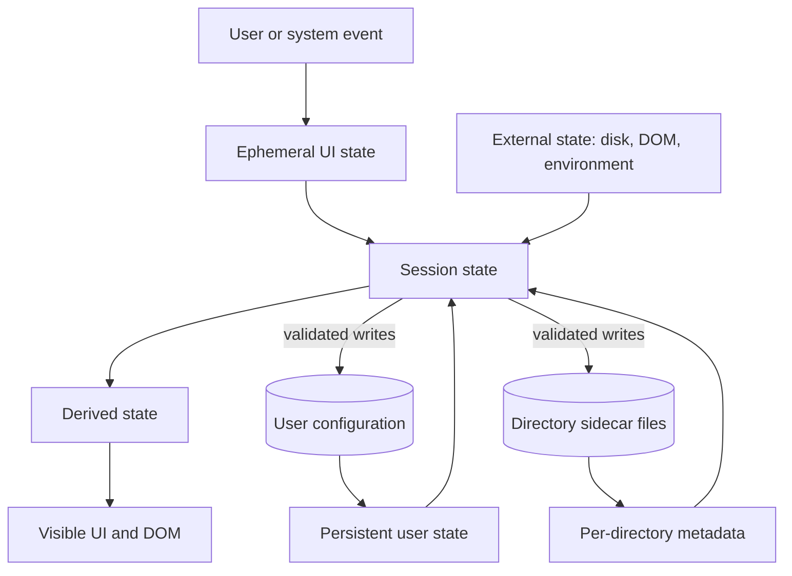

Bugs often occur when one category is treated like another. Derived state should usually be recomputed or invalidated, not persisted blindly. Ephemeral state should not leak across documents. Persistent state requires compatibility and safe writes.

### The single-responsibility principle in practice

The single-responsibility principle does not mean “one method per class.” It means a component should have one coherent reason to change.

`MdExploreWindow` currently has many reasons to change, which is why gradual extraction is appropriate. However, splitting it into dozens of tiny objects without clear ownership could make behavior harder to trace. Refactoring should reduce conceptual coupling, not merely file size.

### Exercise: state ownership map

Choose three state variables from `MdExploreWindow` and document:

- who initializes them;
- who reads them;
- who writes them;
- whether writes occur from callbacks;
- whether they are cached, derived, or persisted;
- which invariant must always hold.

Then identify one state variable whose ownership could be made clearer.

### Review questions

1. When is a class preferable to a pure function?
2. Why is derived state dangerous to persist?
3. What is the difference between lifecycle ownership and simple code grouping?
4. Why can excessive decomposition make a GUI application harder to maintain?

---

## Module 6 — Dependency management, fallbacks, and adapters

### Real applications run in imperfect environments

`mdexplore` does not assume every optional dependency or graphics capability is available. It uses several fallback strategies:

- Markdown rendering prefers `cmarkgfm` but can fall back to `markdown-it-py`.
- BASE64 work can use a vendored SIMD implementation, `pybase64`, or the Python standard library.
- graphics startup can detect an unusable OpenGL context and force software rendering;
- Mermaid can use different rendering backends;
- local assets are preferred for reliability, with behavior documented for missing components.

This is an example of the **ports and adapters** idea. Application logic calls a stable interface, while adapters provide different implementations.

### Validate optimized paths

An optimized path is not trustworthy merely because it is faster. `fast_base64.py` validates vendor encoding output before accepting it. If the result is malformed, the helper silently falls back to a safer backend.

This illustrates a general rule:

> A performance optimization must preserve the semantic contract of the slow path.

Useful validation may include:

- expected output length;
- successful round-trip decoding;
- allowed character set;
- equality against a trusted reference for sampled inputs.

### Graceful degradation versus hidden failure

A fallback is appropriate when:

- the result remains correct;
- reduced performance or fidelity is acceptable;
- the user can continue working;
- the fallback does not conceal data loss.

A hard failure is better when continuing would produce incorrect output, corrupt state, or violate security expectations.

### Exercise: fallback matrix

Create a table with these columns:

| Capability | Preferred path | Fallback | Detection mechanism | User impact | Test strategy |
| --- | --- | --- | --- | --- | --- |
| Markdown engine | `cmarkgfm` | `markdown-it-py` | import/runtime compatibility | possible performance difference | render equivalence fixtures |
| BASE64 encoding | validated vendor path | `pybase64`/stdlib | output validation | slower processing | round-trip and malformed-vendor tests |
| Graphics | hardware | software | context probe | lower rendering performance | launcher/runtime tests |

Add Mermaid, PlantUML, MathJax, and PDF behavior.

### Review questions

1. Why should an optimized backend be treated as untrusted until validated?
2. What distinguishes graceful degradation from silent corruption?
3. How do adapters reduce coupling to third-party libraries?
4. Which fallback decisions belong in runtime helpers rather than the main window?


---

# Part III — Event-driven GUI programming and concurrency

## Module 7 — Thinking in events rather than sequential scripts

### The event loop changes the mental model

A command-line script often reads naturally from top to bottom. A GUI application does not. Qt runs an event loop that reacts to user input, timers, filesystem changes, worker completion, browser callbacks, and window lifecycle events.

A simplified flow looks like this:

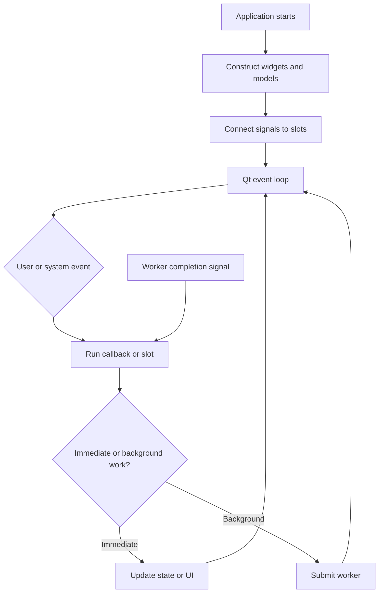

The order in which methods appear in a source file is not the order in which they execute. To understand behavior, inspect signal connections and callback chains.

### Signals and slots

Qt signals communicate that something happened. Slots are callables connected to those signals. This decouples the producer of an event from the code that responds to it.

Examples of events in `mdexplore` include:

- tree selection changed;
- refresh button clicked;
- search text changed;
- worker completed;
- file changed on disk;
- browser page finished loading;
- JavaScript callback returned;
- tab changed;
- application is closing.

A useful signal audit records:

| Signal source | Signal | Connected slot | State changed | Can fire repeatedly? |
| --- | --- | --- | --- | --- |
| tree view | selection/current change | preview loader | current document | yes |
| worker signals | result/finished/error | completion handler | cache and UI | yes |
| web page | load completion | hydration continuation | DOM-dependent state | yes |

### Reentrancy and stale callbacks

Because callbacks run later, application state may have changed by the time a result arrives. Suppose the user selects file A, then quickly selects file B. A render worker for A may finish after B is active.

A safe completion handler should verify that the result still belongs to the active request. Common techniques include:

- request IDs or generation counters;
- checking the current path against the worker result path;
- checking a file signature or cache key;
- invalidating previous work;
- storing background results in a cache while updating the visible UI only when still relevant.

The reusable principle is:

> Asynchronous results must carry enough identity to prove that they are still applicable.

### Exercise: event map

Choose the “open a Markdown file” scenario and draw an event sequence from tree selection to final preview readiness. Mark every point where execution returns to the event loop.

Identify:

1. where a newer selection could supersede an older one;
2. where duplicate callbacks could occur;
3. where a callback must verify document identity;
4. where the status bar should transition back to `Ready`.

### Review questions

1. Why is source-file order misleading in an event-driven program?
2. What is a stale callback?
3. Which identifiers can prove that a result belongs to the current request?
4. Why should callback handlers tolerate repeated invocation?

---

## Module 8 — Background workers and thread boundaries

### Why work leaves the GUI thread

The GUI thread must remain responsive. Expensive operations such as rendering, scanning many files, processing BASE64 images, invoking PlantUML, and preparing PDF output can block input and repainting if performed synchronously.

`mdexplore_app/workers.py` uses Qt's `QRunnable` and signal objects for responsibilities including:

- preview rendering;
- inline data-image materialization;
- PlantUML rendering;
- PDF export steps;
- tree-marker scanning;
- search scanning.

The common worker pattern is:

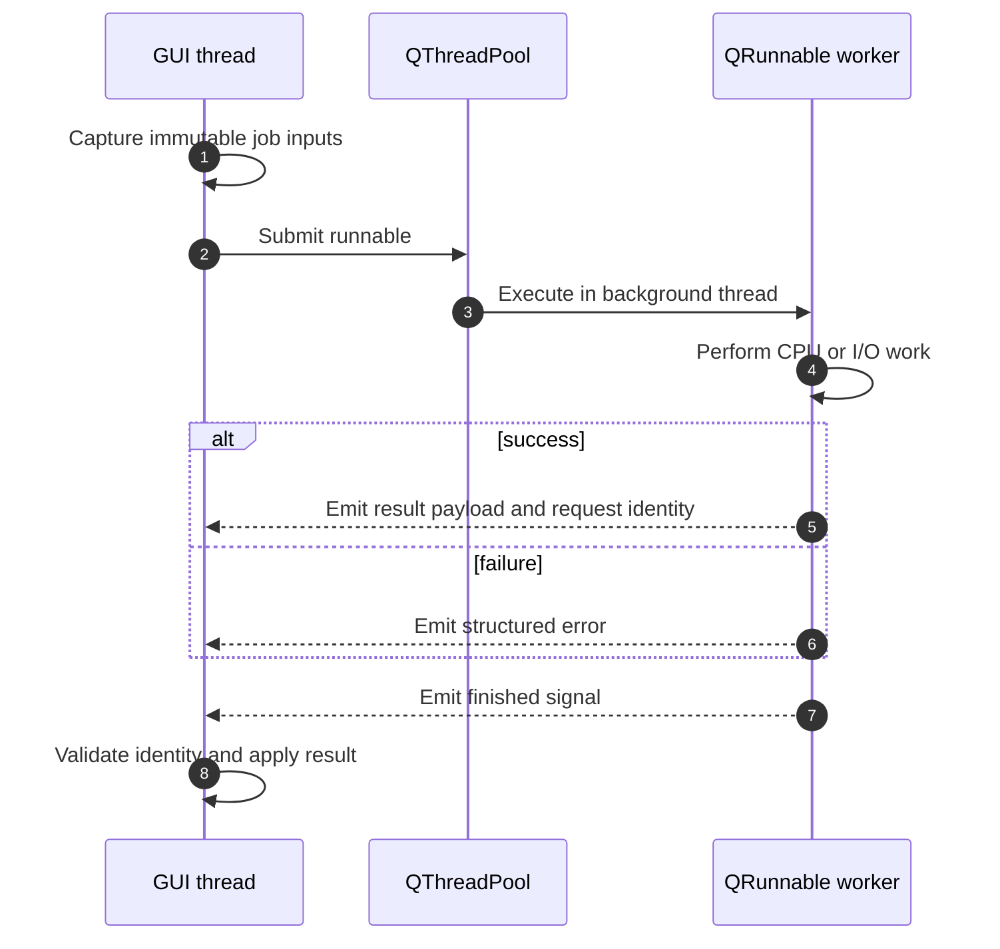

### The GUI-thread rule

Qt widgets should normally be created and mutated only on the GUI thread. Workers should return data, not manipulate widgets directly.

Good worker outputs include:

- strings;
- bytes;
- paths;
- dictionaries and lists containing result data;
- error descriptions;
- identifiers that associate the result with a request.

A worker that reaches into `MdExploreWindow` creates unsafe coupling and makes tests harder.

### Cancellation and supersession

Python threads cannot always be forcibly and safely cancelled. A practical alternative is **logical cancellation**:

- mark a generation obsolete;
- let the worker finish;
- ignore stale output;
- avoid launching redundant work when an equivalent job is already running.

For long loops, cooperative cancellation can check a flag periodically. The worker must still clean up correctly.

### Errors are part of the protocol

A worker protocol should define:

- success payload;
- error payload;
- whether `finished` always fires;
- whether partial results are possible;
- what cleanup occurs on every path.

Avoid swallowing exceptions without evidence. A silent fallback is acceptable only when correctness remains intact and the fallback behavior is intentional.

### Exercise: worker contract review

Inspect two worker classes in `mdexplore_app/workers.py`. For each, document:

```text
Inputs:
Potentially expensive operations:
Signals:
Success result shape:
Error result shape:
Request identity:
Thread-sensitive resources:
Cleanup guarantees:
Tests:
```

Then propose one improvement that would make the contract easier to test or harder to misuse.

### Review questions

1. Why should workers return data instead of manipulating widgets?
2. What is logical cancellation?
3. Why should a worker result include request identity?
4. What must be guaranteed on both success and failure paths?


---

## Module 9 — Race conditions through the BASE64 image case study

### The observed bug

A Markdown document containing embedded BASE64 images could initially display white boxes. Navigating to another file and then back caused the images to appear.

This symptom is highly informative. It suggests that:

- the image data itself is valid;
- the cached or second-load path has the needed information;
- first-load ordering is wrong;
- a retry caused by later navigation masks the race.

### A race is about ordering, not speed alone

A race condition occurs when correctness depends on the relative timing of independent operations.

The relevant operations can be modeled as an asynchronous sequence:

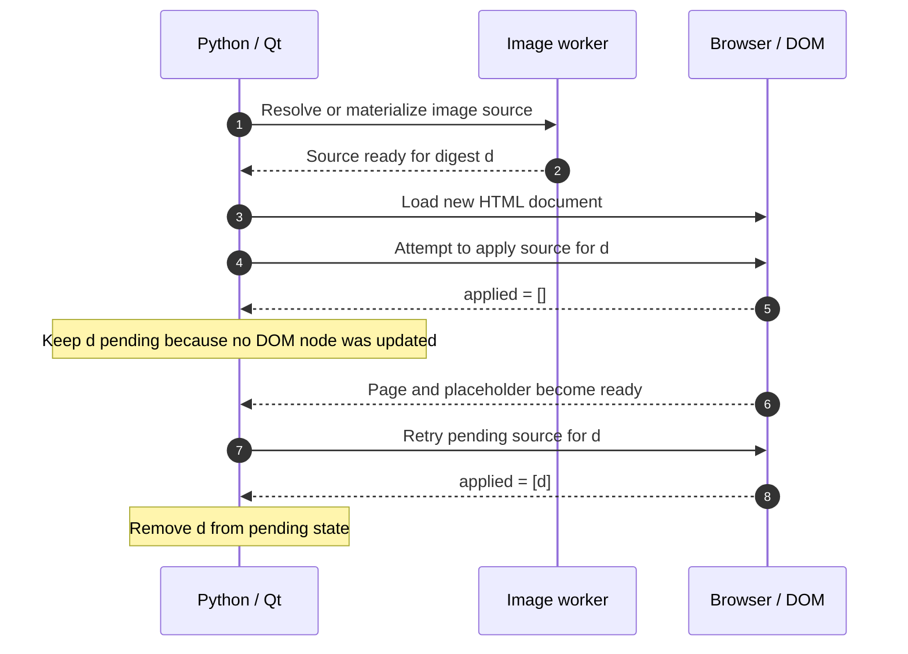

The intended order is roughly “source ready and document loaded, then placeholder present, then source applied.” Real execution may attempt application before the placeholder exists. If JavaScript reports success merely because it ran, Python may discard the pending source even though no DOM node was updated.

### Acknowledgement must describe actual work

The robust design retains pending image sources until JavaScript confirms which image digests were actually applied. This changes the completion protocol from a vague acknowledgement to evidence:

```text
bad acknowledgement: "the script executed"
good acknowledgement: [digests of placeholders actually updated]
```

Python removes only confirmed digests from the pending set. Missing placeholders remain pending for a later attempt after the DOM is ready.

This is a reusable distributed-systems lesson in miniature:

> Do not confuse delivery, execution, and successful application.

Even though Python and JavaScript run in one desktop application, they occupy separate runtimes connected by an asynchronous bridge. Treat the bridge as a small protocol boundary.

### State-machine model

Represent each image digest as a state machine:

```mermaid
stateDiagram-v2
    [*] --> UNRESOLVED
    UNRESOLVED --> RESOLVING: worker starts
    RESOLVING --> READY_PENDING_DOM: source resolved
    RESOLVING --> FAILED: decoding or materialization error
    READY_PENDING_DOM --> READY_PENDING_DOM: placeholder missing; retry later
    READY_PENDING_DOM --> APPLIED: digest acknowledged as applied
    FAILED --> RESOLVING: retry is permitted
    APPLIED --> [*]
```

An item must not transition to `APPLIED` merely because an attempt occurred. The transition requires evidence that the matching DOM placeholder was actually updated.

### Regression-test design

A strong regression test should reproduce the ordering failure deterministically:

1. create or simulate a pending image source;
2. run the application step before the DOM placeholder exists;
3. assert that the digest remains pending;
4. simulate the placeholder becoming available;
5. run the application step again;
6. assert that the digest is reported as applied and removed.

This is better than inserting arbitrary sleeps. Sleeps test the machine's timing; state-based tests test the protocol.

### Exercise: write the invariant

Express the core bug fix as an invariant:

```text
For every pending digest d:
Python may remove d from the pending map
only if JavaScript returns d in the applied-digest acknowledgement
for the active document generation.
```

Now list three ways a future refactor could violate that invariant.

### Review questions

1. Why did navigating away and back make the bug disappear?
2. What is the difference between a script running and an image being applied?
3. Why is an explicit state machine useful for asynchronous bugs?
4. Why are deterministic state transitions preferable to sleeps in regression tests?


---

# Part IV — Browser integration, assets, and rendering pipelines

## Module 10 — Python and JavaScript as cooperating runtimes

### The web view is not just a widget

Qt WebEngine embeds a browser runtime. Python owns the desktop application and invokes JavaScript, while JavaScript owns direct DOM manipulation inside the rendered page.

This creates a boundary similar to a small client/server protocol:

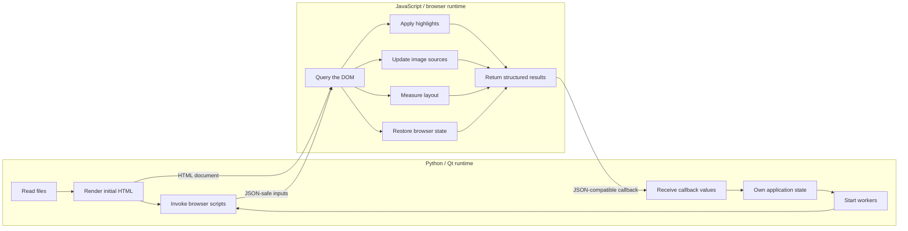

Each side should do the work it is best positioned to perform. Python should not infer live DOM geometry when JavaScript can report it directly. JavaScript should not own persistent filesystem state that belongs to Python.

### Design explicit bridge contracts

Every `runJavaScript` interaction should have a contract:

```text
Script name:
Input payload:
Required DOM preconditions:
Return value:
Failure representation:
Whether retry is safe:
Document identity requirement:
```

Returning structured JSON-compatible values is safer than relying on side effects alone. For example, an image-application script could return:

```json
{
  "applied": ["digest-a", "digest-b"],
  "missing": ["digest-c"]
}
```

Even when the current implementation returns a simpler list, thinking in protocol terms improves extensibility and debugging.

### Idempotence

A bridge operation is **idempotent** when running it repeatedly produces the same correct final state. DOM hydration and highlight restoration should ideally be idempotent because retries and view restoration may cause repeated execution.

An idempotent script should:

- avoid duplicating wrappers or markers;
- identify elements with stable attributes;
- update existing state rather than stacking it;
- return a meaningful acknowledgement on every run.

### Exercise: bridge audit

Search for `runJavaScript` calls in `mdexplore.py`. Choose three and document their contracts using the template above.

For each call, ask:

1. What happens if the page is not ready?
2. What happens if the active document changed?
3. Can the script be run twice safely?
4. Is the callback return value sufficiently precise?
5. Is there a regression test for the contract?

---

## Module 11 — Externalized JavaScript and HTML templates

### Why externalize assets

Large JavaScript strings embedded in Python are difficult to read, lint, test, and edit. `mdexplore` stores scripts under `assets/js/` and document shells under `assets/templates/`, with registries in `mdexplore_app/js.py` and `mdexplore_app/templates.py`.

Benefits include:

- syntax highlighting in editors;
- clearer ownership between Python and browser code;
- focused asset tests;
- reuse across preview and PDF flows;
- reduced clutter in `mdexplore.py`;
- easier inspection of generated output.

### Template replacement as a contract

The asset renderers load source text and replace named placeholders. A key safety rule is that unresolved required placeholders should fail loudly.

Consider this template:

```javascript
const terms = __SEARCH_TERMS_JSON__;
const color = __HIGHLIGHT_COLOR_JSON__;
```

If Python forgets one replacement and the unresolved token reaches the browser, the error appears far from its cause. A renderer that validates replacements turns a late browser failure into an early Python exception.

### Safe serialization

Do not interpolate arbitrary text into JavaScript with naive string concatenation. Use JSON serialization so quotes, newlines, backslashes, and Unicode are escaped correctly.

Unsafe:

```python
script = f'const query = "{query}";'
```

Safer:

```python
script = template.replace("__QUERY_JSON__", json.dumps(query))
```

The same principle applies to HTML attributes and CSS values: encode according to the target language, not according to Python syntax.

### Asset tests

`tests/test_js_assets.py` and `tests/test_template_assets.py` demonstrate useful contract tests:

- assets can be loaded by expected names;
- rendered assets contain expected substitutions;
- unresolved placeholders are absent;
- missing required replacements raise errors;
- source assets contain important selectors or markers.

These tests are fast and catch a large class of integration failures without launching the full GUI.

### Exercise: add an asset contract

Choose one JavaScript asset and define:

- its required placeholders;
- expected stable DOM selectors;
- expected return shape;
- forbidden unresolved tokens;
- one idempotence property.

Write a test plan that verifies these properties without relying on a full browser.

---

## Module 12 — Rendering as a multi-stage pipeline

### Pipeline thinking

The preview is not produced by one indivisible function. It is a pipeline with distinct stages, and PDF export branches from the active preview into a related workflow:

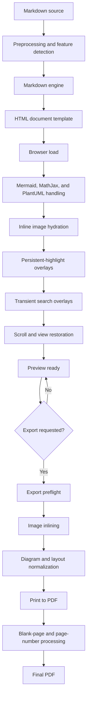

The diagram emphasizes that preview readiness is a prerequisite for export and that overlays, images, and diagrams are completed in an intentional order.

A bug should be assigned to the earliest stage where the invariant is violated. A white image placeholder may originate in source parsing, worker materialization, DOM timing, or export rewriting. Editing the final stage without locating the first bad transition often produces fragile patches.

### Pipeline observability

Each stage should expose enough evidence to answer:

- Did the stage run?
- What input identity did it receive?
- What output identity did it produce?
- How long did it take?
- Did it use a fallback?
- Did it leave pending work?
- Was the result superseded?

Not every event belongs in normal logs, but temporary instrumentation should follow these questions.

### Separate base rendering from overlays

Search highlights, persistent highlights, scrollbar markers, and context-menu selection mapping are overlays on top of the base document. Treating them as separate layers helps avoid one feature corrupting another.

A useful conceptual order is:

```text
base document
    -> diagram and image completion
        -> persistent annotations
            -> transient search annotations
                -> selection/context interactions
```

When layers must coexist, tests should verify both application order and cleanup order.

### Exercise: pipeline failure table

Create a table with these columns:

| Symptom | Earliest suspected stage | Evidence to collect | Safe fallback | Regression test |
| --- | --- | --- | --- | --- |
| white BASE64 image | hydration acknowledgement | pending/applied digest lists | retry after DOM ready | early miss then success |
| Mermaid missing in PDF | export preflight | backend/cache/layout state | clean re-render | PDF precheck asset test |
| stale search highlights | overlay cleanup | marker attributes before/after | clear and reapply | preview regression test |

Add at least five more symptoms from the project documentation.


---

# Part V — Caching, performance, and configuration

## Module 13 — Cache design and invalidation

### A cache is a claim about equivalence

A cache says that a previously computed result is still valid for the current request. Therefore, a cache key must include every input that can affect the result.

For a rendered Markdown preview, relevant inputs may include:

- file path or canonical identity;
- modification time and size, or a stronger content signature;
- rendering engine and options;
- diagram backend;
- theme or CSS-affecting settings;
- asset version;
- image materialization state;
- application version when behavior changes.

Leaving an influential input out of the key creates stale results. Including irrelevant inputs reduces cache effectiveness but is usually safer than returning incorrect output.

### Cache layers

`mdexplore` uses or implies several cache layers:

1. rendered HTML cache;
2. per-file view and scroll state;
3. icon cache;
4. diagram render cache;
5. BASE64 materialization cache;
6. browser resource cache;
7. search/tree marker results.

The relationship between request identity, in-flight work, completed entries, and invalidation can be visualized as follows:

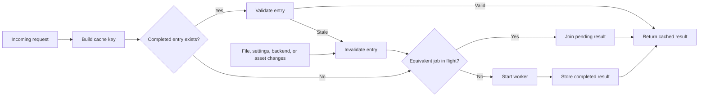

Each layer needs four decisions:

```text
Key:
Value:
Invalidation rule:
Capacity/eviction rule:
```

A cache without a documented invalidation rule is deferred technical debt.

### Content identity versus path identity

A path identifies a location, not necessarily unchanged content. A modification timestamp alone may be insufficient on filesystems with coarse timestamp resolution. A full content hash is reliable but potentially expensive.

Practical designs combine signals:

```text
(path, size, mtime_ns)
```

or compute a stronger digest only when the inexpensive signature changes. The correct choice depends on file size, update frequency, and the cost of a false cache hit.

### In-flight deduplication

Caching completed results is not enough. Two identical requests may arrive before the first finishes. **In-flight deduplication** records that work for a key is already running and attaches later consumers to the same result.

This matters for expensive operations such as diagram rendering or BASE64 processing. Without deduplication, repeated UI events can create redundant workers, wasted CPU, and out-of-order completion.

### Exercise: cache audit

Choose two cache-like structures in the repository. For each, document:

| Question | Answer |
| --- | --- |
| What is the key? | |
| What assumptions make two requests equivalent? | |
| What invalidates the entry? | |
| Can stale entries affect correctness? | |
| Is capacity bounded? | |
| Are in-flight requests deduplicated? | |
| Which tests cover invalidation? | |

Then propose one test that changes exactly one influential input and verifies that a stale entry is not reused.

### Review questions

1. Why is a cache key an architectural decision?
2. What is the difference between path identity and content identity?
3. Why can in-flight deduplication matter even when a result cache exists?
4. Which is usually worse: an unnecessary cache miss or an incorrect cache hit?

---

## Module 14 — Performance engineering without superstition

### Measure stages, not impressions

Users experience “slow preview loading,” but the delay may occur in file I/O, Markdown rendering, diagram generation, BASE64 decoding, HTML loading, JavaScript execution, or final layout.

Instrument stage boundaries before optimizing. Capture:

```text
request identity
start and end time
input size
cache hit or miss
backend selected
worker queue delay
completion status
```

A useful performance investigation compares cold and warm paths separately.

### Avoid blocking the event loop

A fast operation performed many times in the GUI thread can still cause visible stutter. Performance work should consider:

- total duration;
- maximum uninterrupted GUI-thread duration;
- allocation pressure;
- redundant work;
- frequency of repaint or model updates;
- worker-pool contention.

Batching many small UI updates can be more effective than micro-optimizing one helper.

### Optimization hierarchy

A disciplined sequence is:

1. remove unnecessary work;
2. avoid repeating equivalent work;
3. move expensive work off the GUI thread;
4. choose a better algorithm or data representation;
5. use a faster implementation;
6. tune low-level details only after measurement.

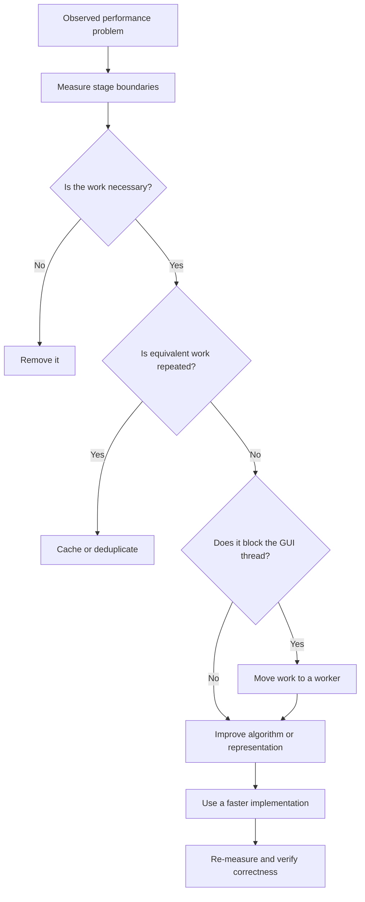

`fast_base64.py` sits near step five. It is useful because the earlier architectural steps—deduplication, worker execution, and caching—also exist. A fast encoder alone would not solve redundant or incorrectly sequenced processing.

### Thread counts are not free speed

The repository supports thread-related tuning through settings or environment configuration. Increasing concurrency can improve throughput until CPU, memory bandwidth, subprocess limits, or I/O contention becomes the bottleneck.

Too many workers can cause:

- higher memory use;
- context-switching overhead;
- duplicate work;
- harder-to-reproduce races;
- starvation of latency-sensitive jobs.

Treat pool sizing as a bounded resource policy, not as a universal “more is faster” setting.

### Exercise: benchmark design

Design a benchmark matrix for preview rendering:

| Dimension | Example values |
| --- | --- |
| document size | small, medium, large |
| embedded images | none, repeated, many unique |
| diagrams | none, cached, uncached |
| cache state | cold, warm |
| backend | preferred, fallback |
| concurrency | 1, default, high |

Specify which metrics you would record and how you would avoid mixing correctness failures with performance measurements.


---

## Module 15 — Configuration and runtime policy

### Configuration has layers

A desktop application may receive configuration from:

- built-in defaults;
- repository JSON settings;
- user persistence files;
- per-directory metadata;
- environment variables;
- command-line or launcher behavior;
- runtime detection.

The precedence order should be explicit. Hidden precedence rules make bugs difficult to reproduce.

A reasonable precedence model is:

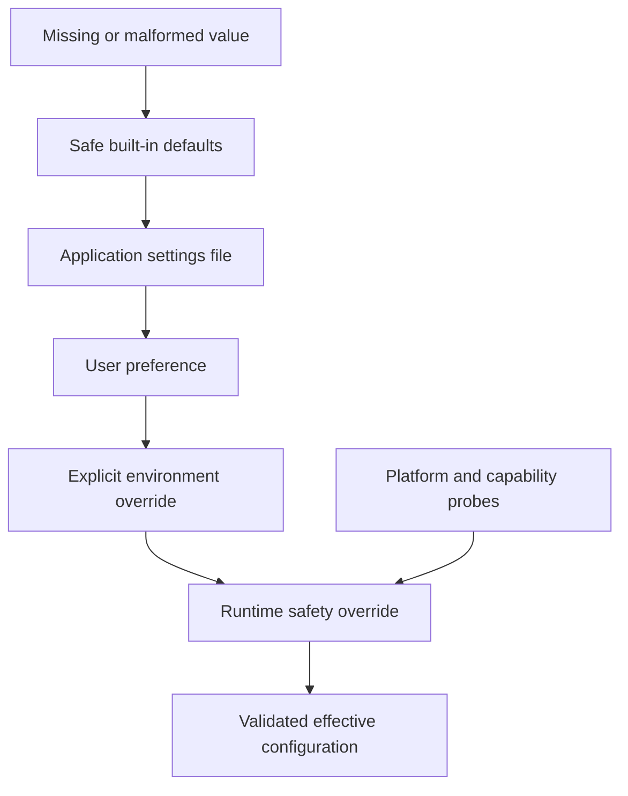

Each lower layer may override the value selected above it. A safety override, such as forcing software graphics after a failed context probe, may intentionally outrank a user preference.

### Parse at the boundary

Configuration strings should be converted into validated domain values near the boundary. For example:

- convert thread counts to bounded integers;
- normalize paths;
- validate enum-like backend names;
- reject negative cache sizes;
- distinguish missing values from intentionally empty values.

Do not scatter repeated string parsing throughout the GUI.

### Compatibility and migrations

Persistent settings outlive the code version that wrote them. Changes should account for:

- missing keys from older versions;
- unknown keys from newer versions;
- malformed or partially written files;
- renamed fields;
- changed value types;
- locked persistence mode.

A robust loader applies defaults and validates each field independently. One malformed preference should not necessarily make the entire application unusable.

### Atomic writes

Persistent JSON should generally be written using an atomic-replacement strategy:

1. serialize complete new content;
2. write to a temporary file in the same directory;
3. flush as appropriate;
4. replace the destination atomically.

This reduces the chance that a crash leaves a truncated file. The application must also respect documented persistence locks and avoid rewriting protected files.

### Exercise: configuration provenance

Choose five visible settings and trace each through:

```text
Default source:
Override source:
Validation:
Runtime consumer:
Persistence location:
Failure behavior:
Test coverage:
```

Include the copy-BASE64 toggle, a rendering backend, a thread limit, a recent-root preference, and a graphics setting.

### Review questions

1. Why should configuration precedence be documented?
2. What does “parse at the boundary” mean?
3. Why must settings loaders tolerate older files?
4. What problem does atomic replacement solve?

---

# Part VI — Testing strategy and regression engineering

## Module 16 — The testing pyramid for a desktop application

### Different tests answer different questions

No single test style is sufficient. `mdexplore` benefits from several layers:

1. **Pure unit tests** — verify parsing, transformations, key calculation, and fallback logic.
2. **Component tests** — exercise workers, models, delegates, asset renderers, or renderer helpers in isolation.
3. **Contract tests** — verify Python/JavaScript assets, templates, callback shapes, and persistence formats.
4. **Regression tests** — lock down a previously failing scenario.
5. **Integration tests** — combine Qt objects, web views, files, workers, and callbacks.
6. **Manual fixture checks** — visually inspect complex Markdown, diagrams, PDF output, and platform behavior.

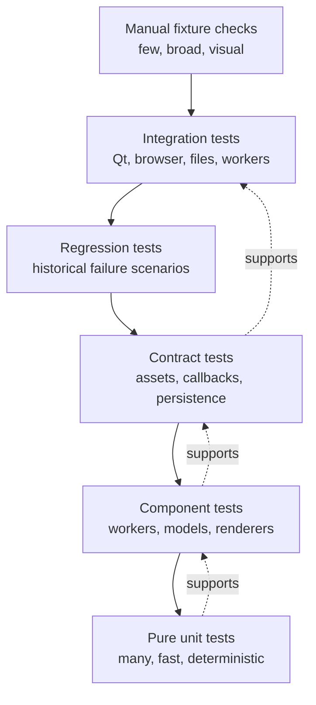

The lower layers should carry most of the combinatorial burden because they are faster and more deterministic. Integration tests should focus on boundaries that cannot be proved adequately at lower levels.

### Test behavior at the smallest useful boundary

Suppose a bug involves a malformed NEAR query. The smallest useful boundary is the search parser or predicate compiler, not the entire main window.

Suppose a bug involves JavaScript returning applied image digests. Useful boundaries include:

- an asset contract test for the script;
- a Python callback-state test for pending digest removal;
- one higher-level regression test that checks the two sides cooperate.

Testing only through the full GUI makes failures slower and harder to diagnose. Testing only helper functions may miss wiring errors. A good suite deliberately covers both.

### Arrange, act, assert, and explain

A clear test normally has:

```text
Arrange: create inputs and controlled state.
Act: invoke one behavior.
Assert: verify observable output and state transition.
```

For regression tests, add a short comment explaining the historical failure and why the assertion matters. Avoid comments that merely restate the code.

### Parametrization and tables

Search syntax, path normalization, asset replacement, and fallback selection naturally support table-driven tests. A table should make each case understandable without reading the test implementation in detail.

Example:

```python
cases = [
    ("alpha", "alpha beta", True),
    ("alpha", "beta gamma", False),
    ('"alpha beta"', "alpha beta gamma", True),
]
```

Keep failure messages informative by naming cases or including the query in assertion output.

### Exercise: classify the suite

Inspect the filenames in `tests/` and classify at least fifteen tests by layer. Include:

- search parsing or matching tests;
- `test_inline_data_image_hydration.py`;
- `test_js_assets.py`;
- PDF-related tests;
- recent-root tests;
- symlink tests;
- window-layout or UI asset tests.

Identify one behavior that appears over-tested at a high level and one boundary that deserves stronger low-level coverage.

---

## Module 17 — Deterministic testing of asynchronous behavior

### Control completion rather than waiting blindly

Timing-based tests often fail intermittently because they depend on machine load, thread scheduling, browser startup, or CI resources.

Prefer techniques such as:

- calling the completion handler directly with a synthetic result;
- replacing a worker pool with a synchronous fake;
- capturing emitted signals;
- using explicit event-loop pumping with a condition;
- simulating JavaScript callback payloads;
- controlling generation IDs;
- asserting state before and after a known transition.

A timeout is still useful as a safety net, but it should not be the mechanism that makes the test pass.

### Fakes, stubs, spies, and mocks

Use test doubles with purpose:

- **stub**: returns a predetermined value;
- **fake**: provides a simplified working implementation, such as an in-memory cache;
- **spy**: records calls for later assertion;
- **mock**: encodes expected interactions.

Prefer state assertions over excessive interaction assertions. A test that insists on the exact sequence of internal helper calls becomes brittle during refactoring.

### Test stale-result protection

A useful asynchronous regression test models two requests and deliberately controls completion order:

```mermaid
sequenceDiagram
    autonumber
    participant T as Test
    participant A as Request A worker
    participant B as Request B worker
    participant UI as Active preview

    T->>A: Start request A
    T->>B: Start request B
    T->>UI: Mark B as active generation
    T->>A: Release result A first
    A-->>UI: Result for stale generation A
    Note over UI: Ignore visible update; optional cache write only
    T->>B: Release result B
    B-->>UI: Result for active generation B
    UI-->>T: Preview updated with B
```

Assertions should prove that:

- result A does not overwrite B's visible state;
- result A may still populate a valid cache if appropriate;
- result B updates the preview;
- busy indicators and pending maps are cleaned correctly.

### Exercise: synchronous worker fake

Design a fake executor with this interface:

```python
class ImmediateExecutor:
    def start(self, runnable):
        runnable.run()
```

Explain when it is sufficient and when it would hide a real concurrency problem. Then design a second fake that queues runnables and lets the test choose completion order.

### Review questions

1. Why do arbitrary sleeps create flaky tests?
2. What is the difference between a fake and a mock?
3. Why should stale-result tests control completion order explicitly?
4. When is a real event loop still necessary in a test?


---

## Module 18 — Headless Qt testing and integration boundaries

### Why headless testing matters

Desktop GUI tests often run without a physical display. The repository documents headless execution so that Qt components, models, and selected web-view behavior can still be exercised in CI or remote development environments.

Headless mode does not make every GUI test reliable automatically. Tests must still control:

- application construction and teardown;
- event-loop processing;
- temporary files and directories;
- worker completion;
- web-page readiness;
- environment variables;
- shared caches and persistent state.

### One application instance

Qt normally expects one application object per process. Tests should use a shared fixture or helper that reuses an existing instance rather than creating a new one for every test.

A good fixture should:

1. return the existing application if one is active;
2. create one with headless-safe options otherwise;
3. avoid exiting the process during test cleanup;
4. process deferred events when required.

### Isolate filesystem state

Tests involving recent roots, sidecar JSON, PDF output, symlinks, or Markdown files should use temporary directories. Never let the suite read or rewrite a developer's real `~/.mdexplore.cfg`.

Useful techniques include:

- overriding the home directory for the test process;
- injecting configuration paths;
- using `tempfile.TemporaryDirectory` or pytest's `tmp_path`;
- restoring environment variables after each test;
- creating symlinks only when the platform supports them.

### Source-contract tests: useful but limited

Some tests inspect source or asset text directly. These can enforce important structural rules, such as:

- a script is externalized rather than embedded;
- a required selector remains present;
- a lower-level module does not import `mdexplore.py`;
- a dangerous obsolete code path has been removed.

Source-contract tests become brittle when they assert formatting, local variable names, or exact implementation order. Use them only when the source structure is itself part of the safety boundary.

### Exercise: integration-test design

Design one headless test for each behavior:

1. recent-root ordering;
2. symlink-safe tree traversal;
3. preview window layout;
4. JavaScript asset loading;
5. persistent sidecar metadata.

For each, state which parts can be tested without Qt and why the remaining integration boundary matters.

---

# Part VII — Debugging, refactoring, and professional change management

## Module 19 — A disciplined debugging workflow

### Start with the symptom, not a theory

A strong debugging report records:

```text
Observed behavior:
Expected behavior:
Minimal reproduction:
First occurrence or known-good version:
Environment:
Frequency:
Recovery action:
Logs or visible errors:
```

The recovery action is especially useful. In the BASE64 image bug, navigating away and back revealed that a second attempt succeeded, pointing toward lifecycle ordering rather than permanently invalid data.

### Narrow the failing layer

Use a binary-search mindset across the pipeline:

1. Is the Markdown source read correctly?
2. Does preprocessing detect the feature?
3. Does the renderer produce the expected placeholder?
4. Does the worker produce valid output?
5. Does the callback retain the output?
6. Is the DOM node present?
7. Does JavaScript apply the value?
8. Does later overlay logic hide or replace it?

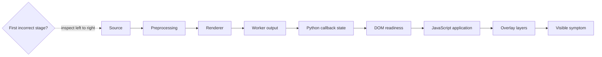

Inspect the earliest incorrect state, not merely the final visible symptom. Once a stage is proven correct, move one boundary to the right rather than guessing at the final layer.

### Add temporary observability

Temporary diagnostic output should include identities and transitions, not vague messages.

Weak:

```text
image callback ran
```

Useful:

```text
doc_generation=42 digest=ab12 state=READY_PENDING_DOM applied=false pending_count=3
```

Remove noisy temporary logging after the issue is understood, or convert the most valuable signals into structured debug logging guarded by a flag.

### Form and falsify hypotheses

Write competing explanations and identify evidence that would disprove each one.

| Hypothesis | Evidence expected | Evidence that falsifies it |
| --- | --- | --- |
| BASE64 data is invalid | decode failure on every load | second load renders same digest |
| worker never returns | no completion signal | callback receives a source |
| DOM is not ready | placeholder absent on first attempt | placeholder present before callback |
| cache is corrupt | warm load differs incorrectly | clean cache reproduces first-load miss |

This prevents repeatedly patching the first plausible theory.

### Minimize the reproduction

Reduce the input until removing one element makes the bug disappear. For a rendering issue, isolate one document, one embedded image, one diagram, one search term, one highlight, or one backend selection.

A small fixture becomes both a debugging aid and a regression test.

### Exercise: debugging dossier

Choose one historical or hypothetical issue from the repository documentation. Produce:

1. a minimal reproduction;
2. a pipeline-stage map;
3. three competing hypotheses;
4. instrumentation fields;
5. the earliest violated invariant;
6. the smallest regression test;
7. cleanup steps for temporary diagnostics.

### Review questions

1. Why is the first incorrect state more valuable than the final symptom?
2. How can a recovery action reveal the class of bug?
3. What makes diagnostic logging useful in asynchronous code?
4. Why should hypotheses include falsifying evidence?


---

## Module 20 — Safe refactoring in a behavior-rich application

### Refactoring is not feature work

Refactoring changes internal structure while preserving externally observable behavior. Combining a large refactor with a feature or bug fix makes review and diagnosis harder because behavior and structure change simultaneously.

Prefer a sequence such as:

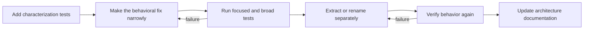

This sequence keeps behavioral evidence ahead of structural change and makes regressions easier to localize.

### Characterization tests

When existing behavior is complex or poorly documented, characterization tests record what the system currently does before restructuring it. They are not an endorsement of every detail. They create a safety net and expose deliberate behavior changes clearly.

Good candidates in `mdexplore` include:

- Recent-menu ordering;
- search scope refresh behavior;
- copy-BASE64 persistence;
- rendering fallback selection;
- tree visibility and symlink handling;
- highlight restoration order;
- cache invalidation after file changes.

### Extract by responsibility

A safe extraction usually follows this shape:

1. identify a cohesive behavior;
2. make its inputs explicit;
3. define its output or side-effect contract;
4. add focused tests around the boundary;
5. move code with minimal logic change;
6. keep a compatibility wrapper temporarily if needed;
7. remove duplication only after equivalence is proven.

Do not begin by moving a large block and redesigning it at the same time.

### Preserve dependency direction

Before extraction:

```text
MdExploreWindow method
    -> reads many instance fields
    -> mutates widgets and cache
```

A useful first step may be:

```text
pure helper(inputs) -> decision/result
MdExploreWindow method -> gathers inputs, calls helper, applies result
```

A later step may introduce a stateful service if the behavior truly owns a lifecycle. Avoid creating a service that still reaches back into the window for every decision.

### Compatibility wrappers

A temporary wrapper can preserve call sites while implementation moves:

```python
def old_helper(value):
    return new_module.new_helper(value)
```

Wrappers should have an explicit removal plan. Permanent duplicate APIs increase maintenance cost and obscure the preferred boundary.

### Exercise: extraction proposal

Select one cohesive responsibility still located in `mdexplore.py`. Write a proposal containing:

```text
Current responsibility:
Why it is cohesive:
Current dependencies:
Proposed module/class/function:
Public API:
Tests to add first:
Migration sequence:
Compatibility risks:
Documentation updates:
```

Evaluate the proposal by whether it reduces coupling and cognitive load—not merely by how many lines it moves.

---

## Module 21 — Code review as risk analysis

### Review the change in layers

A useful review proceeds from broad risk to implementation detail:

1. What user-visible behavior is intended to change?
2. Which documented invariants must remain unchanged?
3. Which asynchronous, persistence, cache, or browser boundaries are touched?
4. Are tests located at the smallest useful boundaries?
5. Does the implementation preserve dependency direction?
6. Are failure, retry, and cleanup paths explicit?
7. Is documentation now inaccurate?

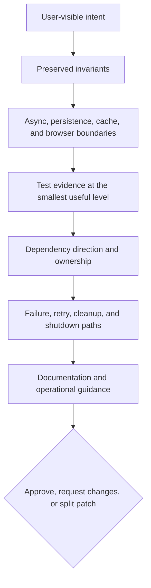

Reviewing only style and line-level correctness misses the most important risks.

### Inspect the negative space

Ask what the patch does **not** handle:

- a worker error;
- a stale callback;
- an absent DOM node;
- a missing optional dependency;
- a locked persistence file;
- a symlink or deleted path;
- malformed JSON;
- an empty query;
- repeated invocation;
- application shutdown while work is pending.

The negative space often contains the regression.

### Prefer evidence over reassurance

“Should be safe” is not evidence. Strong review evidence includes:

- a focused regression test;
- a state-transition table;
- before/after benchmark data;
- a documented cache-key argument;
- a reproducible manual fixture;
- proof that unresolved asset placeholders fail early;
- a clean focused and broad test run.

### Patch-size discipline

Small patches are easier to reason about, but “small” is conceptual rather than purely numerical. A 100-line change that adds one self-contained helper and tests may be safer than a 20-line change that alters several lifecycle boundaries.

A good patch should tell one coherent story.

### Review exercise

Imagine a patch that removes pending BASE64 image entries immediately after calling JavaScript because “the callback always runs.” Write a review explaining:

1. the violated invariant;
2. the race scenario;
3. the evidence required from JavaScript;
4. the deterministic regression test;
5. the safer state transition.

Then review a second hypothetical patch that increases every worker-pool limit. Identify the measurements and resource risks that must be considered.


---

## Module 22 — Reliability, security, and data safety

### Treat rendered content as untrusted input

Markdown files may contain HTML, links, data URIs, large payloads, malformed syntax, and references to local or remote resources. Even in a desktop tool, rendering is a trust boundary.

Questions to consider include:

- Which HTML is accepted or generated?
- Can scripts from document content execute?
- Which URL schemes are allowed?
- Are external links opened deliberately?
- Can a document access unexpected local files?
- Are data URI sizes bounded?
- Can deeply nested or pathological input exhaust resources?

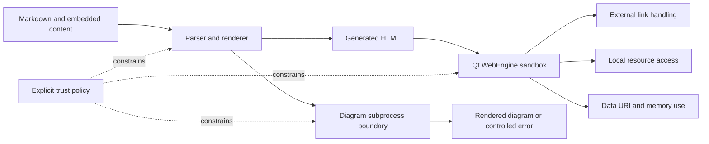

The product policy should be explicit rather than accidental.

### Safe subprocess use

PlantUML or related helpers may invoke external programs. Subprocess calls should:

- pass arguments as a list rather than constructing a shell string;
- avoid `shell=True` unless there is a compelling, reviewed reason;
- apply timeouts where hangs are possible;
- capture and report useful error output;
- clean temporary files;
- avoid treating document text as executable command syntax.

### Path safety

Filesystem browsing must handle:

- symlinks;
- broken links;
- permission errors;
- paths disappearing during a scan;
- directories changing while the model is active;
- canonicalization differences;
- accidental traversal outside an intended root.

Errors should usually degrade one item or operation rather than crash the whole application.

### Persistence safety

User state and per-directory sidecar metadata are valuable data. Safe persistence requires:

- validation before use;
- atomic writes;
- respectful lock behavior;
- no rewrite when nothing changed;
- predictable formatting where users may inspect files;
- recovery from malformed data;
- clear ownership of each file.

### Resource limits

Correct input can still be hostile to resources. Consider limits for:

- document size;
- embedded BASE64 payload size;
- number of diagrams;
- worker concurrency;
- cache capacity;
- search result counts;
- subprocess duration;
- browser-side DOM wrappers.

Limits should fail predictably and, where possible, preserve partial usability.

### Exercise: lightweight threat model

Create a threat model with these columns:

| Asset | Trust boundary | Failure or abuse case | Existing defense | Proposed test |
| --- | --- | --- | --- | --- |
| user config | JSON file parser | malformed/truncated file | defaults and validation | malformed-field test |
| PlantUML invocation | process boundary | command injection or hang | argument list and timeout | hostile filename test |
| embedded image | document/browser boundary | huge data URI | deduplication/limits | oversized payload test |

Add at least seven more rows covering links, symlinks, PDFs, browser scripts, caches, and per-directory metadata.

### Review questions

1. Why is local Markdown still untrusted input?
2. What risks arise from shell command construction?
3. Why should persistence avoid unnecessary rewrites?
4. How do resource limits improve reliability as well as security?

---

# Part VIII — Applied projects and progression

## Module 23 — Guided maintenance projects

The following projects move from isolated reasoning to repository-scale work. Each project should be completed on a separate Git branch and accompanied by tests and a short engineering note.

### Project A — Search-query specification

**Goal:** turn the existing search helpers into a precise, test-backed language specification.

Deliverables:

1. a grammar-like description of terms, phrases, negation, OR, NEAR, and legacy aliases;
2. a table of valid and invalid queries;
3. tests for malformed nesting, empty terms, and six-term NEAR groups;
4. an explanation of hit-count semantics;
5. no GUI changes.

Skills practiced: pure-function reasoning, table-driven tests, edge-case design, documentation.

### Project B — Worker protocol audit

**Goal:** make one worker's lifecycle explicit without changing behavior.

Deliverables:

1. an input/result/error contract;
2. request identity in every completion path;
3. a deterministic stale-result test;
4. proof that widgets are not touched from the worker thread;
5. documentation of cleanup behavior.

Skills practiced: concurrency boundaries, signal design, test doubles, lifecycle analysis.

### Project C — Asset placeholder hardening

**Goal:** improve one JavaScript or HTML asset contract.

Deliverables:

1. a registry entry or contract review;
2. required-placeholder validation;
3. JSON-safe serialization tests;
4. a test proving unresolved placeholders cannot reach runtime;
5. an idempotence argument for the script.

Skills practiced: cross-language boundaries, encoding, contract tests, fail-fast design.

### Project D — Cache invalidation experiment

**Goal:** prove that a cache key includes every influential input.

Deliverables:

1. a cache equivalence statement;
2. tests that vary path, file signature, rendering option, and backend one at a time;
3. a stale-hit failure demonstration or proof of correctness;
4. a proposal for bounded eviction or in-flight deduplication;
5. cold/warm timing measurements.

Skills practiced: cache theory, experimental design, performance measurement, correctness arguments.

### Project E — Persistence resilience

**Goal:** make one persistence path robust against malformed and interrupted data.

Deliverables:

1. tests for missing, malformed, and partially valid JSON;
2. field-level validation and defaults;
3. atomic-replacement writing where applicable;
4. tests for persistence-lock behavior;
5. confirmation that unchanged state is not rewritten unnecessarily.

Skills practiced: filesystem safety, compatibility, validation, failure recovery.

---

## Module 24 — Capstone: extract a coherent subsystem

### Capstone objective

Extract one responsibility from `mdexplore.py` into a focused module while preserving all user-visible behavior.

Suitable candidates include:

- preview lifecycle coordination;
- view-state persistence;
- recent-root management;
- image hydration coordination;
- search result presentation;
- export preflight orchestration.

A successful extraction should redirect dependencies away from the main window rather than merely moving methods to another file:

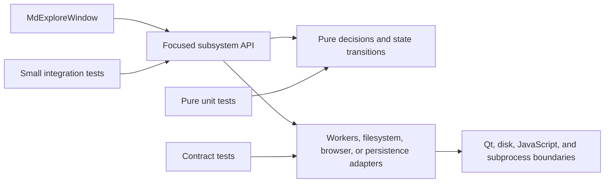

The chosen scope must be large enough to demonstrate architecture work but small enough to review as one coherent change.

### Required artifacts

1. **Behavior inventory** — all relevant documented invariants and existing tests.
2. **Dependency map** — current inputs, outputs, callbacks, caches, and state ownership.
3. **Characterization tests** — tests added before structural changes.
4. **Proposed boundary** — public functions, classes, protocols, or data objects.
5. **Incremental migration** — a sequence that keeps the application working at every step.
6. **Regression suite** — focused tests plus an appropriate broader suite.
7. **Architecture update** — changes to developer documentation.
8. **Review note** — risks, alternatives, and follow-up work.

### Evaluation rubric

| Area | Strong evidence |
| --- | --- |
| Behavioral preservation | explicit invariants and passing characterization tests |
| Cohesion | extracted code has one understandable responsibility |
| Coupling | dependencies are explicit and point toward lower-level modules |
| Testability | core behavior can be tested without the full window |
| Async safety | request identity, retry, and stale-result handling are clear |
| Failure behavior | errors, fallbacks, and cleanup are intentional |
| Maintainability | names and APIs express the domain rather than incidental mechanics |
| Documentation | repository maps and contracts match the new structure |

### Capstone constraint

Do not optimize, redesign the UI, and extract the subsystem in the same patch. First preserve and isolate behavior. Performance or product changes should follow as separately reviewable work.


---

## Module 25 — Suggested twelve-week study plan

This schedule assumes five to eight hours of study per week. Adjust the project scope rather than rushing through the reasoning exercises.

| Week | Focus | Repository work | Evidence of completion |
| --- | --- | --- | --- |
| 1 | orientation and behavior contracts | read the main documentation; build a feature-to-test map | completed behavior inventory |
| 2 | architecture and call-path tracing | classify `mdexplore_app/`; trace one preview scenario | architecture and call-path diagrams |
| 3 | pure functions and state | study search helpers; map window state ownership | search truth table and state map |
| 4 | dependencies and fallbacks | inspect Markdown, BASE64, graphics, and diagram fallbacks | fallback matrix with tests |
| 5 | Qt events and workers | map signals, slots, thread boundaries, and stale-result checks | event map and worker contracts |
| 6 | race conditions | reconstruct the inline-image hydration failure | state machine and regression-test design |
| 7 | browser assets and rendering | audit JavaScript calls, templates, and pipeline stages | three bridge contracts and an asset test |
| 8 | caching and performance | inspect keys, invalidation, deduplication, and timing stages | cache audit and benchmark plan |
| 9 | configuration and persistence | trace precedence and persistence paths | configuration provenance table |
| 10 | testing | classify the suite; design deterministic asynchronous tests | test-layer inventory and queued-worker fake |
| 11 | debugging and review | complete a debugging dossier and review two hypothetical patches | written dossier and review notes |
| 12 | capstone | extract or fully design one coherent subsystem | capstone artifacts and retrospective |

### Weekly retrospective

At the end of each week, answer:

1. What behavior can I now explain from user action to final result?
2. Which invariant surprised me?
3. Which boundary remains unclear?
4. Which test gave me the most confidence?
5. What assumption did I discover was wrong?
6. What would I document for the next developer?

---

# Practical checklists

## Before changing code

- Read the relevant sections of `README.md`, `AGENTS.md`, and `DEVELOPERS-AGENTS.md`.
- State the user-visible behavior and expected result.
- Identify the owning subsystem and all asynchronous boundaries.
- Search for focused tests and historical regression tests.
- Record relevant state, cache, persistence, and fallback rules.
- Reproduce the issue or characterize the current behavior.
- Keep unrelated cleanup out of the patch.

## While implementing

- Keep inputs and outputs explicit.
- Preserve request identity across asynchronous work.
- Mutate Qt widgets only from the GUI thread.
- Retain pending state until actual application is acknowledged.
- Make retries idempotent.
- Serialize values for the target language safely.
- Validate optimized or optional backends.
- Update cache keys when influential inputs change.
- Handle error, stale-result, shutdown, and cleanup paths.
- Add the smallest deterministic regression test first.

## Before declaring the change complete

- Run the focused tests for the changed behavior.
- Run neighboring subsystem tests.
- Run the appropriate broader suite in headless mode when needed.
- Exercise the relevant manual fixture.
- Test cold and warm paths when caching is involved.
- Test preferred and fallback backends when dependencies are involved.
- Verify persistence files are not rewritten unexpectedly.
- Check that documentation and architecture maps remain accurate.
- Inspect the diff for accidental formatting or unrelated changes.
- Explain the risk and evidence in the commit or review note.

## Asynchronous-code checklist

- What uniquely identifies the request?
- Can a newer request supersede it?
- Which callbacks can arrive late or more than once?
- What proves that work was actually applied?
- Is retry safe and idempotent?
- Which pending state must survive a failed attempt?
- What happens during application shutdown?
- Are all success and failure paths cleaned up?
- Can the test control completion order without sleeping?

## Cache checklist

- What exact inputs define equivalence?
- Is content identity stronger than path identity where needed?
- What invalidates an entry?
- Can two equivalent jobs run simultaneously?
- Is the cache bounded?
- What happens when a cached artifact disappears from disk?
- Are fallback-backend results distinguishable?
- Is stale data merely inefficient, or can it be incorrect?
- Is there a test that varies each influential input independently?


---

# Glossary

**Acknowledgement** — a returned value proving what an asynchronous operation actually accomplished, not merely that it executed.

**Adapter** — code that translates between an application's stable interface and a library, process, filesystem, or runtime-specific implementation.

**Atomic write** — writing complete data to a temporary file and replacing the destination in one filesystem operation to avoid partial content.

**Cache invalidation** — the rules that determine when a stored result is no longer valid for a request.

**Characterization test** — a test that records existing behavior before refactoring, especially when the implementation is complex or poorly specified.

**Cohesion** — how strongly the responsibilities within a component belong together.

**Contract test** — a test that verifies the shape and semantics of a boundary between components, languages, or data formats.

**Coupling** — the degree to which one component depends on the internal details of another.

**Derived state** — data computed from other authoritative state and therefore usually better recomputed or invalidated than independently persisted.

**Event loop** — the runtime mechanism that dispatches GUI, timer, worker, browser, and system events to callbacks.

**Functional core** — pure decision and transformation logic isolated from I/O and side effects.

**Generation counter** — a monotonically changing identifier used to distinguish current asynchronous work from stale results.

**Idempotent operation** — an operation that can be repeated without producing duplicated or progressively corrupted state.

**Imperative shell** — code that coordinates I/O, UI updates, threads, processes, and other side effects around a functional core.

**In-flight deduplication** — preventing multiple equivalent jobs from running concurrently by sharing one pending result.

**Invariant** — a condition that must remain true across valid state transitions.

**Logical cancellation** — treating a job's result as obsolete rather than forcibly terminating the underlying thread or process.

**Race condition** — a defect in which correctness depends on the relative timing of operations.

**Regression test** — a test that reproduces a previous failure and protects the corrected behavior.

**Reentrancy** — the possibility that callbacks or nested event processing invoke behavior again before a previous logical operation is fully complete.

**Source-contract test** — a test that verifies a deliberate property of source or asset structure when that structure is itself a safety boundary.

**Stale callback** — a delayed callback whose result belongs to an earlier request or document state.

**State machine** — a model that defines valid states, transitions, and the conditions required for each transition.

**Strangler pattern** — incrementally replacing or extracting parts of a large system behind new boundaries while the original system remains operational.

---

# Final perspective

The most important lesson in `mdexplore` is not a particular Python or Qt technique. It is the discipline of treating behavior as a network of contracts.

A file selection crosses the filesystem model, renderer, worker pool, cache, HTML template, browser lifecycle, JavaScript bridge, DOM, overlay layers, and persistent view state. Reliability comes from making each transition explicit:

```text
known input
    -> owned transformation
        -> verifiable output
            -> acknowledged application
                -> preserved invariant
```

Junior developers often focus on making the happy path work. Mid-level engineering begins when you can also explain stale results, retries, invalidation, fallbacks, malformed state, shutdown, and regression evidence.

Use this repository to practice that transition. Read behavior before implementation. Trace one scenario at a time. Extract seams rather than lines. Test state transitions rather than elapsed time. Measure before optimizing. Preserve user-visible invariants. Leave the architecture and documentation clearer than you found them.
