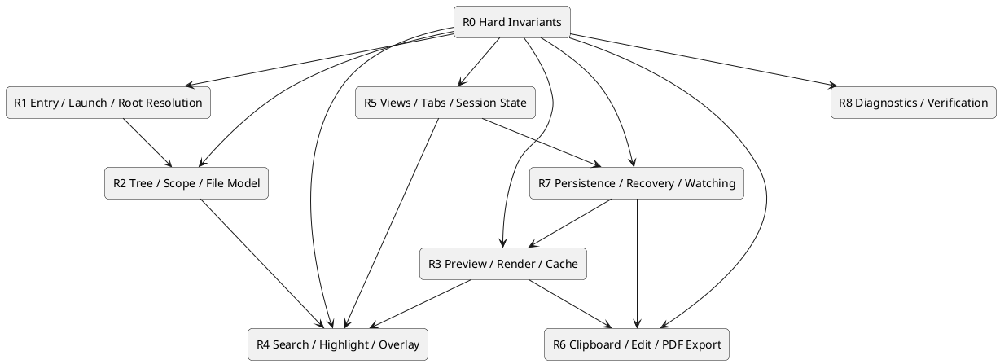
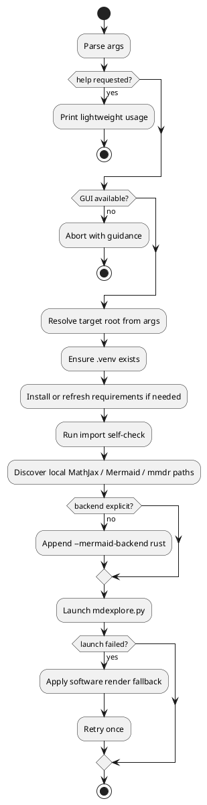
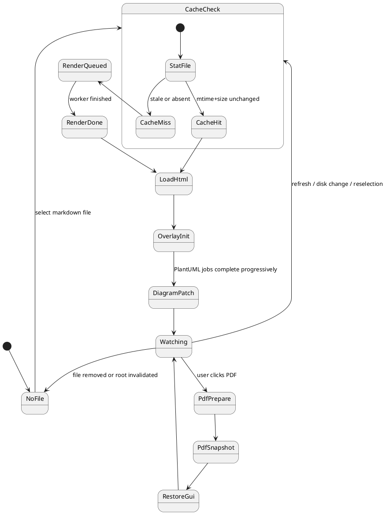
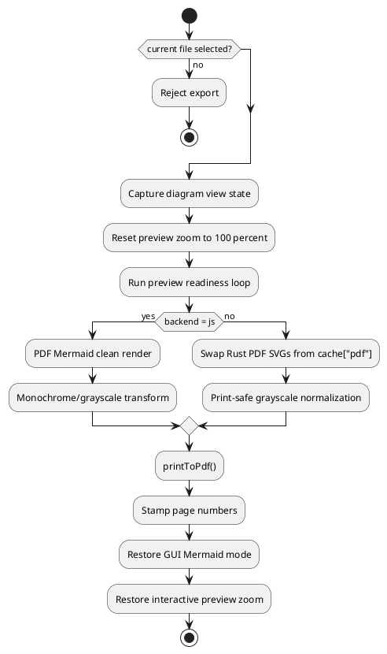
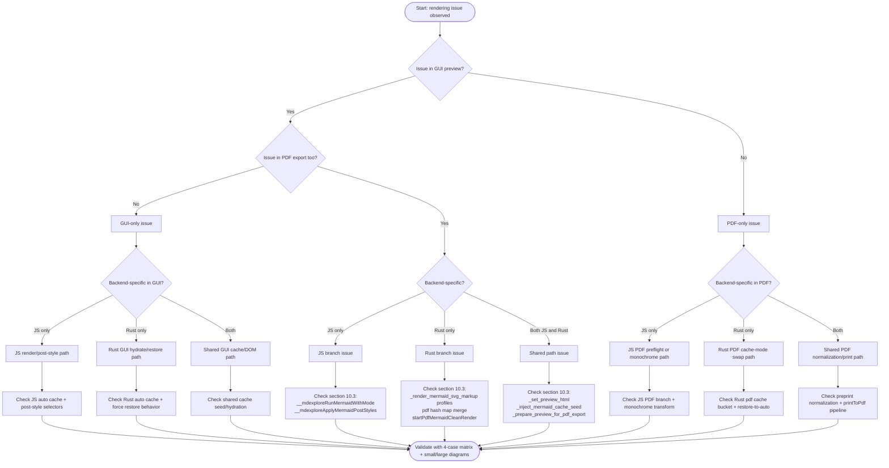
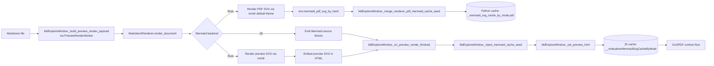
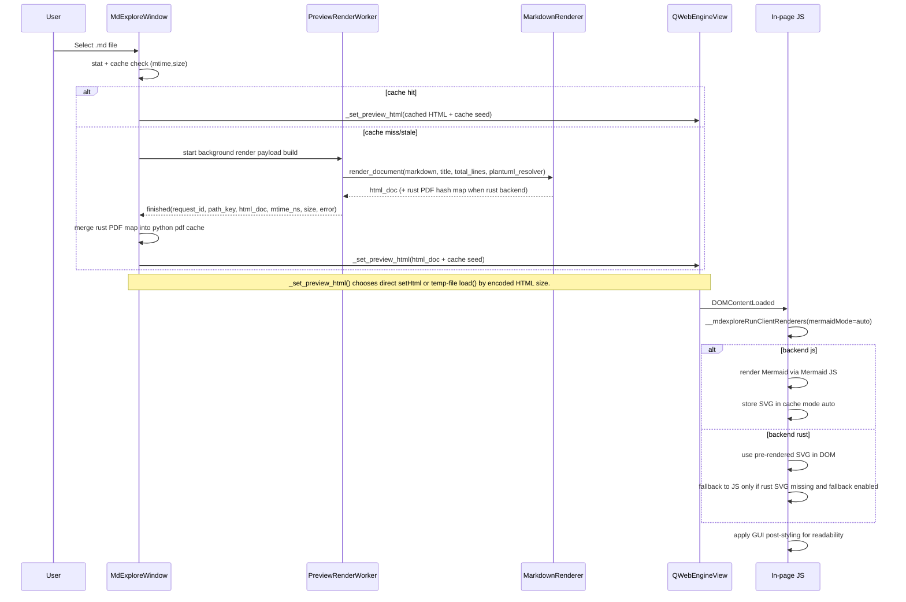
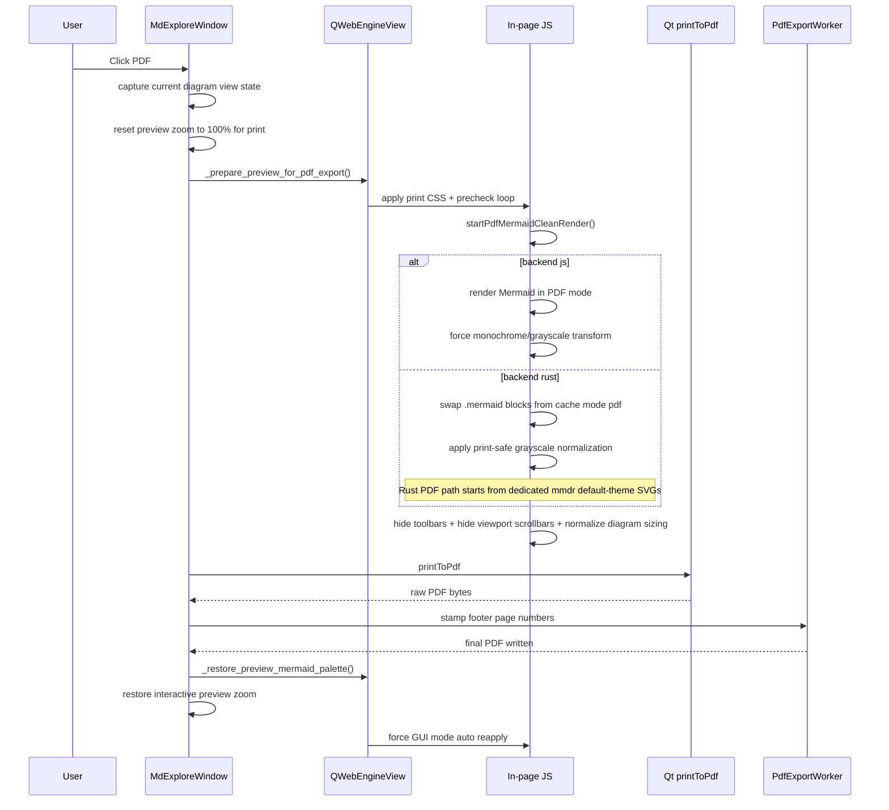
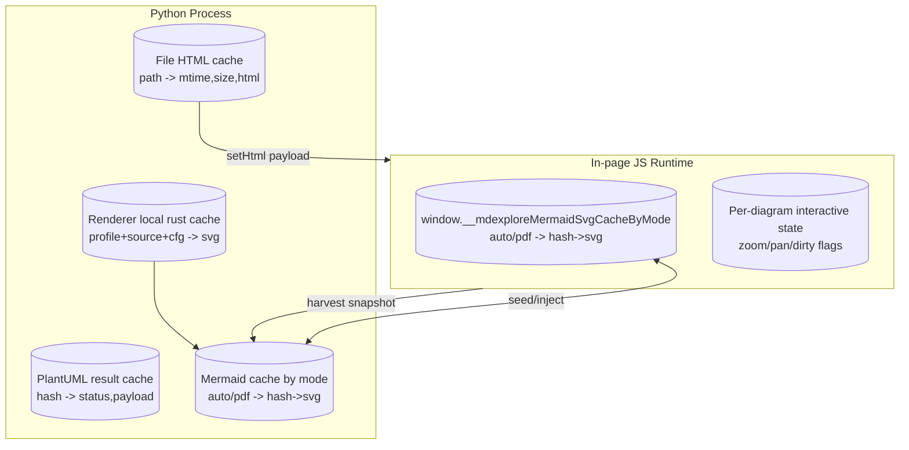

# DEVELOPERS-AGENTS.md

Canonical maintenance, behavior, and render-architecture guide for developers and automated
coding agents that add features or maintain `mdexplore`.

## Table Of Contents

- [Mission](#mission)
- [Repository Map](#repository-map)
- [Runtime Assumptions](#runtime-assumptions)
- [Entry Points And Hotspots](#entry-points-and-hotspots)
- [Core Behavior You Must Preserve](#core-behavior-you-must-preserve)
- [Formal Behavior Rules Model](#formal-behavior-rules-model)
  - [1. Rule Language](#1-rule-language)
  - [2. Source and Precedence Model](#2-source-and-precedence-model)
  - [3. Hierarchy of Rule Domains](#3-hierarchy-of-rule-domains)
  - [4. Global Invariants](#4-global-invariants)
  - [5. Entry, Launch, and Root Resolution](#5-entry-launch-and-root-resolution)
  - [6. Tree, Scope, and File Model](#6-tree-scope-and-file-model)
  - [7. Preview, Render, and Cache Rules](#7-preview-render-and-cache-rules)
  - [8. Search, Highlight, and Overlay Rules](#8-search-highlight-and-overlay-rules)
  - [9. View, Tab, and Session Rules](#9-view-tab-and-session-rules)
  - [10. Clipboard, Edit, and PDF Export Rules](#10-clipboard-edit-and-pdf-export-rules)
  - [11. Persistence, Refresh, and Recovery Rules](#11-persistence-refresh-and-recovery-rules)
  - [12. Diagnostics and Verification Rules](#12-diagnostics-and-verification-rules)
  - [13. Canonical Decision Tables](#13-canonical-decision-tables)
  - [14. Rule Summary](#14-rule-summary)
- [Editing Rules](#editing-rules)
- [Rendering Rules](#rendering-rules)
- [Mermaid Render/Caching Architecture (Read Before Changes)](#mermaid-rendercaching-architecture-read-before-changes)
- [Render Triage, Architecture, And Debugging](#render-triage-architecture-and-debugging)
  - [0. One-Page Triage Card](#0-one-page-triage-card)
  - [1. Scope and Intent](#1-scope-and-intent)
  - [2. Render Mode Matrix](#2-render-mode-matrix)
  - [3. End-to-End Ownership](#3-end-to-end-ownership)
  - [4. GUI Preview Path](#4-gui-preview-path)
  - [5. PDF Export Path](#5-pdf-export-path)
  - [6. Cache Architecture](#6-cache-architecture)
  - [7. Critical Invariants](#7-critical-invariants)
  - [8. Failure and Fallback Rules](#8-failure-and-fallback-rules)
  - [9. Known TODO](#9-known-todo)
  - [10. Debugging Playbook (Human + Agent)](#10-debugging-playbook-human--agent)
- [Known TODO: Diagram View State Restore](#known-todo-diagram-view-state-restore)
- [Launcher Rules](#launcher-rules)
- [Setup Script Rules](#setup-script-rules)
- [Quality Gates Before Finishing](#quality-gates-before-finishing)
- [Test Inventory](#test-inventory)
- [Documentation Requirements](#documentation-requirements)
- [Common Feature Patterns](#common-feature-patterns)
- [Out of Scope Unless Requested](#out-of-scope-unless-requested)

## Mission

Maintain a fast, reliable Markdown explorer for Ubuntu/Linux desktop with:

- Left-pane directory tree rooted at a target folder.
- Markdown-only file listing (`*.md`).
- Right-pane rendered preview with math and diagram support.
- `^`, `Refresh`, `PDF`, `Add View`, and `Edit` actions.
- Top-right copy controls with destination mode (`Clipboard` or `Directory`)
  plus color/pin copy actions.
- In `Directory` mode, copy actions must copy file content and merge
  copied-file metadata into destination sidecars.

## Repository Map

- `mdexplore.py`: large main application module (roughly 15k lines) containing
  `MarkdownRenderer`, `MdExploreWindow`, preview/PDF orchestration, caching,
  file watching, search, and the direct Python CLI entrypoint.
- `mdexplore_app/constants.py`: shared constants used by the main app and support modules.
- `mdexplore_app/js.py`: startup JS-asset registry and template renderer for
  externalized preview/PDF page scripts under `assets/js/preview/` and
  `assets/js/pdf/`.
- `mdexplore_app/templates.py`: startup HTML-template asset registry and renderer
  for externalized preview document shells under `assets/templates/`.
- `mdexplore_app/runtime.py`: runtime/config/GPU-print helper functions.
- `mdexplore_app/search.py`: extracted pure search query helpers for tokenization,
  predicate compilation, `NEAR(...)` parsing, legacy `CLOSE(...)` alias
  normalization, NEAR-window selection, and per-file hit counting.
- `mdexplore_app/pdf.py`: PDF footer stamping, blank-page suppression, TOC-aware
  landscape-page classification, and PlantUML stderr helpers.
- `mdexplore_app/icons.py`: icon loading/recoloring helpers used by the tree and tab UI.
- `mdexplore_app/tree.py`: extracted tree/model classes (`ColorizedMarkdownModel`, `MarkdownTreeItemDelegate`).
- `mdexplore_app/tabs.py`: extracted custom tab-bar class (`ViewTabBar`).
- `mdexplore_app/workers.py`: background worker classes for preview render, PlantUML, and PDF export.
- `mdexplore_app/fast_base64.py`: shared BASE64 encode/decode helpers with
  adaptive routing between vendored `fastbase64` and `pybase64`, plus stdlib
  fallback.
- `mdexplore.sh`: launcher (venv lifecycle + dependency install + app run).
- `setup-mdexplore.sh`: full bootstrap helper for local setup (venv, vendored assets, Rust Mermaid renderer).
- `requirements.txt`: Python runtime dependencies.
- `assets/ui/`: local UI icon/font assets (tree badges, tab actions, copy pin,
  and search-hit pill font).
- `assets/js/`: externalized JavaScript templates used by preview/search/PDF flows.
  - `assets/js/preview/`: preview search/highlight/selection/context-menu DOM scripts.
  - `assets/js/pdf/`: PDF preflight, DOM normalization, and restore scripts.
- `assets/templates/`: externalized HTML template assets used by preview/document rendering.
  - `assets/templates/preview/`: preview document shell/template assets.
- `vendor/`: vendored local runtime assets (Mermaid JS, MathJax, PlantUML jar,
  and related renderer sources/binaries when bootstrapped).
- `test/`: sample Markdown/PDF fixtures used for manual smoke testing.
- `README.md`: user-facing setup and usage documentation.
- `UML.md`: higher-level architecture, class, and activity diagrams.
- `mdexplore.desktop.sample`: user-adaptable `.desktop` launcher template.
- `mdexplor-icon.png`: primary app icon asset kept at repo root for desktop launchers.
- `tests/`: unit/headless regressions for preview restore/markers, search syntax,
  search module behavior, template assets, UI assets, highlight confirmations,
  and tab-bar layout.
- `LICENSE`: MIT license text.
- Runtime config file: `~/.mdexplore.cfg` (persisted last effective root).
- Runtime color sidecars: per-directory `.mdexplore-colors.json` files for
  persisted tree highlight colors where writable.
- Runtime view sidecars: per-directory `.mdexplore-views.json` files for
  persisted view-tab state (multi-view sessions and custom tab labels).
- Runtime preview-highlight sidecars: per-directory
  `.mdexplore-highlighting.json` files for persistent text highlights created
  from the preview pane.

## Runtime Assumptions

- Python `3.10+`.
- Linux desktop with GUI support.
- `PySide6` and `QtWebEngine` available via pip dependencies.
- `pypdf` and `reportlab` available for PDF page-number stamping.
- `cmarkgfm` is preferred for fast markdown rendering and should be present in
  runtime dependencies.
- BASE64 decode path should prefer `pybase64`, opportunistically route to
  vendored `fastbase64` for tuned payload-size sweet spots, and keep stdlib
  fallback functional when accelerated backends are unavailable.
- BASE64 encode path should validate vendored `fastbase64` output before use
  (length/padding/alphabet sanity) and fall back to `pybase64`/stdlib when
  vendor output is malformed.
- Mermaid should prefer a local bundle when available and only use CDN fallback.
- Rust Mermaid backend is optional and uses `mmdr` when `--mermaid-backend rust` is selected.
- MathJax should prefer a local bundle when available and only use CDN fallback.
- Java runtime is expected for local PlantUML rendering.
- MarkText at `/usr/bin/marktext` may or may not be installed; app should fail
  gracefully when missing.
- The direct Python entrypoint and the shell launcher do not currently default
  to the same Mermaid backend:
  - `mdexplore.py` defaults `--mermaid-backend` to `js`.
  - `mdexplore.sh` injects `--mermaid-backend rust` unless explicitly overridden.

## Entry Points And Hotspots

- `mdexplore.sh` is the primary launcher path. It handles `.desktop` `%u`
  arguments, venv bootstrapping, runtime import self-heal, local asset
  discovery, backend defaulting, and one retry with software-render fallback.
- `mdexplore.py` remains the direct Python entrypoint. `main()` parses `PATH`,
  `--mermaid-backend`, and `--debug`, resolves the effective root, creates
  `QApplication`, probes GPU availability, and constructs `MdExploreWindow`.
- `MarkdownRenderer` in `mdexplore.py` owns markdown engine selection
  (`cmarkgfm` fast path with markdown-it fallback), fenced syntax handling,
  MathJax/Mermaid source selection, PlantUML integration, and the Rust Mermaid
  preview-vs-PDF SVG fork.
- `MdExploreWindow` in `mdexplore.py` is the main orchestration boundary and
  highest-blast-radius edit surface.
- Before changing preview/render/PDF flow, inspect these methods in
  `mdexplore.py`:
  - `_merge_renderer_pdf_mermaid_cache_seed()`
  - `_inject_mermaid_cache_seed()`
  - `_on_preview_render_finished()`
  - `_prepare_preview_for_pdf_export()`
  - `_restore_preview_mermaid_palette()`
- `_set_preview_html()` in `mdexplore.py` has two preview load paths:
  - direct `setHtml(..., base_url)` for normal-sized documents
  - temp-file `load()` fallback for oversized HTML
  Changes to base URLs, asset injection, JS boot order, or page-load timing
  must be tested on both paths.
- `TreeMarkerScanWorker` in `mdexplore_app/workers.py` shares sidecar read
  contracts with the main window code. Keep `.mdexplore-colors.json`,
  `.mdexplore-views.json`, and `.mdexplore-highlighting.json` formats
  compatible across both readers/writers.

## Core Behavior You Must Preserve

- Without a path arg, default root is loaded from `~/.mdexplore.cfg` if valid;
  otherwise home directory is used.
- Both entrypoints support optional root path argument:
  - `mdexplore.sh [PATH]`
  - `mdexplore.py [PATH]`
- Tree shows directories and `.md` files only.
- Selecting a Markdown file updates preview quickly.
- GitHub/Obsidian-style markdown callouts (`> [!TYPE]`) should render as styled
  callout boxes in preview and PDF output.
- Navigating to a previously cached file must still stat-check mtime/size;
  if changed, it must re-render instead of showing stale cached HTML.
- PlantUML rendering jobs must run off the UI thread to keep the window responsive.
- PlantUML blocks should not block markdown preview; show placeholders first,
  then progressively replace each diagram as local render jobs complete.
- PlantUML progressive updates should be applied in-place so the preview scroll
  location is preserved.
- PlantUML progress should persist across file navigation so returning to a
  file shows completed diagrams without restarting work.
- Preview scroll position should be remembered per markdown file for the
  current application run.
- While dragging the preview pane's vertical scrollbar, the preview should show
  an approximate `current line / total lines` indicator beside the scrollbar handle.
- `Ctrl++`, `Ctrl+-`, and `Ctrl+0` should adjust only the preview pane zoom
  factor, not the tree pane or overall UI scale.
- Preview zoom changes should briefly show a top-center percentage overlay inside
  the preview area.
- `^` navigates one directory level up and re-roots the tree.
- User-adjusted splitter width between tree and preview should persist across
  root changes for the current application run.
- Window title reflects effective root scope (selected directory if selected, otherwise current root).
- Effective-root directory row in the tree should stay bold and use:
  - aqua-blue text (`#7fdfe8`) when no active-search hits are under the
    effective scope,
  - yellow text plus an appended hit-count pill when active search has hits
    under the effective scope (`1..99`, then `++`).
- Effective root is persisted on close to `~/.mdexplore.cfg`.
- Linux desktop identity should remain `mdexplore` so launcher icon matching
  works (`QApplication.setDesktopFileName("mdexplore")` + desktop
  `StartupWMClass=mdexplore`).
- `Edit` opens currently selected file with `/usr/bin/marktext`.
- `Add View` creates another tabbed view of the same current document, starting
  from the current top-visible line/scroll position.
- View tabs default to top-visible source line numbers, are closeable, and are
  capped at 8 tabs per document.
- View tabs include a left-side mini bargraph indicating each view's position in
  the current document.
- View tabs should keep a stable soft-pastel color sequence based on open order.
- View tabs are draggable/reorderable; moving tabs must not change their assigned
  color.
- Right-clicking a view tab should allow editing a custom tab label up to
  48 characters, including spaces.
- If a longer tab label is entered, it should be truncated to the first
  48 characters rather than rejected.
- If a custom tab label is cleared back to blank, that tab should resume using
  the default dynamic line-number label.
- When a tab receives a custom label, the app should capture that tab's current
  scroll position and top visible source line as the saved label-time beginning.
- Right-clicking a custom-labeled tab should also offer `Return to beginning`,
  which restores that saved label-time location for the tab.
- Custom-labeled tabs should also show a refresh icon beside the close button;
  clicking it should reset the saved label-time beginning to the tab's current
  scroll position/top line.
- Relabeling a custom-labeled tab with different text should reset the saved
  beginning to the tab's current scroll position/top line at relabel time.
- When assigning a new tab color and wrapping the palette, skip any color already
  used by open tabs.
- Per-document tabs should persist for the app run: switching to another markdown
  file and back must restore prior tabs, their order, and the previously selected
  tab.
- View-tab state should also persist across app restarts via per-directory
  `.mdexplore-views.json`, keyed by markdown filename.
- For custom-labeled tabs, `.mdexplore-views.json` should also persist the
  saved label-time beginning location used by `Return to beginning`.
- If custom labels make the tab strip wider than the available space, the tab
  bar should scroll rather than truncating the tab set.
- Only documents with explicit multi-view state or custom tab labels should be
  written to `.mdexplore-views.json`; untouched single-view documents should
  fall back to the default one-tab state without sidecar entries.
- The tab strip should remain hidden when there is only one unlabeled default
  view.
- If only one view remains and it has a custom label, its tab should stay
  visible so the custom label and `Return to beginning` action remain
  available.
- Closing that sole remaining custom-labeled tab should clear the custom label
  and saved beginning, then fall back to the hidden default single-view state.
- `Refresh` button and `F5` both refresh the current directory tree view
  (new files appear, deleted files disappear) without requiring app restart.
- `PDF` exports the currently previewed markdown rendering to
  `<source-basename>.pdf` beside the source file, with centered `N of M`
  numbering at the bottom of each page.
- PDF export should preflight preview readiness (MathJax/Mermaid/fonts) before
  snapshotting, and apply print-focused math styling to avoid cramped glyphs.
- `MIN_PRINT_DIAGRAM_FONT_PT` in `mdexplore.py` is the tweakable PDF
  one-page shrink floor for diagram sizing decisions. Lowering it allows tall
  diagrams (for example Mermaid activity/flowcharts) to stay on one page more
  aggressively before the exporter falls back to multi-page spill.
- In PDF mode, headed Mermaid and PlantUML sections should attach the heading
  to the diagram fence itself for pagination purposes, so Chromium cannot leave
  the heading on one page and push the diagram to the next.
- If the currently previewed markdown file changes on disk, preview should
  auto-refresh and report that via status bar message.
- Status bar should show progress during long-running operations (preview
  loading/rendering, PlantUML completion, PDF export) and should not remain
  blank during idle gaps.
- Search input uses label `Search and highlight:` and includes an explicit in-field `X`
  clear action.
- Pressing `Enter` in search should bypass debounce and run search immediately.
- Non-quoted and double-quoted search terms should be case-insensitive.
- Single-quoted search terms should be case-sensitive.
- Only the opening quote delimiter should terminate a quoted search term; the
  other quote character should remain literal inside the term.
- `NEAR(...)` should be supported in search queries and require all listed
  terms to occur within `SEARCH_CLOSE_WORD_GAP` content words.
- Legacy `CLOSE(...)` should remain accepted as a backward-compatible alias and
  normalize to canonical `NEAR(...)` parsing/evaluation internally.
- `NEAR(...)` should require distinct qualifying occurrences per listed term;
  the same text start should not satisfy multiple required terms.
- Single-word `NEAR(...)` terms should match on word boundaries for proximity
  evaluation rather than as substrings inside larger words.
- Search hit-count pills for `NEAR(...)` queries should count qualifying NEAR
  windows, not the number of highlighted term spans inside the chosen window.
- Function-style operators should accept both no-space and spaced forms before
  `(` (for example `OR(...)` and `OR (...)`).
- `AND(...)`, `OR(...)`, and `NEAR(...)` should accept comma-delimited,
  space-delimited, or mixed argument lists.
- `AND(...)` and `OR(...)` should be variadic (2+ arguments).
- If search is active and visible-tree scope changes (expand/collapse, selected
  scope change, or root change), search should rerun against the newly visible
  markdown set.
- File highlight colors are assigned from tree context menu and persisted per directory.
- File-highlight palette includes Yellow, Green, Blue, Orange, Purple, Light Gray,
  Medium Gray, and Red.
- Highlight state persists in `.mdexplore-colors.json` files where writable.
- `Clear in Directory` in the context menu clears highlight metadata
  non-recursively for the selected directory scope after confirmation.
- `Clear All` in the context menu recursively removes highlight metadata after confirmation.
- Copy/Clear scope resolves in this order: selected directory, then most
  recently selected/expanded directory, then current root.
- Copy controls should be labeled `Copy to: () Clipboard () Directory`, with
  `Clipboard` selected by default.
- Clipboard-mode copy must preserve Nemo/Nautilus compatibility
  (`text/uri-list` plus `x-special/gnome-copied-files`).
- Clipboard-mode pin action should copy exactly the currently previewed markdown file
  using the same clipboard MIME compatibility guarantees.
- Directory-mode copy should open a destination-folder chooser defaulted to
  the last selected destination or current effective root.
- Directory-mode copy should merge copied-file metadata into destination
  `.mdexplore-colors.json`, `.mdexplore-views.json`, and
  `.mdexplore-highlighting.json` sidecars (create when missing, update/append by filename when present).
- Preview context menu should offer persistent `Highlight`,
  `Highlight Important`, and `Remove Highlight` actions for rendered text
  selections and existing highlighted blocks.
- Preview text highlights should persist per directory in
  `.mdexplore-highlighting.json`.
- Persistent preview text highlights should support at least two visual kinds:
  normal and important. Entries in `.mdexplore-highlighting.json` should carry
  enough metadata to preserve that distinction across runs.
- Persistent preview text highlights should also surface as left-gutter markers
  in the preview; clicking a marker should jump to the corresponding
  highlighted block, and taller markers should reflect highlights that span
  more lines.
- Important-highlight markers should be visually lighter than normal-highlight
  markers, and selecting part of an existing block should allow converting that
  selected subrange between normal and important highlighting.
- Preview context menu should keep standard actions and add
  `Copy Rendered Text` and `Copy Source Markdown` when there is a text
  selection.
- `Copy Rendered Text` should copy the selected preview text as plain text.
- `Copy Source Markdown` should map preview selection to source markdown line
  ranges and copy source text (not rendered plain text).
  If direct mapping fails, it should use selected-text matching and first/last
  line fuzzy matching against source markdown lines, then fall back to copying
  the full source file.
- While search is active, opening a matched markdown file should highlight
  matched terms in yellow in preview and scroll to the first match.
- While search is active, the preview should show yellow scrollbar-side markers
  for highlighted hits, and clicking a marker should jump to the nearest
  underlying hit represented by that marker cluster.
- While search is active, matching markdown files in the tree should show a
  yellow hit-count pill in the left gutter rather than the older triangle badge.
- Markdown files that currently have more than the default single view should
  show a small light-gray tab badge beside the markdown icon in the tree.
- Markdown files with persisted preview text highlights should also show a
  separate marker badge in the tree.
- Tree gutter badge order for markdown files is:
  search hit-count pill, highlight marker, views badge, markdown file icon.
- The markdown file icon and filename must stay horizontally aligned across all
  markdown rows by using a fixed-width gutter strip and packing only the active
  badges inside it.
- Named views with saved `Return to beginning` anchors should also appear as
  color-matched left-side preview gutter markers positioned by their saved home
  line number. These markers must render above persistent-highlight markers
  when their positions overlap.
- Clicking a named-view gutter marker should restore the same saved location as
  selecting that named view's tab.

## Formal Behavior Rules Model

This section consolidates the former `RULES.md` content into the canonical
agent guide. It is a behavioral specification, not a user guide.

Use it with:

- `README.md` for user-facing setup and usage.
- `UML.md` for subsystem structure.
- this file for maintenance guarantees, behavior rules, and render/debug flow.

### 1. Rule Language

#### 1.1 Modal operators

- `O(x)` means `x` is mandatory.
- `P(x)` means `x` is permitted.
- `X(x)` means `x` is forbidden.

#### 1.2 Rule form

Each rule is written as:

```text
R.<DOMAIN>.<N> :: [guard] => modal(requirement) / effect
```

Examples:

```text
R.ROOT.01 :: [cli_path is valid_dir] => O(use cli_path as root)
R.CACHE.01 :: [mtime or size changed] => X(reuse cached_html)
R.MERMAID.06 :: [backend = rust and mode = pdf] => X(use cache["auto"])
```

#### 1.3 Precedence notation

- `A > B` means rule set `A` overrides `B` on conflict.
- `first(a, b, c)` means "first defined/valid value in order".
- `state := expr` means state assignment or resolution.

### 2. Source and Precedence Model

Behavior should be interpreted through the following precedence stack:

```text
Current code paths
  > DEVELOPERS-AGENTS.md behavioral guarantees, rules, and render architecture
  > UML.md architectural abstraction
  > README.md user-facing description
```

Within the application itself, runtime rule precedence is:

```text
Hard invariants
  > mode/backend-specific safety rules
  > user-visible behavioral guarantees
  > persisted state restoration
  > session-local state
  > defaults
  > fallbacks
```

### 3. Hierarchy of Rule Domains



Interpretation:

- `R0` defines non-negotiable correctness boundaries.
- `R1-R8` refine behavior by domain.
- No lower tier may violate a higher tier.

### 4. Global Invariants

These rules are system-wide and dominate every lower rule.

```text
R.INV.01 :: [always] => O(show only directories and *.md in the tree)
R.INV.02 :: [always] => O(preserve responsive UI during slow render work)
R.INV.03 :: [always] => O(stat-check cached markdown before reuse)
R.INV.04 :: [always] => O(preserve Linux desktop identity as "mdexplore")
R.INV.05 :: [backend = rust and mode = pdf] => X(use GUI-adjusted SVG as PDF source)
R.INV.06 :: [backend = rust and mode = pdf] => X(select Mermaid cache mode "auto")
R.INV.07 :: [after PDF export] => O(force restore of GUI Mermaid mode "auto")
R.INV.08 :: [PlantUML incomplete] => O(show markdown preview before all diagrams finish)
R.INV.09 :: [search or persisted markers active] => O(treat overlays as post-render navigation aids, not alternate render outputs)
R.INV.10 :: [file changed on disk] => X(show stale preview as current truth)
```

### 5. Entry, Launch, and Root Resolution

#### 5.1 Root selection

```text
effective_root := first(valid(cli_path), valid(cfg_root), HOME)
```

```text
R.ROOT.01 :: [cli_path is valid_dir] => O(use cli_path)
R.ROOT.02 :: [cli_path absent and cfg_root is valid_dir] => O(use cfg_root)
R.ROOT.03 :: [cli_path absent and cfg_root invalid] => O(use HOME)
R.ROOT.04 :: [window closes] => O(persist effective_root to ~/.mdexplore.cfg)
R.ROOT.05 :: [user presses ^] => O(re-root one directory upward)
```

#### 5.2 Entry-point asymmetry

```text
launcher_default_backend := rust if no explicit backend
python_main_default_backend := js
```

```text
R.ENTRY.01 :: [entry = mdexplore.sh and backend not explicit] => O(append --mermaid-backend rust)
R.ENTRY.02 :: [entry = mdexplore.py and backend not explicit] => O(default backend to js)
R.ENTRY.03 :: [launcher arg is file:// URI] => O(decode URI)
R.ENTRY.04 :: [launcher arg is a file] => O(resolve parent directory as root)
R.ENTRY.05 :: [initial GUI launch fails] => O(retry once with software rendering fallback)
R.ENTRY.06 :: [DISPLAY and WAYLAND_DISPLAY absent] => X(start GUI)
```

#### 5.3 Launcher decision model



### 6. Tree, Scope, and File Model

#### 6.1 Tree constraints

```text
R.TREE.01 :: [path is directory] => O(show path in tree)
R.TREE.02 :: [path is file and suffix = .md] => O(show path in tree)
R.TREE.03 :: [path is file and suffix != .md] => X(show path in tree)
R.TREE.04 :: [markdown row rendered] => O(use fixed-width gutter with badge order:
                                          search-hit pill, highlight marker, views badge, file icon)
R.TREE.05 :: [color highlight exists] => O(paint filename background without breaking row alignment)
```

#### 6.2 Scope resolution

```text
copy_scope := first(selected_directory, last_selected_or_expanded_directory, current_root)
copy_destination_default := first(last_directory_copy_target, current_effective_root)
search_scope := visible_markdown_files_in_tree()
```

```text
R.SCOPE.01 :: [copy-by-color scan or highlight-clear action] => O(resolve scope by selected dir > last dir > root)
R.SCOPE.02 :: [search active and visible-tree markdown set changes] => O(re-run search in new visible scope)
R.SCOPE.03 :: [tree root changes] => O(preserve session splitter width for the app run)
R.SCOPE.04 :: [directory copy mode folder chooser opened] => O(default chooser path to last destination folder, else current effective root)
```

#### 6.3 Scope resolution table

| Selected dir | Last dir | Root | Result |
|---|---|---|---|
| yes | any | any | selected dir |
| no | yes | any | last selected/expanded dir |
| no | no | yes | current root |

### 7. Preview, Render, and Cache Rules

#### 7.1 Cache law

```text
preview_cache_hit(file) :=
  cached(file)
  and cached.mtime_ns = stat(file).mtime_ns
  and cached.size = stat(file).size
```

```text
R.CACHE.01 :: [preview_cache_hit(file)] => P(reuse cached HTML)
R.CACHE.02 :: [not preview_cache_hit(file)] => O(re-render file)
R.CACHE.03 :: [cached file revisited] => O(re-stat before trust)
R.CACHE.04 :: [large encoded HTML] => O(use temp-file load path instead of direct setHtml)
```

#### 7.2 Render branch space

```text
mode in {auto, pdf}
backend in {js, rust}
render_branch := (mode, backend)
```

```text
R.RENDER.01 :: [backend = js and mode = auto] => O(render Mermaid in page via Mermaid JS)
R.RENDER.02 :: [backend = rust and mode = auto] => O(prefer pre-rendered Rust preview SVG)
R.RENDER.03 :: [backend = rust and preview SVG missing] => P(JS fallback for GUI only)
R.RENDER.04 :: [backend = js and mode = pdf] => O(run PDF clean render and monochrome/grayscale pass)
R.RENDER.05 :: [backend = rust and mode = pdf] => O(select dedicated Rust PDF SVG)
R.RENDER.06 :: [backend = rust and mode = pdf] => X(reuse GUI SVG or cache["auto"])
R.RENDER.07 :: [PDF finished] => O(restore GUI palette mode to auto)
R.RENDER.08 :: [relative links or images in markdown] => O(preserve base URL behavior)
```

#### 7.3 Math, Mermaid, and PlantUML

```text
R.DIAG.01 :: [MathJax available locally] => O(prefer local bundle)
R.DIAG.02 :: [Mermaid available locally] => O(prefer local bundle)
R.DIAG.03 :: [local bundle missing] => P(use CDN fallback)
R.DIAG.04 :: [PlantUML fence detected] => O(render locally via java -jar plantuml.jar)
R.DIAG.05 :: [PlantUML render slow] => O(run off UI thread)
R.DIAG.06 :: [PlantUML unfinished] => O(show placeholders and patch results in place)
R.DIAG.07 :: [PlantUML failed] => O(render inline error with stderr context)
R.DIAG.08 :: [dark preview background] => O(apply high-contrast Mermaid GUI styling)
```

#### 7.4 Preview lifecycle



### 8. Search, Highlight, and Overlay Rules

#### 8.1 Search semantics

```text
case(term) := sensitive if single_quoted(term) else insensitive
quoted_term_closer(term) := opening_quote(term)
near(term) occurrence := distinct_from(other_near_terms) and (word_bounded(term) if single_word(term) else raw_substring(term))
```

```text
R.SEARCH.01 :: [search text empty] => O(clear active match styling immediately)
R.SEARCH.02 :: [typing search text] => O(debounce before running search (currently 3000ms))
R.SEARCH.03 :: [Enter pressed in search] => O(run search immediately)
R.SEARCH.04 :: [query contains NEAR(...)] => O(require all terms within SEARCH_CLOSE_WORD_GAP content words)
R.SEARCH.04a :: [query contains CLOSE(...)] => O(treat as backward-compatible alias of NEAR(...))
R.SEARCH.05 :: [query contains AND(...) or OR(...)] => O(accept comma-delimited, space-delimited, or mixed arguments)
R.SEARCH.06 :: [query active and file opened from matches] => O(highlight preview hits and scroll to first match)
R.SEARCH.07 :: [tree row is a match] => O(show hit-count pill in gutter and render filename bold+italic)
R.SEARCH.08 :: [term begins with quote q] => O(treat only q as the closing delimiter)
R.SEARCH.09 :: [single quote appears inside double-quoted term or double quote appears inside single-quoted term] => O(treat inner quote as literal content)
R.SEARCH.10 :: [query contains NEAR(t1..tn)] => O(require distinct qualifying occurrences for t1..tn)
R.SEARCH.11 :: [single-word term appears inside NEAR(...)] => O(evaluate proximity using word-bounded matches)
R.SEARCH.12 :: [query contains NEAR(...)] => O(count file hit pills by qualifying NEAR windows, not by individual term spans)
R.SEARCH.13 :: [tree row has filename-term hit] => O(render filename text yellow)
R.SEARCH.14 :: [active search has hits under effective scope directory] => O(render effective-scope directory label yellow with aggregated hit-count pill)
```

#### 8.2 Persistent highlights and markers

```text
R.HL.01 :: [preview text highlighted] => O(persist to .mdexplore-highlighting.json)
R.HL.02 :: [persistent highlight kind] => O(distinguish normal vs important)
R.HL.03 :: [persistent highlights exist] => O(show preview gutter markers)
R.HL.04 :: [named views have saved homes] => O(show named-view markers above persistent-highlight markers on overlap)
R.HL.05 :: [file has persistent preview highlights] => O(show dedicated tree marker badge)
```

#### 8.3 Search / marker layering

```text
R.OVERLAY.01 :: [search active] => O(show right-side yellow hit markers in preview)
R.OVERLAY.02 :: [persistent highlights active] => O(show left-side highlight markers)
R.OVERLAY.03 :: [named-view home markers active] => O(show above persistent-highlight markers at overlapping positions)
R.OVERLAY.04 :: [marker clicked] => O(jump to nearest represented target)
R.OVERLAY.05 :: [named-view marker clicked] => O(reuse the named-view/tab restore path so marker landing matches tab landing)
```

### 9. View, Tab, and Session Rules

#### 9.1 Tab constraints

```text
R.VIEW.01 :: [Add View invoked] => O(create view at current top-visible line)
R.VIEW.02 :: [per-document view count] => X(exceed 8 tabs)
R.VIEW.03 :: [tab moved] => O(preserve assigned color)
R.VIEW.04 :: [tab label length > 48] => O(truncate to first 48 chars)
R.VIEW.05 :: [custom label cleared] => O(revert to dynamic line-number label)
R.VIEW.06 :: [custom label set or changed] => O(capture current scroll and top line as label-time home)
R.VIEW.07 :: [custom-labeled tab context menu] => O(expose Return to beginning)
R.VIEW.08 :: [single remaining tab is unlabeled default] => O(hide tab strip)
R.VIEW.09 :: [single remaining tab is custom-labeled] => O(keep tab visible)
R.VIEW.10 :: [closing sole remaining custom-labeled tab] => O(clear custom label and home, then fall back to hidden default state)
R.VIEW.11 :: [custom-labeled tab refresh icon clicked] => O(reset saved beginning to current scroll and top line)
```

#### 9.2 Persistence law

```text
persist_view_session(file) := has_multiple_views(file) or has_custom_label(file)
```

```text
R.SESSION.01 :: [switch away and back during app run] => O(restore tabs, order, and selected tab)
R.SESSION.02 :: [persist_view_session(file)] => O(write file state to .mdexplore-views.json)
R.SESSION.03 :: [not persist_view_session(file)] => X(write default single-view sidecar entry)
R.SESSION.04 :: [named home anchor exists] => O(persist anchor for Return to beginning)
```

### 10. Clipboard, Edit, and PDF Export Rules

#### 10.1 Clipboard and editor actions

```text
R.CLIP.01 :: [copy mode = Clipboard and copy files by color] => O(write text/uri-list and x-special/gnome-copied-files MIME forms)
R.CLIP.02 :: [copy mode = Clipboard and pin action used] => O(copy exactly the currently previewed markdown file)
R.CLIP.03 :: [copy mode = Directory and copy action invoked] => O(open destination-folder chooser with default = last destination or current effective root)
R.CLIP.04 :: [copy mode = Directory and destination accepted] => O(copy selected markdown file(s) into destination folder)
R.CLIP.05 :: [copy mode = Directory and files copied] => O(merge copied-file metadata into destination .mdexplore-colors/.mdexplore-views/.mdexplore-highlighting sidecars)
R.CLIP.06 :: [preview text selection and Copy Rendered Text] => O(copy plain rendered text)
R.CLIP.07 :: [preview text selection and Copy Source Markdown] => O(map selection to source lines if possible)
R.CLIP.08 :: [direct source mapping fails] => P(fallback to text match, then fuzzy lines, then full file)
R.CLIP.09 :: [Edit clicked] => O(invoke /usr/bin/marktext on current file)
R.CLIP.10 :: [/usr/bin/marktext missing] => O(fail gracefully with user-visible error)
```

#### 10.2 PDF export law

```text
R.PDF.01 :: [current_file absent] => X(start PDF export)
R.PDF.02 :: [PDF export begins] => O(preflight math, Mermaid, fonts, and print CSS readiness)
R.PDF.03 :: [PDF export begins] => O(capture diagram state and reset preview zoom to 100 percent)
R.PDF.04 :: [PDF snapshot ready] => O(write <source-basename>.pdf beside source file)
R.PDF.05 :: [PDF post-process] => O(stamp centered "N of M" footer numbering)
R.PDF.06 :: [headed Mermaid or PlantUML section] => O(bind heading to diagram fence for pagination)
R.PDF.06a :: [page text looks like a table of contents] => O(never promote that page to landscape from heading/token matches)
R.PDF.07 :: [PDF export ends] => O(restore preview Mermaid mode and interactive zoom)
```

#### 10.3 Export decision chain



### 11. Persistence, Refresh, and Recovery Rules

```text
R.PERSIST.01 :: [tree colors modified] => O(persist per-directory .mdexplore-colors.json where writable)
R.PERSIST.02 :: [preview text highlights modified] => O(persist per-directory .mdexplore-highlighting.json)
R.PERSIST.03 :: [current file changes on disk] => O(auto-refresh preview and report it in the status bar)
R.PERSIST.04 :: [Refresh button or F5] => O(refresh current tree view without restart)
R.PERSIST.05 :: [status bar idle gap] => X(leave status bar blank)
```

### 12. Diagnostics and Verification Rules

```text
R.LOG.01 :: [debug mode off] => O(keep mdexplore.log disabled)
R.LOG.02 :: [debug mode on] => O(write bounded debug log in project root)
R.LOG.03 :: [launcher non-interactive] => O(log to ~/.cache/mdexplore/launcher.log with retention cap)
R.QA.01 :: [agent changes behavior] => O(run bash -n mdexplore.sh)
R.QA.02 :: [agent changes behavior] => O(run python3 -m py_compile mdexplore.py)
R.QA.03 :: [render behavior changed] => O(re-test GUI and PDF for JS and Rust branches)
```

### 13. Canonical Decision Tables

#### 13.1 Root resolution

| CLI path valid | Config root valid | Result |
|---|---|---|
| yes | any | CLI path |
| no/absent | yes | config root |
| no/absent | no | HOME |

#### 13.2 Mermaid backend default

| Entry path | Explicit backend supplied | Effective default |
|---|---|---|
| `mdexplore.sh` | yes | explicit value |
| `mdexplore.sh` | no | `rust` |
| `mdexplore.py` | yes | explicit value |
| `mdexplore.py` | no | `js` |

#### 13.3 View-session persistence

| Multi-view | Custom label | Persist to `.mdexplore-views.json` |
|---|---|---|
| no | no | no |
| yes | no | yes |
| no | yes | yes |
| yes | yes | yes |

### 14. Rule Summary

The application can be read as this composite law:

```text
mdexplore :=
  markdown_tree_browser
  + cached_but_stat-validated_preview
  + local-first_math_and_diagrams
  + async_PlantUML_progressive_patch
  + mode-separated_Mermaid_cache(auto, pdf)
  + persistent_search/highlight/view_navigation_state
  + Linux-compatible_clipboard_and_editor_actions
  + print-safe_PDF_export_with_restore
```

If one rule must dominate all others, it is this:

```text
R.PRIME.01 :: [always] => O(preserve correctness and responsiveness without crossing branch boundaries)
```

## Editing Rules

- Keep code ASCII unless file already requires Unicode.
- Prefer type hints and straightforward, explicit control flow.
- Avoid large framework changes unless requested.
- Do not add heavy dependencies without clear user value.
- Keep startup and preview interactions responsive.
- Preserve cache semantics unless changing performance behavior intentionally.
- Treat `mdexplore_app/` as the extraction boundary for low-risk support code:
  - leaf helpers belong there first,
  - reusable UI support classes that do not own application orchestration may
    also move there (`tree.py`, `tabs.py`),
  - keep `mdexplore.py` responsible for main-window orchestration and UI state
    unless a second-stage refactor is explicitly intended,
  - do not duplicate helpers or support classes between `mdexplore.py` and
    `mdexplore_app/*`.

## Rendering Rules

- Markdown rendering defaults to `cmarkgfm` fast path when available and the
  document is compatible with the fast renderer.
- `markdown-it-py` remains the compatibility fallback and can be forced.
- `MDEXPLORE_MARKDOWN_ENGINE` controls parser selection:
  - `cmark` (default): prefer cmark fast path and fall back when needed.
  - `markdown-it`: force markdown-it rendering.
  - `auto`: permit automatic branch selection.
- Mermaid and MathJax are rendered client-side in web view.
- Mermaid backend is switchable via CLI:
  - `--mermaid-backend js` (default)
  - `--mermaid-backend rust` (renders SVG with `mmdr`)
- Mermaid loading order is local-first, then CDN fallback.
- Mermaid rendering should use a dark-theme-friendly high-contrast palette when
  preview background is dark.
- Mermaid SVG render results should be cached in-memory (by diagram hash and
  render mode) for the current app run so revisiting documents avoids rerender.
- Mermaid cache modes are:
  - `auto`: GUI/interactive preview mode.
  - `pdf`: print/export mode.
- PDF Mermaid behavior is backend-specific:
  - JS backend: uses PDF clean render + print-safe monochrome/grayscale transform.
  - Rust backend: uses separate PDF SVGs rendered by `mmdr` with default theming,
    then applies print-safe grayscale normalization (with gradation and readable text).
    GUI preview post-processing must not leak into Rust PDF source SVG selection.
- `MDEXPLORE_MERMAID_JS` can be used to force a specific local Mermaid script path.
- `MDEXPLORE_MERMAID_RS_BIN` can be used to force a specific `mmdr` executable path.
- MathJax loading order is local-first, then CDN fallback.
- `MDEXPLORE_MATHJAX_JS` can be used to force a specific local MathJax script path.
- Callout syntax is parsed from blockquotes using `[!TYPE]` markers and rendered
  as non-collapsible callout containers.
- PlantUML fences are rendered locally through `plantuml.jar` (`java -jar ...`),
  defaulting to `vendor/plantuml/plantuml.jar` unless `PLANTUML_JAR` is set.
- PlantUML failures should render inline as:
  `PlantUML render failed with error ...`, including detailed stderr context
  (line numbers when available).
- Inline preview BASE64 data-image materialization should stay parallelized and
  deduplicated by payload hash.
- Copy-time markdown image-link BASE64 conversion should keep parallel prefetch
  behavior so large copy/export operations do not regress.
- `MDEXPLORE_BASE64_IMAGE_THREADS` can be used to tune BASE64 worker-pool size
  for both preview materialization and copy-time prefetch.
- BASE64 helper routing should keep adaptive vendored `fastbase64` vs
  `pybase64` selection with persisted tuning state (`fastbase64-adaptive.json`);
  benchmark logging must remain optional and non-disruptive.
- BASE64 encode helper behavior must preserve data-URI safety for diagram/image
  consumers (notably PlantUML): reject malformed vendor-encoded payloads and
  auto-fallback instead of propagating broken BASE64.
- Maintain base URL behavior (`setHtml(..., base_url)`) so relative links/images resolve.
- If adding new embedded syntaxes, implement via fenced code handling and document it.
- Debug logging to project-root `mdexplore.log` must remain disabled unless the
  app is launched with `--debug`.

## Mermaid Render/Caching Architecture (Read Before Changes)

This code has multiple render forks. Preserve these boundaries.
For practical, symptom-driven troubleshooting, also read section
`Render Triage, Architecture, And Debugging` below.

### Python-side responsibilities

- `MarkdownRenderer` parses markdown fences and renders Mermaid differently by backend.
- When backend is `rust`:
  - Preview SVG is rendered using Rust preview profile and embedded in HTML.
  - A second PDF-profile SVG (default `mmdr` theming) is rendered per Mermaid hash and
    stored in `env["mermaid_pdf_svg_by_hash"]`.
- `render_document()` captures this per-document Rust PDF map and exposes it through
  `take_last_mermaid_pdf_svg_by_hash()`.
- `MdExploreWindow._merge_renderer_pdf_mermaid_cache_seed()` merges that map into
  runtime Mermaid cache mode `pdf`.
- `_inject_mermaid_cache_seed()` injects the full mode cache (`auto` + `pdf`) into page JS.

### In-page JS responsibilities

- `window.__mdexploreMermaidSvgCacheByMode` stores mode-specific SVG caches.
- GUI path:
  - JS backend renders Mermaid through Mermaid JS and stores SVGs in `auto`.
  - Rust backend prefers pre-rendered Rust SVG already in DOM; if missing, may fallback
    to Mermaid JS (unless explicitly disabled for that operation).
  - GUI post-processing/tuning is applied only in GUI mode.
- PDF preflight path:
  - JS backend runs PDF-mode Mermaid render and then monochrome/grayscale transform.
  - Rust backend swaps `.mermaid` blocks to cached Rust `pdf` SVGs and then applies
    the same print-safe monochrome/grayscale normalization pass.

### Critical invariant

- Never reuse GUI-adjusted Mermaid SVG as Rust PDF output.
- Never select Mermaid cache mode `auto` during Rust PDF export.
- Never leave PDF-mode Rust SVG in place after export completes.
- Restore path (`_restore_preview_mermaid_palette`) must force mode `auto` reapplication.
  For Rust, this means replacing with cached `auto` SVGs (or regenerating if unavailable).

### Practical maintenance guidance

- If you change Mermaid DOM wrappers/toolbars/viewport behavior:
  - Re-test GUI render, PDF export, and post-PDF return for both JS and Rust backends.
- If you change cache keys:
  - Keep mode separation (`auto` vs `pdf`) and hash normalization stable.
- If you change preprint normalization:
  - Ensure toolbars/scrollbars are hidden in PDF.
  - Ensure width/height normalization does not break GUI restore.

## Render Triage, Architecture, And Debugging

This section consolidates the former `RENDER-PATHS.md` content into the
canonical agent guide.

Use this section before changing Mermaid, PlantUML, preview caching, or PDF
export.

Support code has been split into `mdexplore_app/`, but render orchestration
still lives primarily in `mdexplore.py`. In practice:

- `mdexplore.py` still owns preview HTML generation, cache injection, and all
  preview orchestration, cache injection, and in-page JavaScript orchestration,
  while the document shell itself now lives in `assets/templates/preview/document.html`
  and is rendered through `mdexplore_app/templates.py`.
- `mdexplore_app/tree.py` and `mdexplore_app/tabs.py` now own the extracted
  tree-pane and tab-bar UI support classes, but not render control flow.
- `mdexplore_app/pdf.py` owns PDF footer stamping and related PDF post-pass
  helpers.
- `mdexplore_app/search.py` owns the extracted search tokenizer/parser and
  canonical `NEAR(...)` query semantics (including legacy `CLOSE(...)` aliasing).
- `mdexplore_app/workers.py` owns the background worker classes used by the
  window.

When tracing a render bug, start in `mdexplore.py` for control flow and then
drop into `mdexplore_app/*` only for leaf helpers.

Preview-only zoom (`Ctrl++`, `Ctrl+-`, `Ctrl+0`) is intentionally outside the
diagram render/cache forks described below. It is implemented as a
`QWebEngineView.setZoomFactor()` adjustment in `mdexplore.py`, so it scales the
entire preview surface after HTML/diagram rendering rather than creating a
separate render branch or cache namespace.

Preview overlay markers are also intentionally outside the diagram render/cache
forks. Search-hit markers, persistent-highlight markers, and named-view home
markers are lightweight in-page overlays driven from already-known match spans
or persisted source-line anchors. They should be maintained as post-render UI
navigation aids, not as renderer outputs or cache buckets.

### 0. One-Page Triage Card

Use this as the fast incident-response path before going deep.

#### Quick Procedure

1. Reproduce on one file with Mermaid diagrams.
2. Run the 4-case matrix in order:
   - JS GUI
   - JS PDF
   - Rust GUI
   - Rust PDF
3. Classify failure scope:
   - only GUI,
   - only PDF,
   - only Rust,
   - only JS,
   - all branches.
4. Jump directly to the matching code waypoints in section `10.3`.
5. Verify fix with both:
   - one small-diagram file,
   - one large multi-diagram file.

#### Command Checklist (Copy/Paste)

Use these commands from the project root (`/home/npepin/Projects/mdexplore`).
For launcher commands rooted at a directory, select the named file in the tree
after launch.

```bash
# 1) Launch with JS backend (baseline)
./mdexplore.sh --mermaid-backend js test
```

```bash
# 2) Launch with Rust backend (target branch)
./mdexplore.sh --mermaid-backend rust test
```

```bash
# 3) Force explicit Rust binary if needed
MDEXPLORE_MERMAID_RS_BIN=/home/npepin/.cargo/bin/mmdr \
  ./mdexplore.sh --mermaid-backend rust test
```

```bash
# 4) Launch rooted at test/ and open committed Mermaid fixture UML.md
./mdexplore.sh --mermaid-backend rust test
```

```bash
# 5) Launch rooted at repo root and open the larger Mermaid-heavy compatibility stub or DEVELOPERS-AGENTS.md
./mdexplore.sh --mermaid-backend rust .
```

```bash
# 6) Fast quality gates after code edits
bash -n mdexplore.sh
python3 -m py_compile mdexplore.py
```

#### Standard Verification Sequence

For each backend (`js`, `rust`) and each file (small + large):

1. Open file and confirm GUI diagram colors/layout.
2. Export PDF and confirm PDF Mermaid path for that backend.
3. Return to GUI and confirm preview styling is restored.
4. Re-open same file in same app run and verify cache path still behaves.

#### Decision Tree



#### Immediate Red Flags

- Rust PDF output looks like GUI output.
  - likely mode mix-up (`auto` used where `pdf` expected).
- GUI remains white/print-styled after PDF export.
  - likely restore-to-`auto` did not reapply.
- Mermaid in PDF is tiny relative to page width.
  - likely width/height attr normalization incomplete.
- Only large diagrams fail.
  - likely `setHtml` payload/temporary-file load path and timing interactions.

### 1. Scope and Intent

`mdexplore` has multiple render branches:

- GUI preview vs PDF export mode.
- Mermaid JS backend vs Rust Mermaid backend (`mmdr`).
- Python-side render/cache responsibilities vs in-page JavaScript responsibilities.

The main maintenance risk is crossing these concerns and accidentally reusing
the wrong SVG variant (for example reusing GUI-adjusted SVGs in PDF mode).

This section does not treat the following as render branches:

- preview-wide `QWebEngineView` zoom,
- preview overlay markers for search hits / persistent highlights / named views,
- tree gutter badge composition (search pill, highlight marker, views badge).

Those features consume render outputs, but they do not create alternate HTML,
diagram SVG, or cache namespaces.

### 2. Render Mode Matrix

| Mode | Mermaid Backend | SVG Source | Post-processing | Primary Cache Bucket |
|---|---|---|---|---|
| GUI | JS | Mermaid JS runtime (`mermaid.render`) | GUI contrast/style tuning | `auto` |
| GUI | Rust | `mmdr` preview profile (Python) | GUI contrast/style tuning | `auto` |
| PDF | JS | Mermaid JS runtime in PDF preflight | print monochrome/grayscale transform | `pdf` |
| PDF | Rust | `mmdr` PDF profile (default theme, Python) | print-safe grayscale normalization (multi-shade) | `pdf` |

### 3. End-to-End Ownership



### 4. GUI Preview Path



#### 4.1 Preview Overlay Layers (Non-Render)

After the HTML is already loaded, mdexplore may add three navigation overlays
inside the preview viewport:

- right-side yellow search-hit markers derived from the active search result DOM,
- left-side persistent-highlight markers derived from persisted text
  highlight spans, with separate normal and important visual styles,
- left-side named-view markers derived from saved tab home line numbers.

These overlays are intentionally kept outside the diagram render branches:

- search markers are rebuilt from existing highlighted-match DOM,
- persistent-highlight markers are rebuilt only when persisted highlight spans
  exist,
- named-view markers are pushed from Python as a compact line-anchor payload and
  do not scan the DOM.

The layering order is significant:

1. persistent-highlight markers,
2. named-view markers on top when positions overlap.

### 5. PDF Export Path



### 6. Cache Architecture



Oversized preview HTML uses `_set_preview_html()` temp-file transport instead of
direct `setHtml()`, but that is only a load path and not a separate cache bucket.

### 7. Critical Invariants

- Keep Mermaid cache separation by mode (`auto` vs `pdf`).
- Rust PDF output must come from the dedicated Rust PDF render profile, not GUI SVG.
- GUI Mermaid post-processing must not run on Rust PDF SVGs.
- For PDF pagination, headed Mermaid and PlantUML sections are classified on
  the diagram fence itself rather than on an outer wrapper. This avoids the
  Chromium behavior where a heading can be left behind on the prior page while
  the diagram starts on the next page.
- Rust PDF path may apply print-safe grayscale normalization after selecting
  the dedicated Rust PDF SVG source.
- PDF preflight must hide interactive controls (toolbars/scrollbars) before snapshot.
- Post-export restore must force a GUI-mode reapply.

### 8. Failure and Fallback Rules

- Rust backend unavailable:
  - app falls back to JS backend and reports warning.
- Rust render missing SVG for a block:
  - GUI path may JS-fallback unless disabled for that operation.
  - PDF path reports explicit Mermaid failure for that block if no PDF SVG exists.
- PlantUML failure:
  - render placeholder becomes detailed error text; markdown stays visible.
- Stale cache safety:
  - file cache keyed by `mtime_ns` and `size`; changed files are re-rendered.

### 9. Known TODO

- Diagram zoom/pan state restore across document switches is still not fully reliable
  for all Mermaid/PlantUML navigation sequences in one app run.
- See `DEVELOPERS-AGENTS.md` for attempted approaches and constraints.
- Preview-only zoom factor is intentionally session-local and is not persisted
  per file, per view, or into any render cache bucket.

### 10. Debugging Playbook (Human + Agent)

This section is a practical troubleshooting guide for render regressions.
Use it when behavior deviates from expectations.

#### 10.1 First Principles

- Always isolate by branch first:
  - GUI vs PDF.
  - Mermaid backend `js` vs `rust`.
  - Small diagram vs large diagram.
- Keep one variable changing per test run.
- Verify whether failure is:
  - source generation,
  - cache selection,
  - in-page transform,
  - restore after PDF.

#### 10.2 Fast Isolation Matrix

Run these four cases on the same markdown file with Mermaid:

| Case | Backend | Path | Expected |
|---|---|---|---|
| A | JS | GUI | dark-theme tuned Mermaid in preview |
| B | JS | PDF | monochrome/grayscale Mermaid in PDF |
| C | Rust | GUI | dark-theme tuned Mermaid in preview |
| D | Rust | PDF | dedicated Rust PDF SVG + print-safe grayscale normalization |

If only one case fails, debug that branch first.  
If all fail, suspect shared setup (asset loading, cache seed injection, or broken JS runtime).

#### 10.3 Key Code Waypoints

Use these anchors in `mdexplore.py` while debugging:

- Mermaid render profile split:
  - `MarkdownRenderer._render_mermaid_svg_markup(..., render_profile=...)`
- Rust PDF SVG capture:
  - `env["mermaid_pdf_svg_by_hash"]` in `render_document()`
  - `take_last_mermaid_pdf_svg_by_hash()`
  - `MdExploreWindow._merge_renderer_pdf_mermaid_cache_seed()`
- Background preview render handoff:
  - `_build_preview_render_payload(...)`
  - `_on_preview_render_finished(...)`
- HTML injection path:
  - `_inject_mermaid_cache_seed(...)`
  - `_set_preview_html(...)`
- In-page runtime orchestration:
  - `window.__mdexploreRunMermaidWithMode(...)`
  - `startPdfMermaidCleanRender(...)`
  - `window.__mdexploreApplyMermaidPostStyles(...)`
- PDF mode entry/exit:
  - `_prepare_preview_for_pdf_export(...)`
  - `_trigger_pdf_print(...)`
  - `_restore_preview_mermaid_palette(...)`

#### 10.4 Symptom -> Likely Cause -> Next Check

| Symptom | Likely Cause | Next Check |
|---|---|---|
| Rust PDF still shows GUI colors | wrong SVG source reused | verify Rust PDF path is pulling cache mode `pdf`, not current DOM |
| GUI stays white after PDF (Rust) | restore did not reapply `auto` SVG | verify `_restore_preview_mermaid_palette` forces mode `auto` and Rust branch honors `force` |
| PDF Mermaid tiny on page | width/height attrs not normalized | verify print preflight strips width/height attrs and sets width/max-width/height |
| GUI Mermaid labels too dark | post-style function missed selector class | inspect `__mdexploreApplyMermaidPostStyles` for diagram-kind-specific logic |
| Random “Preview load failed” on heavy files | `setHtml` payload too large / transient web load issue | verify temp-file fallback path in `_set_preview_html` and check status/log output |
| Rust fallback unexpectedly using JS in PDF | fallback guard missing in PDF stage | verify Rust PDF branch does not trigger JS fallback render path |
| Sequence diagram labels invisible in PDF | label content not normalized to dark text | verify grayscale pass handles both SVG text and foreignObject HTML labels |

#### 10.5 Runtime Inspection Steps (Inside Running App)

When the preview is open, inspect these JS objects from the page context:

- `window.__mdexploreMermaidBackend`
- `window.__mdexploreMermaidSvgCacheByMode`
- `window.__mdexploreMermaidPaletteMode`
- `window.__mdexplorePdfMermaidReady`
- `window.__mdexplorePdfMermaidError`

Pedagogical check sequence:

1. Confirm backend matches intent (`js` or `rust`).
2. Confirm both cache buckets exist (`auto` and `pdf`).
3. Confirm target diagram hash exists in expected bucket.
4. Confirm SVG payload in that bucket actually contains `<svg`.
5. Confirm active Mermaid mode (`auto`/`pdf`) matches current operation.

#### 10.6 Cache and Ownership Sanity Rules

Treat these as hard assertions:

- Python cache ownership:
  - source of truth for injected seed snapshot at page load.
- JS cache ownership:
  - source of truth for in-page re-render/re-hydrate operations.
- Cross-mode safety:
  - `auto` and `pdf` caches must never be mixed.
- Rust profile safety:
  - preview profile output and PDF profile output are intentionally different artifacts.

#### 10.7 Practical Reproduction Protocol

Use this exact sequence to reproduce and verify fixes:

1. Launch with JS backend and test one file (`GUI -> PDF -> GUI`).
2. Launch with Rust backend and repeat same file (`GUI -> PDF -> GUI`).
3. Repeat with:
  - one small Mermaid diagram file,
  - one large multi-diagram file.
4. For Rust, verify:
  - GUI returns to dark-tuned view after PDF export,
  - PDF starts from dedicated Rust PDF SVGs and remains readable after grayscale normalization.
5. Re-open the file in same app session and ensure cache path still behaves.

#### 10.8 Logging and Instrumentation Strategy

When uncertain, add temporary, narrow logging at branch points:

- entering/exiting PDF mode,
- selecting Mermaid mode (`auto`/`pdf`),
- backend switch (`js`/`rust`),
- hash lookup misses per mode,
- restore completion path.

Remove or gate verbose logs after confirming the fix.

#### 10.9 Acceptance Criteria for Render Fixes

A Mermaid/PDF fix is complete only when all are true:

- No regression in JS GUI preview.
- No regression in Rust GUI preview.
- JS PDF still produces readable print-safe output.
- Rust PDF uses dedicated Rust PDF SVG path before grayscale normalization.
- GUI view restores correctly after PDF export.
- Behavior holds for both small and large diagrams.
- Documentation (`README.md`, `DEVELOPERS-AGENTS.md`) reflects the final path.

## Known TODO: Diagram View State Restore

- Open issue: Mermaid and PlantUML zoom/pan state is not yet reliably restored
  when switching away from a document and then returning during the same app run.
- Treat this as a known TODO. Do not remove this note until behavior is
  verified end-to-end and documented with a reproducible test.

### Attempts Tried That Did Not Fully Resolve It

- Frequent JS-side state capture timers plus explicit capture on file-switch.
- Per-diagram state keys and in-page reapply hooks (`__mdexploreReapplySavedState`).
- Multi-pass deferred restore reapply from Python (`QTimer` at staggered delays).
- Reapplying restore after Mermaid palette reset and after async renderer completion.
- Forcing PDF-mode normalization/reset before print and restoring interaction state afterward.

These approaches improved behavior in some cases but did not make restore reliable
across all navigation sequences.

## Launcher Rules

- `mdexplore.sh` must be runnable from any working directory.
- It must keep venv handling deterministic:
  - create if missing
  - install dependencies
  - run app
  - invoke `.venv/bin/python` directly (no shell activation required)
  - do not use `exec -a` with Python (can break venv resolution)
- Launcher arg handling must tolerate `.desktop` `%u` behavior:
  - empty argument should behave like "no path"
  - `file://` URIs should be decoded
  - file arguments should resolve to parent directory
- Launcher must pass through supported app switches (for example `--mermaid-backend`).
- Launcher `DEBUG_MODE=true` should append `--debug` so application debug logging
  can be enabled without editing desktop launchers or shell aliases.
- Non-interactive launcher runs should log to
  `~/.cache/mdexplore/launcher.log` for desktop troubleshooting.
  Log retention is capped to the most recent 1000 lines.
- Launcher should verify key runtime imports (`cmarkgfm`, `markdown_it`,
  `mdit_py_plugins.dollarmath`, `linkify_it`, `pybase64`,
  `PySide6.QtWebEngineWidgets`, `pypdf`, `reportlab.pdfgen.canvas`) and
  self-heal by reinstalling requirements if the environment is incomplete.
- `--help` should stay lightweight and not require venv activation.

## Setup Script Rules

- `setup-mdexplore.sh` is the full local bootstrap path and should remain safe to rerun.
- It should:
  - create/update `.venv`
  - install Python dependencies from `requirements.txt`
  - verify tracked UI assets exist under `assets/ui`
  - ensure vendored local assets exist for MathJax, Mermaid JS, and PlantUML
  - ensure the Rust Mermaid renderer source exists under `vendor/mermaid-rs-renderer`
  - build `mmdr` into the path already probed by the launcher/app
- If the vendored Rust renderer source already exists, prefer it over recloning.
- If `cargo` is missing, the setup script may install a minimal Rust toolchain
  through `rustup` so bootstrap can complete non-interactively.
- The setup script should not silently apt-install arbitrary system packages.
  Missing optional system runtime pieces (for example Java or
  `/usr/bin/marktext`) should
  produce clear warnings instead.

## Quality Gates Before Finishing

Run at least:

```bash
bash -n mdexplore.sh
python3 -m py_compile mdexplore.py
```

If behavior changes, also run manual smoke tests:

1. Launch with no path.
2. Launch with explicit path.
3. Open `.md` file and verify render.
4. Verify `Edit` behavior with and without `/usr/bin/marktext` present.

If preview search, named views, or preview marker behavior changes, also run:

```bash
xvfb-run -a .venv/bin/python -m unittest discover -s tests -v
```

## Test Inventory

The `tests/` directory currently contains these suites:

- `tests/test_preview_regressions.py`: headless `QWebEngineView` regressions for
  saved view-tab round trips, named-view marker restore parity with tab
  selection, selection-time restore snapshot races during tab switches,
  persistent-highlight marker navigation, right-gutter search marker
  navigation/placement, same-document preview search highlighting, revisit
  highlight-drift checks, and preview context-menu/live-highlight probes. Uses
  `test/testdoc.md` plus persisted sidecars copied into a temp fixture root,
  and also creates synthetic documents for targeted NEAR/search/marker cases.
- `tests/test_search_query_module.py`: pure `mdexplore_app.search` unit tests for
  tokenization, quote/case handling, trailing-space preservation, NEAR-window
  selection, hit counting, invalid-query fallback, and legacy `CLOSE(...)`
  alias normalization to canonical `NEAR(...)`.
- `tests/test_search_query_syntax.py`: `MdExploreWindow` wrapper tests that
  verify the window-facing search helper methods (`_tokenize_match_query`,
  `_current_search_terms`, `_current_near_term_groups`,
  `_compile_match_predicate`, `_compile_match_hit_counter`,
  `_best_near_focus_window`) stay aligned with the extracted module behavior.
- `tests/test_fast_base64.py`: BASE64 helper regressions for canonical encoded
  length/round-trip correctness across varied payload sizes and tolerant decode
  handling (whitespace/missing padding) via `b64decode_loose()`.
- `tests/test_js_assets.py`: startup registry/template tests for all externalized
  JavaScript assets under `assets/js/preview/` and `assets/js/pdf/`, including
  preload coverage and placeholder-substitution validation for preview search,
  live selection, context-menu probing, marker updates, persistent highlights,
  and PDF precheck/restore scripts.
- `tests/test_template_assets.py`: startup registry/template tests for external
  HTML assets under `assets/templates/preview/`, including unresolved-placeholder
  validation and integration coverage that `MarkdownRenderer.render_document()`
  uses the external `preview/document.html` shell correctly.
- `tests/test_tab_bar_layout.py`: focused `ViewTabBar` widget regressions for
  custom-label text budgeting and fallback handling when Qt reports stale
  close-button geometry, covering the class of bugs where an inactive tab label
  appears clipped until a later relayout/selection.
- `tests/test_window_layout.py`: main-window Qt layout regression for the top
  path label, covering the case where a long document path would otherwise
  raise the window minimum width and make the app feel unshrinkable.
- `tests/test_ui_assets.py`: repository-layout checks that tracked UI
  `.svg`/`.png`/`.ttf` assets live under `assets/ui/` while `mdexplor-icon.png`
  remains at the repo root.
- `tests/test_highlight_clear_confirmations.py`: confirmation-dialog coverage
  for non-recursive `Clear in Directory` and recursive `Clear All` tree actions,
  including “No”/“Yes” flows and status-message assertions.
- `tests/test_pdf_layout_hints.py`: pure PDF post-pass unit tests for TOC
  detection and landscape/diagram page-flag classification, covering the case
  where a TOC page mentions a landscape diagram heading but must remain portrait.

Recommended execution patterns:

- Fast parser-only check:
  `.venv/bin/python -m unittest tests.test_search_query_module tests.test_search_query_syntax -v`
- Asset/template loader check:
  `.venv/bin/python -m unittest tests.test_js_assets tests.test_template_assets tests.test_ui_assets tests.test_pdf_layout_hints -v`
- Tab-bar layout check:
  `xvfb-run -a .venv/bin/python -m unittest tests.test_tab_bar_layout -v`
- Window layout check:
  `xvfb-run -a .venv/bin/python -m unittest tests.test_window_layout -v`
- Preview/marker/search integration check:
  `xvfb-run -a .venv/bin/python -m unittest tests.test_preview_regressions -v`
- Full regression sweep:
  `xvfb-run -a .venv/bin/python -m unittest discover -s tests -v`

## Documentation Requirements

When changing behavior:

- Update `README.md` usage and examples.
- Update `DEVELOPERS-AGENTS.md` when behavioral hierarchy, precedence, invariants,
  render/caching/PDF/diagram control flow, or agent-facing workflow changes.
- Update `UML.md` when extracted boundaries, architecture, or major control-flow
  ownership changes.

## Common Feature Patterns

- New keyboard action: add `QAction` in `_add_shortcuts`.
- New toolbar action: add button in top bar setup and handler method.
- New markdown extension: extend custom fence handling in `MarkdownRenderer`.
- New CLI option: update argparse setup in `main`, then mirror wrapper behavior in `mdexplore.sh`.

## Out of Scope Unless Requested

- Packaging into Snap/Deb/AppImage.
- Multi-tab editing or embedded text editor.
- Background file watching/auto-reload loops.
- Cross-platform polish outside Linux desktop behavior.
