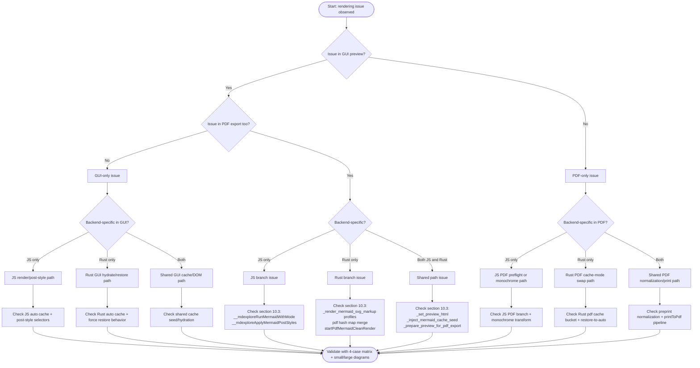
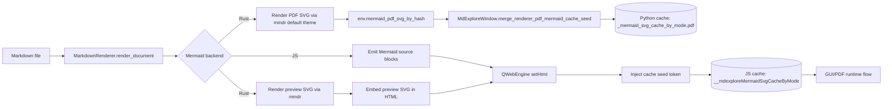
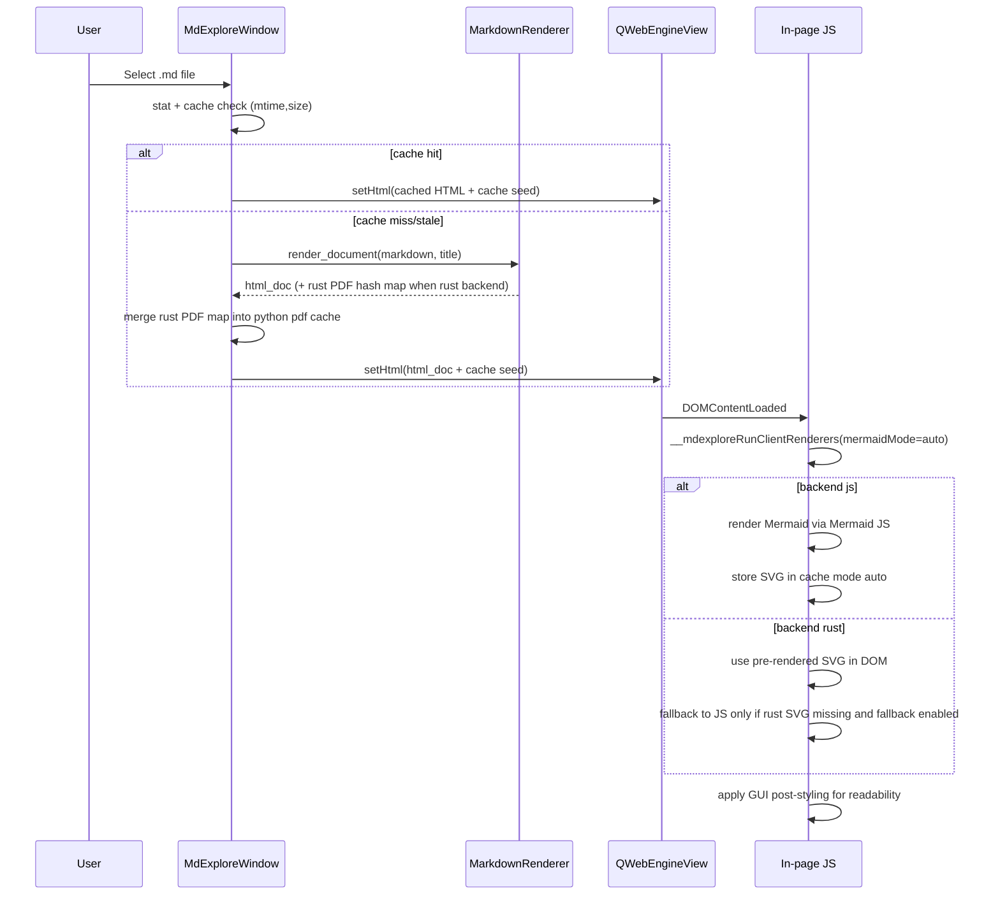
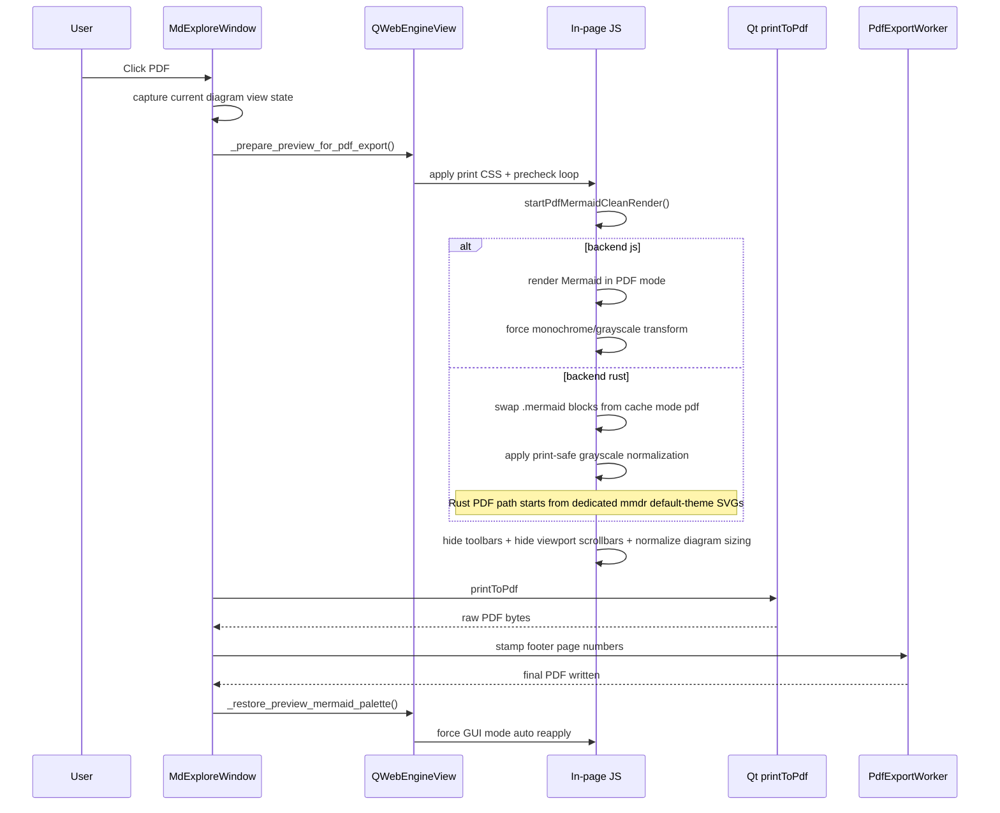
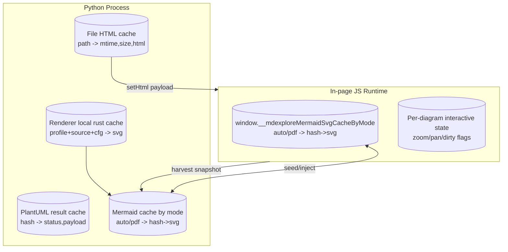

# mdexplore Render Paths

This document is the render/caching map for `mdexplore`.
It complements `UML.md` by going deep on the render forks and cache ownership.

Use this file before changing Mermaid, PlantUML, preview caching, or PDF export.

## 0. One-Page Triage Card

Use this as the fast incident-response path before going deep.

### Quick Procedure

1. Reproduce on one file with Mermaid diagrams.
2. Run the 4-case matrix in order:
   - JS GUI
   - JS PDF
   - Rust GUI
   - Rust PDF
3. Classify failure scope:
   - only GUI,
   - only PDF,
   - only Rust,
   - only JS,
   - all branches.
4. Jump directly to the matching code waypoints in section `10.3`.
5. Verify fix with both:
   - one small-diagram file,
   - one large multi-diagram file.

### Command Checklist (Copy/Paste)

Use these commands from the project root (`/home/npepin/Projects/mdexplore`).

```bash
# 1) Launch with JS backend (baseline)
./mdexplore.sh --mermaid-backend js test
```

```bash
# 2) Launch with Rust backend (target branch)
./mdexplore.sh --mermaid-backend rust test
```

```bash
# 3) Force explicit Rust binary if needed
MDEXPLORE_MERMAID_RS_BIN=/home/npepin/.cargo/bin/mmdr \
  ./mdexplore.sh --mermaid-backend rust test
```

```bash
# 4) Open canonical small-diagram file during test run
./mdexplore.sh --mermaid-backend rust test/ARCHITECTURE.md
```

```bash
# 5) Open canonical large multi-diagram file (quoted path)
./mdexplore.sh --mermaid-backend rust "test/2026-02-25 RPF_Response_MCP_Proposal.md"
```

```bash
# 6) Fast quality gates after code edits
bash -n mdexplore.sh
python3 -m py_compile mdexplore.py
```

### Standard Verification Sequence

For each backend (`js`, `rust`) and each file (small + large):

1. Open file and confirm GUI diagram colors/layout.
2. Export PDF and confirm PDF Mermaid path for that backend.
3. Return to GUI and confirm preview styling is restored.
4. Re-open same file in same app run and verify cache path still behaves.

### Decision Tree



### Immediate Red Flags

- Rust PDF output looks like GUI output.
  - likely mode mix-up (`auto` used where `pdf` expected).
- GUI remains white/print-styled after PDF export.
  - likely restore-to-`auto` did not reapply.
- Mermaid in PDF is tiny relative to page width.
  - likely width/height attr normalization incomplete.
- Only large diagrams fail.
  - likely `setHtml` payload/temporary-file load path and timing interactions.

## 1. Scope and Intent

`mdexplore` has multiple render branches:

- GUI preview vs PDF export mode.
- Mermaid JS backend vs Rust Mermaid backend (`mmdr`).
- Python-side render/cache responsibilities vs in-page JavaScript responsibilities.

The main maintenance risk is crossing these concerns and accidentally reusing
the wrong SVG variant (for example reusing GUI-adjusted SVGs in PDF mode).

## 2. Render Mode Matrix

| Mode | Mermaid Backend | SVG Source | Post-processing | Primary Cache Bucket |
|---|---|---|---|---|
| GUI | JS | Mermaid JS runtime (`mermaid.render`) | GUI contrast/style tuning | `auto` |
| GUI | Rust | `mmdr` preview profile (Python) | GUI contrast/style tuning | `auto` |
| PDF | JS | Mermaid JS runtime in PDF preflight | print monochrome/grayscale transform | `pdf` |
| PDF | Rust | `mmdr` PDF profile (default theme, Python) | print-safe grayscale normalization (multi-shade) | `pdf` |

## 3. End-to-End Ownership



## 4. GUI Preview Path



## 5. PDF Export Path



## 6. Cache Architecture



## 7. Critical Invariants

- Keep Mermaid cache separation by mode (`auto` vs `pdf`).
- Rust PDF output must come from the dedicated Rust PDF render profile, not GUI SVG.
- GUI Mermaid post-processing must not run on Rust PDF SVGs.
- Rust PDF path may apply print-safe grayscale normalization after selecting
  the dedicated Rust PDF SVG source.
- PDF preflight must hide interactive controls (toolbars/scrollbars) before snapshot.
- Post-export restore must force a GUI-mode reapply.

## 8. Failure and Fallback Rules

- Rust backend unavailable:
  - app falls back to JS backend and reports warning.
- Rust render missing SVG for a block:
  - GUI path may JS-fallback unless disabled for that operation.
  - PDF path reports explicit Mermaid failure for that block if no PDF SVG exists.
- PlantUML failure:
  - render placeholder becomes detailed error text; markdown stays visible.
- Stale cache safety:
  - file cache keyed by `mtime_ns` and `size`; changed files are re-rendered.

## 9. Known TODO

- Diagram zoom/pan state restore across document switches is still not fully reliable
  for all Mermaid/PlantUML navigation sequences in one app run.
- See `AGENTS.md` for attempted approaches and constraints.

## 10. Debugging Playbook (Human + Agent)

This section is a practical troubleshooting guide for render regressions.
Use it when behavior deviates from expectations.

### 10.1 First Principles

- Always isolate by branch first:
  - GUI vs PDF.
  - Mermaid backend `js` vs `rust`.
  - Small diagram vs large diagram.
- Keep one variable changing per test run.
- Verify whether failure is:
  - source generation,
  - cache selection,
  - in-page transform,
  - restore after PDF.

### 10.2 Fast Isolation Matrix

Run these four cases on the same markdown file with Mermaid:

| Case | Backend | Path | Expected |
|---|---|---|---|
| A | JS | GUI | dark-theme tuned Mermaid in preview |
| B | JS | PDF | monochrome/grayscale Mermaid in PDF |
| C | Rust | GUI | dark-theme tuned Mermaid in preview |
| D | Rust | PDF | dedicated Rust PDF SVG + print-safe grayscale normalization |

If only one case fails, debug that branch first.  
If all fail, suspect shared setup (asset loading, cache seed injection, or broken JS runtime).

### 10.3 Key Code Waypoints

Use these anchors in `mdexplore.py` while debugging:

- Mermaid render profile split:
  - `MarkdownRenderer._render_mermaid_svg_markup(..., render_profile=...)`
- Rust PDF SVG capture:
  - `env["mermaid_pdf_svg_by_hash"]` in `render_document()`
  - `take_last_mermaid_pdf_svg_by_hash()`
  - `MdExploreWindow._merge_renderer_pdf_mermaid_cache_seed()`
- HTML injection path:
  - `_inject_mermaid_cache_seed(...)`
- In-page runtime orchestration:
  - `window.__mdexploreRunMermaidWithMode(...)`
  - `startPdfMermaidCleanRender(...)`
  - `window.__mdexploreApplyMermaidPostStyles(...)`
- PDF mode entry/exit:
  - `_prepare_preview_for_pdf_export(...)`
  - `_trigger_pdf_print(...)`
  - `_restore_preview_mermaid_palette(...)`

### 10.4 Symptom -> Likely Cause -> Next Check

| Symptom | Likely Cause | Next Check |
|---|---|---|
| Rust PDF still shows GUI colors | wrong SVG source reused | verify Rust PDF path is pulling cache mode `pdf`, not current DOM |
| GUI stays white after PDF (Rust) | restore did not reapply `auto` SVG | verify `_restore_preview_mermaid_palette` forces mode `auto` and Rust branch honors `force` |
| PDF Mermaid tiny on page | width/height attrs not normalized | verify print preflight strips width/height attrs and sets width/max-width/height |
| GUI Mermaid labels too dark | post-style function missed selector class | inspect `__mdexploreApplyMermaidPostStyles` for diagram-kind-specific logic |
| Random “Preview load failed” on heavy files | `setHtml` payload too large / transient web load issue | verify temp-file fallback path in `_set_preview_html` and check status/log output |
| Rust fallback unexpectedly using JS in PDF | fallback guard missing in PDF stage | verify Rust PDF branch does not trigger JS fallback render path |
| Sequence diagram labels invisible in PDF | label content not normalized to dark text | verify grayscale pass handles both SVG text and foreignObject HTML labels |

### 10.5 Runtime Inspection Steps (Inside Running App)

When the preview is open, inspect these JS objects from the page context:

- `window.__mdexploreMermaidBackend`
- `window.__mdexploreMermaidSvgCacheByMode`
- `window.__mdexploreMermaidPaletteMode`
- `window.__mdexplorePdfMermaidReady`
- `window.__mdexplorePdfMermaidError`

Pedagogical check sequence:

1. Confirm backend matches intent (`js` or `rust`).
2. Confirm both cache buckets exist (`auto` and `pdf`).
3. Confirm target diagram hash exists in expected bucket.
4. Confirm SVG payload in that bucket actually contains `<svg`.
5. Confirm active Mermaid mode (`auto`/`pdf`) matches current operation.

### 10.6 Cache and Ownership Sanity Rules

Treat these as hard assertions:

- Python cache ownership:
  - source of truth for injected seed snapshot at page load.
- JS cache ownership:
  - source of truth for in-page re-render/re-hydrate operations.
- Cross-mode safety:
  - `auto` and `pdf` caches must never be mixed.
- Rust profile safety:
  - preview profile output and PDF profile output are intentionally different artifacts.

### 10.7 Practical Reproduction Protocol

Use this exact sequence to reproduce and verify fixes:

1. Launch with JS backend and test one file (`GUI -> PDF -> GUI`).
2. Launch with Rust backend and repeat same file (`GUI -> PDF -> GUI`).
3. Repeat with:
  - one small Mermaid diagram file,
  - one large multi-diagram file.
4. For Rust, verify:
  - GUI returns to dark-tuned view after PDF export,
  - PDF starts from dedicated Rust PDF SVGs and remains readable after grayscale normalization.
5. Re-open the file in same app session and ensure cache path still behaves.

### 10.8 Logging and Instrumentation Strategy

When uncertain, add temporary, narrow logging at branch points:

- entering/exiting PDF mode,
- selecting Mermaid mode (`auto`/`pdf`),
- backend switch (`js`/`rust`),
- hash lookup misses per mode,
- restore completion path.

Remove or gate verbose logs after confirming the fix.

### 10.9 Acceptance Criteria for Render Fixes

A Mermaid/PDF fix is complete only when all are true:

- No regression in JS GUI preview.
- No regression in Rust GUI preview.
- JS PDF still produces readable print-safe output.
- Rust PDF uses dedicated Rust PDF SVG path before grayscale normalization.
- GUI view restores correctly after PDF export.
- Behavior holds for both small and large diagrams.
- Documentation (`README.md`, `AGENTS.md`, `RENDER-PATHS.md`) reflects the final path.
