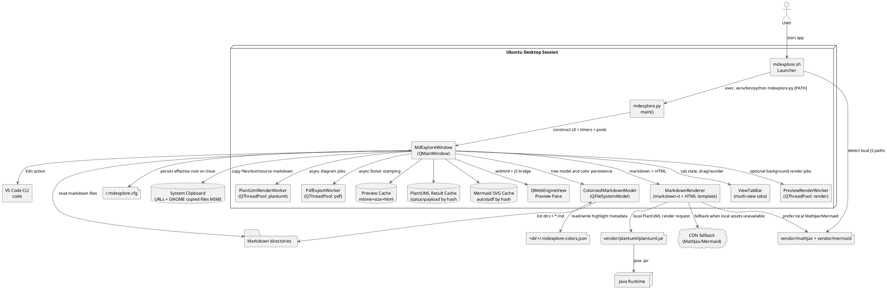
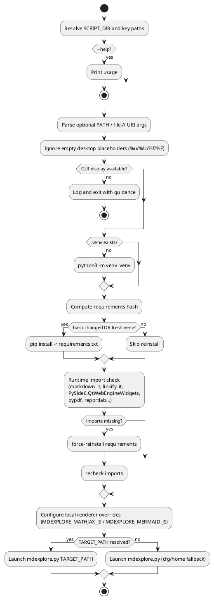
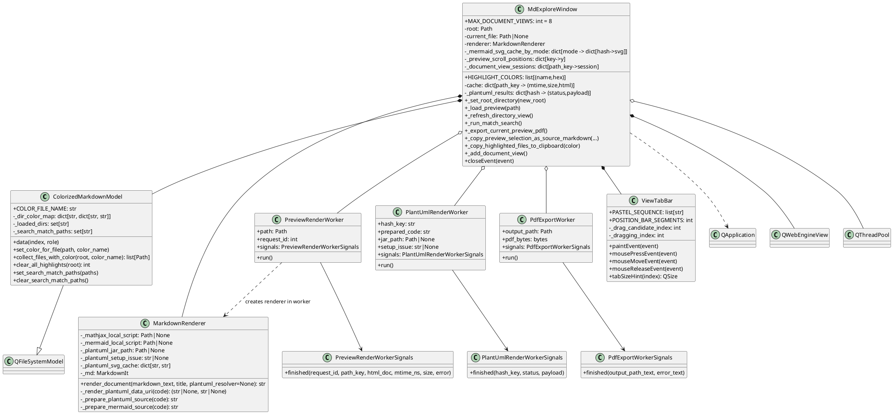
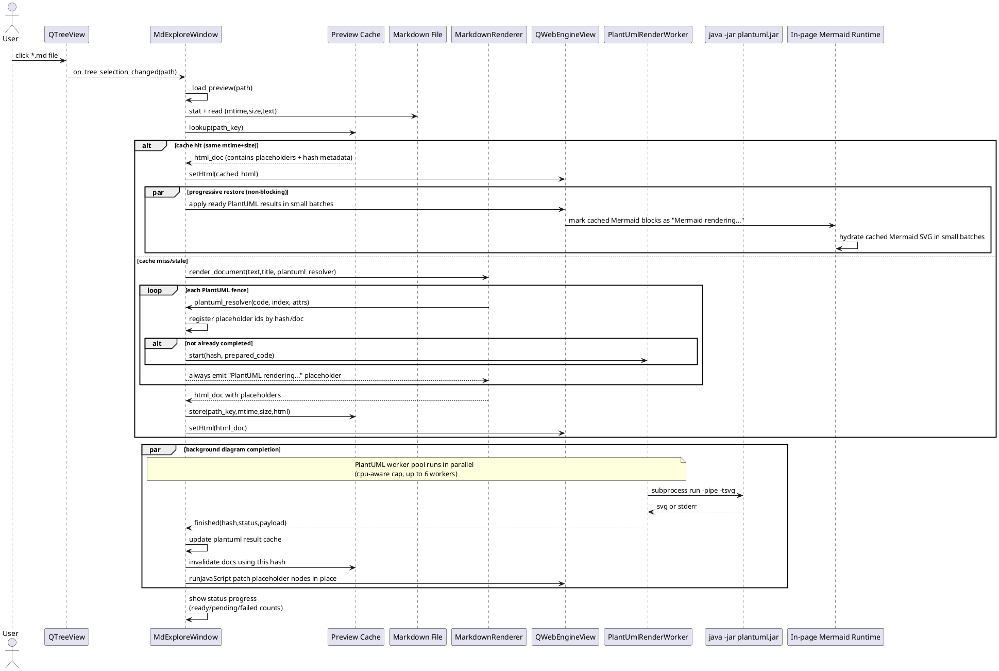
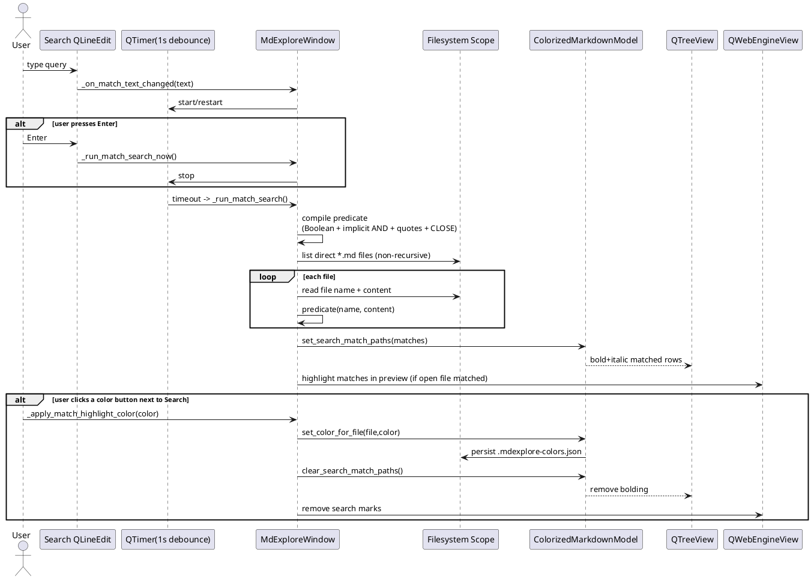
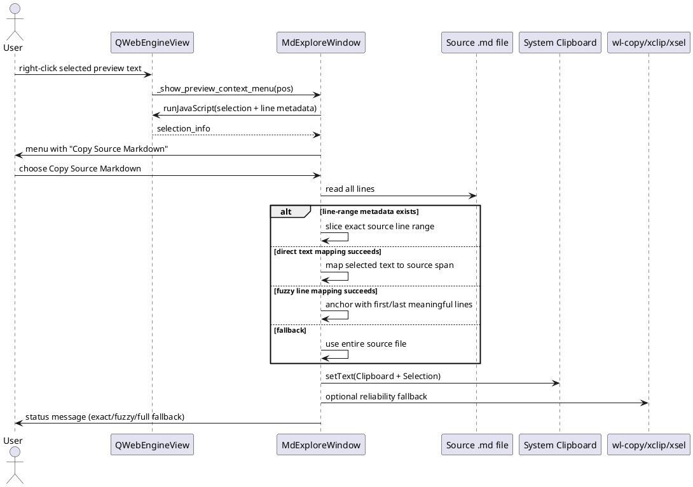
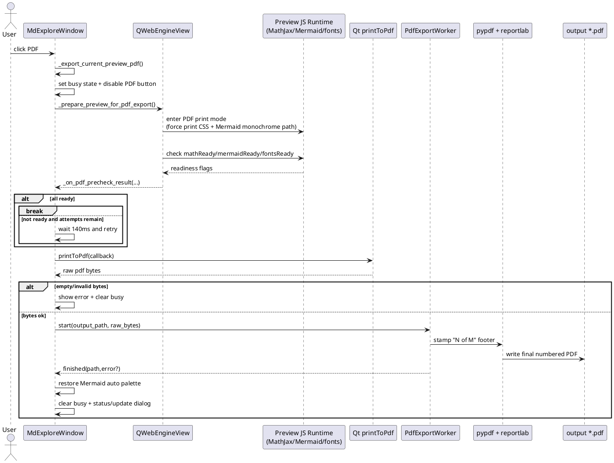
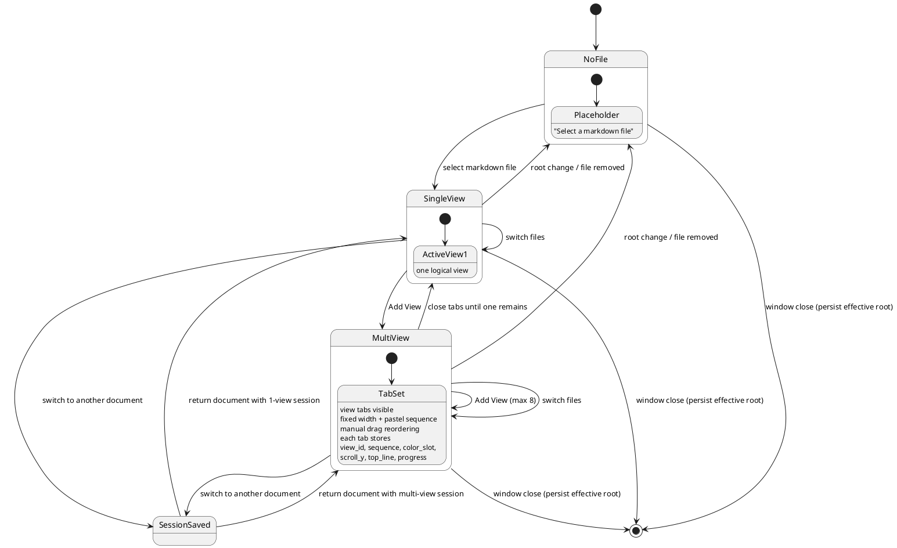

# mdexplore UML

This document provides a comprehensive PlantUML view of the current `mdexplore` implementation.
All diagrams are embedded so they can be rendered directly by mdexplore (or any Markdown viewer with PlantUML support).

## 1. System Architecture

## 2. Launcher Runtime Activity (`mdexplore.sh`)

## 3. Core Class Diagram

## 4. Preview Load + Progressive Diagram Restore

## 5. Search + Highlight + Apply Color Flow

## 6. Preview Context Menu: Copy Source Markdown

## 7. PDF Export Pipeline

## 8. Document View/Tab Lifecycle

## Notes

- Diagrams are based on current code in `mdexplore.py` and `mdexplore.sh`.
- Worker/threadpool usage is intentionally separated by concern:
  - render pool (preview HTML jobs),
  - PlantUML pool (diagram jobs),
  - PDF pool (post-processing/stamping).
- PlantUML rendering is non-blocking in UI flow: placeholders are rendered first, then patched in place as jobs finish.
- TODO (known issue): diagram zoom/pan restore (Mermaid and PlantUML) is not
  yet consistently reliable when leaving a document and returning in the same app run.
