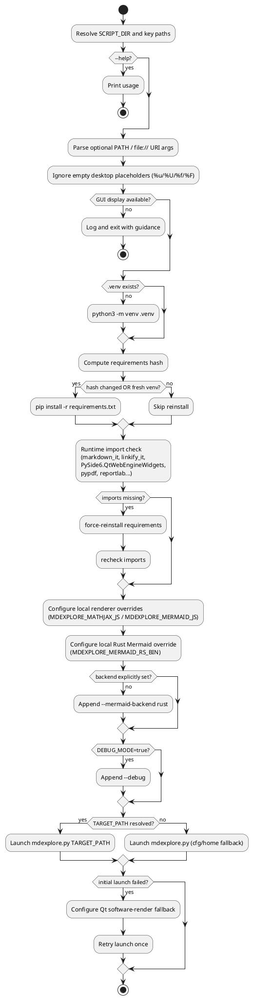
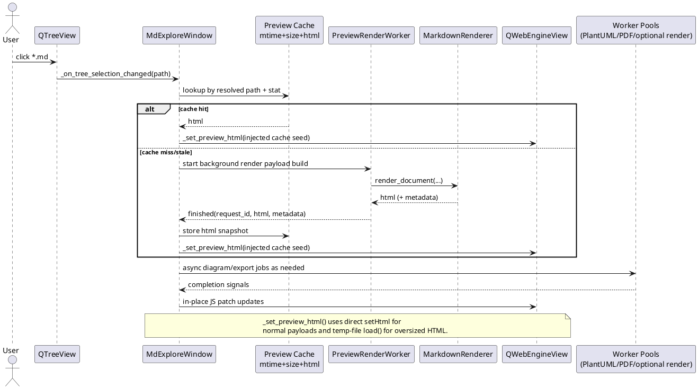
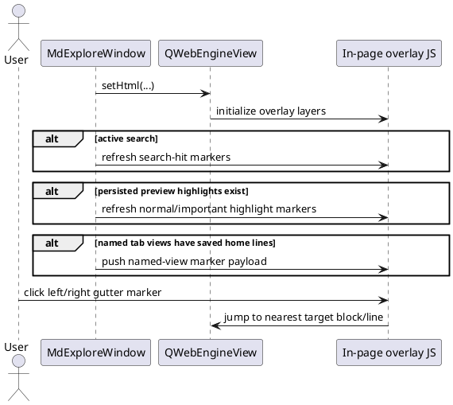
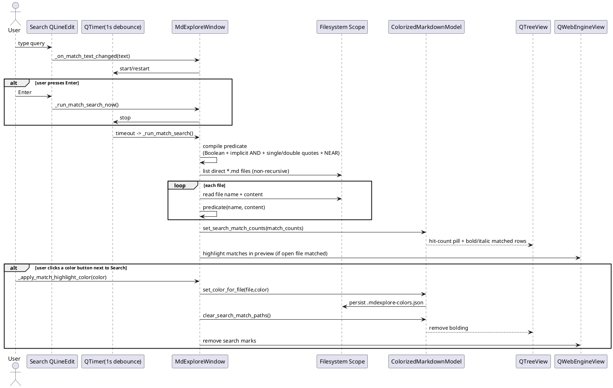
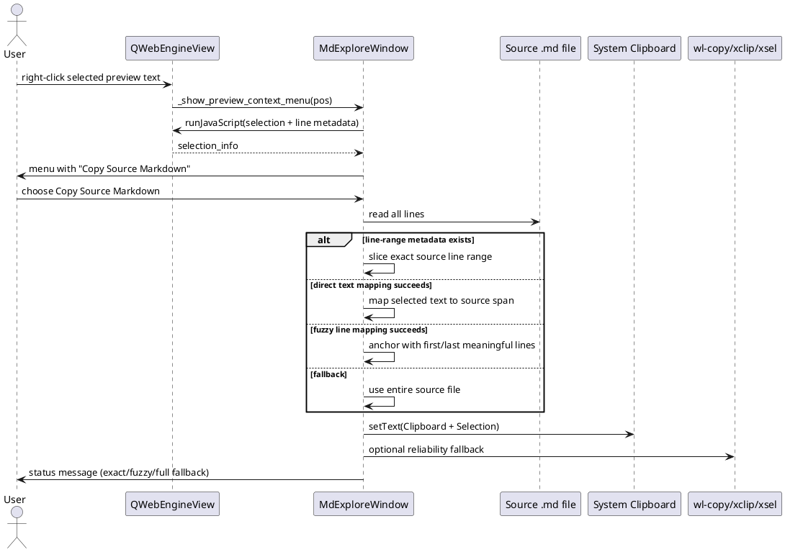
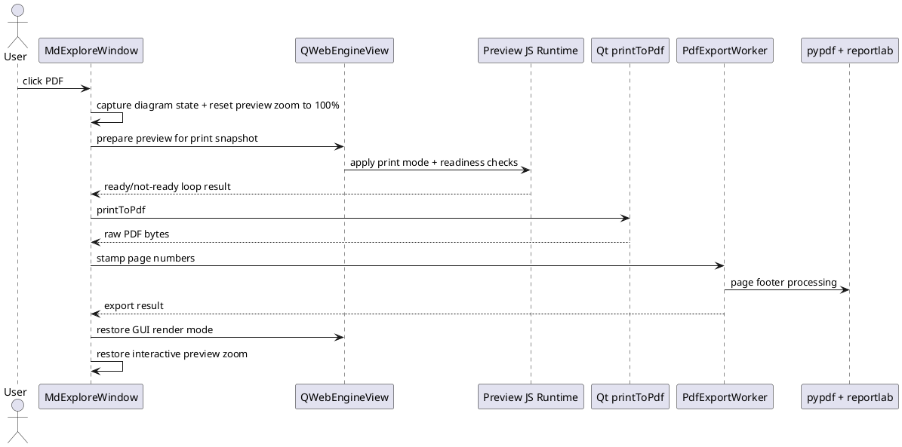
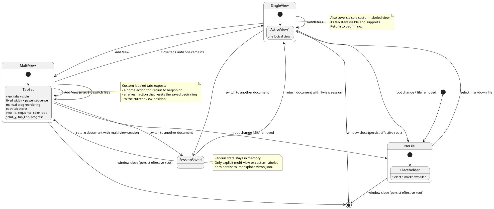

# mdexplore UML

This document provides a subsystem-level PlantUML view of the current
`mdexplore` implementation across `mdexplore.py`, `mdexplore.sh`, and
`mdexplore_app/*`.
All diagrams are embedded so they can be rendered directly by mdexplore (or any Markdown viewer with PlantUML support).

Detailed render/caching forks (GUI vs PDF, JS Mermaid vs Rust Mermaid, cache mode
ownership, and restore behavior) are intentionally consolidated in the deeper
render/debugging sections of `DEVELOPERS-AGENTS.md`.
This UML file keeps those areas abstracted at system/class boundaries to avoid
duplicating low-level render logic across two docs.

Low-risk modularization note: support code now lives in `mdexplore_app/`
(`constants.py`, `runtime.py`, `search.py`, `templates.py`, `pdf.py`,
`icons.py`, `workers.py`, `tree.py`, `tabs.py`), while the main orchestration,
renderer/template wiring, and UI state machine remain in `mdexplore.py`. The
diagrams below show that split at subsystem boundaries rather than expanding
every extracted helper inline.

## 1. System Architecture

```plantuml
@startuml
skinparam componentStyle rectangle
skinparam shadowing false
skinparam ArrowColor #4b5563
skinparam defaultTextAlignment center

actor User

node "Ubuntu Desktop Session" as Desktop {
  component "mdexplore.sh\nLauncher" as Launcher
  component "mdexplore.py\nmain()" as AppEntry
  component "MdExploreWindow\n(QMainWindow)" as Window
  package "mdexplore_app\nsupport package" as Support {
    component "constants.py" as ConstantsSupport
    component "runtime.py" as RuntimeSupport
    component "search.py" as SearchSupport
    component "templates.py" as TemplateSupport
    component "pdf.py" as PdfSupport
    component "icons.py" as IconSupport
    component "tree.py" as TreeSupport
    component "tabs.py" as TabSupport
    component "workers.py" as WorkerSupport
  }
  component "QWebEngineView\nPreview Pane" as WebView
  component "ColorizedMarkdownModel\n(QFileSystemModel)" as Model
  component "MarkdownTreeItemDelegate\n(tree row painter)" as TreeDelegate
  component "MarkdownRenderer\n(markdown-it + HTML template)" as Renderer
  component "ViewTabBar\n(multi-view tabs)" as ViewTabs
  component "PreviewRenderWorker\n(QThreadPool: render)" as PreviewWorker
  component "TreeMarkerScanWorker\n(QThreadPool: sidecar scan)" as MarkerWorker
  component "PlantUmlRenderWorker\n(QThreadPool: plantuml)" as PumlWorker
  component "PdfExportWorker\n(QThreadPool: pdf)" as PdfWorker
  component "mmdr\n(Rust Mermaid renderer)" as MermaidRs
  database "Preview Cache\nmtime+size+html" as PreviewCache
  database "PlantUML Result Cache\nstatus/payload by hash" as PumlCache
  database "Mermaid SVG Cache\nauto/pdf by hash" as MermaidCache
}

folder "Markdown directories" as MdFS
file "~/.mdexplore.cfg" as UserCfg
file "<dir>/.mdexplore-colors.json" as ColorCfg
file "<dir>/.mdexplore-views.json" as ViewCfg
file "<dir>/.mdexplore-highlighting.json" as HighlightCfg
folder "User-selected copy target directory" as CopyTargetDir
database "System Clipboard\nURLs + GNOME copied-files MIME" as Clipboard
component "VS Code CLI\ncode" as Vscode
file "vendor/plantuml/plantuml.jar" as PlantJar
node "Java Runtime" as Java
file "vendor/mathjax + vendor/mermaid" as LocalAssets
cloud "CDN fallback\n(MathJax/Mermaid)" as CDN

User --> Launcher : start app
Launcher --> AppEntry : exec .venv/bin/python mdexplore.py [PATH]
Launcher --> LocalAssets : detect local JS paths
AppEntry --> Window : construct UI + timers + pools
Window --> Model : tree model, search-hit counts,\nand badge persistence
Window --> TreeDelegate : filename-only background painting
Window --> WebView : setHtml/load + JS bridge
Window --> Renderer : markdown -> HTML
Window --> ViewTabs : tab state, drag/reorder
Window --> PreviewWorker : background preview render on cache miss/stale
Window --> MarkerWorker : async sidecar badge scans
Window --> PumlWorker : async diagram jobs
Window --> PdfWorker : async footer stamping
Window --> PreviewCache
Window --> PumlCache
Window --> MermaidCache
Window --> ConstantsSupport
Window --> RuntimeSupport
Window --> SearchSupport
Window --> PdfSupport
Window --> IconSupport
Window --> TreeSupport
Window --> TabSupport
Window --> WorkerSupport

Model --> MdFS : list dirs + *.md
Model <--> ColorCfg : read/write highlight metadata
Window <--> UserCfg : persist effective root on close
Window <--> ViewCfg : persist saved view sessions
Window <--> HighlightCfg : persist preview text highlights
Window --> CopyTargetDir : copy selected files (directory mode)
Window --> ColorCfg : merge copied-file color metadata (directory mode)
Window --> ViewCfg : merge copied-file view metadata (directory mode)
Window --> HighlightCfg : merge copied-file highlight metadata (directory mode)
MarkerWorker --> ViewCfg : scan persisted view state
MarkerWorker --> HighlightCfg : scan persisted preview highlights
Window --> Clipboard : copy files/text/source markdown
Window --> Vscode : Edit action
Renderer --> MermaidRs : local Rust Mermaid render request
Renderer --> PlantJar : direct PlantUML render when no async resolver
Renderer --> TemplateSupport : render preview/document.html
PumlWorker --> PlantJar : async PlantUML render request
PlantJar --> Java : java -jar
Renderer --> LocalAssets : prefer local MathJax/Mermaid
Renderer --> CDN : fallback when local assets unavailable
Window --> MdFS : read markdown files
@enduml
```

## 2. Launcher Runtime Activity (`mdexplore.sh`)

```plantuml
@startuml
start
:Resolve SCRIPT_DIR and key paths;
if (--help?) then (yes)
  :Print usage;
  stop
endif

:Parse optional PATH / file:// URI args;
:Ignore empty desktop placeholders (%u/%U/%f/%F);
if (GUI display available?) then (no)
  :Log and exit with guidance;
  stop
endif

if (.venv exists?) then (no)
  :python3 -m venv .venv;
endif

:Compute requirements hash;
if (hash changed OR fresh venv?) then (yes)
  :pip install -r requirements.txt;
else (no)
  :Skip reinstall;
endif

:Runtime import check
(markdown_it, linkify_it,
PySide6.QtWebEngineWidgets,
pypdf, reportlab...);
if (imports missing?) then (yes)
  :force-reinstall requirements;
  :recheck imports;
endif

:Configure local renderer overrides
(MDEXPLORE_MATHJAX_JS / MDEXPLORE_MERMAID_JS);
:Configure local Rust Mermaid override
(MDEXPLORE_MERMAID_RS_BIN);
if (backend explicitly set?) then (no)
  :Append --mermaid-backend rust;
endif
if (DEBUG_MODE=true?) then (yes)
  :Append --debug;
endif
if (TARGET_PATH resolved?) then (yes)
  :Launch mdexplore.py TARGET_PATH;
else (no)
  :Launch mdexplore.py (cfg/home fallback);
endif
if (initial launch failed?) then (yes)
  :Configure Qt software-render fallback;
  :Retry launch once;
endif
stop
@enduml
```

## 3. Core Class Diagram

```plantuml
@startuml
skinparam classAttributeIconSize 0
skinparam shadowing false

class ColorizedMarkdownModel {
  +COLOR_FILE_NAME: str
  -_dir_color_map: dict[str, dict[str, str]]
  -_loaded_dirs: set[str]
  -_search_match_counts: dict[str, int]
  -_multi_view_paths: set[str]
  -_highlighted_preview_paths: set[str]
  +data(index, role)
  +set_color_for_file(path, color_name)
  +collect_files_with_color(root, color_name): list[Path]
  +clear_directory_highlights(directory): int
  +clear_all_highlights(root): int
  +color_for_file(path): str|None
  +set_search_match_counts(match_counts)
  +clear_search_match_paths()
  +set_multi_view_paths(paths)
  +set_persistent_highlight_paths(paths)
}

class MarkdownTreeItemDelegate {
  +paint(painter, option, index)
}

class MarkdownRenderer {
  -_mermaid_backend_requested: str
  -_mermaid_backend: str
  -_mermaid_rs_binary: Path|None
  -_mermaid_rs_setup_issue: str|None
  -_mathjax_local_script: Path|None
  -_mermaid_local_script: Path|None
  -_plantuml_jar_path: Path|None
  -_plantuml_setup_issue: str|None
  -_plantuml_svg_cache: dict[str, str]
  -_last_mermaid_pdf_svg_by_hash: dict[str, str]
  -_md: MarkdownIt
  +render_document(markdown_text, title, total_lines=None, plantuml_resolver=None): str
  +take_last_mermaid_pdf_svg_by_hash(): dict[str, str]
  -_render_plantuml_data_uri(code): (str|None, str|None)
  -_prepare_plantuml_source(code): str
  -_prepare_mermaid_source(code): str
}

class PreviewRenderWorker {
  +path: Path
  +request_id: int
  +signals: PreviewRenderWorkerSignals
  +run()
}
class PreviewRenderWorkerSignals {
  +finished(request_id, path_key, html_doc, mtime_ns, size, error)
}

class PlantUmlRenderWorker {
  +hash_key: str
  +prepared_code: str
  +jar_path: Path|None
  +setup_issue: str|None
  +signals: PlantUmlRenderWorkerSignals
  +run()
}
class PlantUmlRenderWorkerSignals {
  +finished(hash_key, status, payload)
}

class PdfExportWorker {
  +output_path: Path
  +pdf_bytes: bytes
  +signals: PdfExportWorkerSignals
  +run()
}
class PdfExportWorkerSignals {
  +finished(output_path_text, error_text)
}

class TreeMarkerScanWorker {
  +root: Path
  +request_id: int
  +views_file_name: str
  +highlighting_file_name: str
  +signals: TreeMarkerScanWorkerSignals
  +run()
}
class TreeMarkerScanWorkerSignals {
  +finished(request_id, root_key, multi_view_paths, highlighted_paths, error_text)
}

class ViewTabBar {
  +PASTEL_SEQUENCE: list[str]
  +POSITION_BAR_SEGMENTS: int
  +MAX_LABEL_CHARS: int
  +homeRequested(tab_index)
  +beginningResetRequested(tab_index)
  -_drag_candidate_index: int
  -_dragging_index: int
  +paintEvent(event)
  +mousePressEvent(event)
  +mouseMoveEvent(event)
  +mouseReleaseEvent(event)
  +tabSizeHint(index): QSize
}

class MdExploreWindow {
  +MAX_DOCUMENT_VIEWS: int = 8
  +HIGHLIGHT_COLORS: list[(name,hex)]
  -root: Path
  -current_file: Path|None
  -renderer: MarkdownRenderer
  -cache: dict[path_key -> (mtime,size,html)]
  -_plantuml_results: dict[hash -> (status,payload)]
  -_mermaid_svg_cache_by_mode: dict[mode -> dict[hash->svg]]
  -_tree_multi_view_marker_paths: set[str]
  -_tree_highlight_marker_paths: set[str]
  -_preview_scroll_positions: dict[key->y]
  -_document_view_sessions: dict[path_key->session]
  -_current_preview_text_highlights: list[dict]
  +_set_root_directory(new_root)
  +_load_preview(path)
  +_refresh_directory_view()
  +_refresh_tree_multi_view_markers()
  +_start_tree_marker_scan()
  +_on_tree_marker_scan_finished(...)
  +_refresh_named_view_markers_in_preview()
  +_run_match_search()
  +_export_current_preview_pdf()
  +_copy_preview_selection_as_source_markdown(...)
  +_copy_destination_is_directory(): bool
  +_copy_files_to_directory_with_metadata(files)
  +_merge_copied_file_metadata(source_dest_pairs, target_directory)
  +_copy_current_preview_file_to_clipboard()
  +_copy_highlighted_files_to_clipboard(color, color_name)
  +_confirm_and_clear_directory_highlighting(scope)
  +_confirm_and_clear_all_highlighting(scope)
  +_add_document_view()
  +closeEvent(event)
}

class "mdexplore_app.constants" as ConstantsSupportBoundary
class "mdexplore_app.runtime" as RuntimeSupportBoundary
class "mdexplore_app.search" as SearchSupportBoundary
class "mdexplore_app.templates" as TemplateSupportBoundary
class "mdexplore_app.pdf" as PdfSupportBoundary
class "mdexplore_app.icons" as IconSupportBoundary
class "mdexplore_app.tree" as TreeSupportBoundary
class "mdexplore_app.tabs" as TabSupportBoundary
class "mdexplore_app.workers" as WorkerSupportBoundary

class QApplication
class QWebEngineView
class QFileSystemModel
class QThreadPool
class QStyledItemDelegate

MdExploreWindow *-- MarkdownRenderer
MdExploreWindow *-- ColorizedMarkdownModel
MdExploreWindow *-- MarkdownTreeItemDelegate
MdExploreWindow *-- ViewTabBar
MdExploreWindow *-- QWebEngineView
MdExploreWindow o-- PreviewRenderWorker
MdExploreWindow o-- TreeMarkerScanWorker
MdExploreWindow o-- PlantUmlRenderWorker
MdExploreWindow o-- PdfExportWorker
MdExploreWindow o-- QThreadPool
ColorizedMarkdownModel --|> QFileSystemModel
MarkdownTreeItemDelegate --|> QStyledItemDelegate
PreviewRenderWorker --> PreviewRenderWorkerSignals
TreeMarkerScanWorker --> TreeMarkerScanWorkerSignals
PlantUmlRenderWorker --> PlantUmlRenderWorkerSignals
PdfExportWorker --> PdfExportWorkerSignals
PreviewRenderWorker ..> MarkdownRenderer : creates renderer in worker
MdExploreWindow ..> QApplication
MdExploreWindow ..> ConstantsSupportBoundary
MdExploreWindow ..> RuntimeSupportBoundary
MdExploreWindow ..> SearchSupportBoundary
MdExploreWindow ..> PdfSupportBoundary
MdExploreWindow ..> IconSupportBoundary
MdExploreWindow ..> TreeSupportBoundary
MdExploreWindow ..> TabSupportBoundary
MdExploreWindow ..> WorkerSupportBoundary
ColorizedMarkdownModel ..> IconSupportBoundary
ColorizedMarkdownModel ..> RuntimeSupportBoundary
ColorizedMarkdownModel ..> TreeSupportBoundary
ViewTabBar ..> TabSupportBoundary
MarkdownRenderer ..> ConstantsSupportBoundary
MarkdownRenderer ..> TemplateSupportBoundary
@enduml
```

## 4. Preview Pipeline (Abstracted)

The detailed render/cache branches are covered in the render/debugging sections
of `DEVELOPERS-AGENTS.md`. This section intentionally keeps an architectural
boundary view only.

```plantuml
@startuml
actor User
participant "QTreeView" as Tree
participant "MdExploreWindow" as Win
participant "Preview Cache\nmtime+size+html" as Cache
participant "PreviewRenderWorker" as Worker
participant "MarkdownRenderer" as Renderer
participant "QWebEngineView" as Web
participant "Worker Pools\n(PlantUML/PDF/optional render)" as Pools

User -> Tree : click *.md
Tree -> Win : _on_tree_selection_changed(path)
Win -> Cache : lookup by resolved path + stat

alt cache hit
  Cache --> Win : html
  Win -> Web : _set_preview_html(injected cache seed)
else cache miss/stale
  Win -> Worker : start background render payload build
  Worker -> Renderer : render_document(...)
  Renderer --> Worker : html (+ metadata)
  Worker --> Win : finished(request_id, html, metadata)
  Win -> Cache : store html snapshot
  Win -> Web : _set_preview_html(injected cache seed)
end

Win -> Pools : async diagram/export jobs as needed
Pools --> Win : completion signals
Win -> Web : in-place JS patch updates
note over Win,Web
  _set_preview_html() uses direct setHtml for
  normal payloads and temp-file load() for oversized HTML.
end note
@enduml
```

## 4.1 Preview Navigation Overlays

These are intentionally shown here only as boundary-level UI overlays. The
exact DOM/CSS/JS mechanics remain in the deeper render/debugging sections of
`DEVELOPERS-AGENTS.md`.

```plantuml
@startuml
actor User
participant "MdExploreWindow" as Win
participant "QWebEngineView" as Web
participant "In-page overlay JS" as Overlay

Win -> Web : setHtml(...)
Web -> Overlay : initialize overlay layers

alt active search
  Win -> Overlay : refresh search-hit markers
end

alt persisted preview highlights exist
  Win -> Overlay : refresh normal/important highlight markers
end

alt named tab views have saved home lines
  Win -> Overlay : push named-view marker payload
end

User -> Overlay : click left/right gutter marker
Overlay -> Web : jump to nearest target block/line
@enduml
```

## 5. Search + Highlight + Apply Color Flow

```plantuml
@startuml
actor User
participant "Search QLineEdit" as Search
participant "QTimer(1s debounce)" as Debounce
participant "MdExploreWindow" as Win
participant "Filesystem Scope" as Scope
participant "ColorizedMarkdownModel" as Model
participant "QTreeView" as Tree
participant "QWebEngineView" as Web

User -> Search : type query
Search -> Win : _on_match_text_changed(text)
Win -> Debounce : start/restart

alt user presses Enter
  User -> Search : Enter
  Search -> Win : _run_match_search_now()
  Win -> Debounce : stop
end

Debounce -> Win : timeout -> _run_match_search()
Win -> Win : compile predicate\n(Boolean + implicit AND + single/double quotes + NEAR)
Win -> Scope : list direct *.md files (non-recursive)
loop each file
  Win -> Scope : read file name + content
  Win -> Win : predicate(name, content)
end
Win -> Model : set_search_match_counts(match_counts)
Model --> Tree : hit-count pill + bold/italic matched rows
Win -> Web : highlight matches in preview (if open file matched)

alt user clicks a color button next to Search
  User -> Win : _apply_match_highlight_color(color)
  Win -> Model : set_color_for_file(file,color)
  Model -> Scope : persist .mdexplore-colors.json
  Win -> Model : clear_search_match_paths()
  Model --> Tree : remove bolding
  Win -> Web : remove search marks
end
@enduml
```

Search semantics note:

- unquoted terms are case-insensitive,
- double-quoted phrases are case-insensitive and preserve spaces,
- single-quoted phrases are case-sensitive and preserve spaces,
- only the opening quote character closes a quoted term, so apostrophes inside
  double-quoted phrases stay literal,
- `NEAR(...)` requires distinct qualifying occurrences per term, and
  single-word NEAR terms use word boundaries for proximity matching.

## 6. Preview Context Menu: Copy Source Markdown

```plantuml
@startuml
actor User
participant "QWebEngineView" as Web
participant "MdExploreWindow" as Win
participant "Source .md file" as Src
participant "System Clipboard" as Clip
participant "wl-copy/xclip/xsel" as CliClip

User -> Web : right-click selected preview text
Web -> Win : _show_preview_context_menu(pos)
Win -> Web : runJavaScript(selection + line metadata)
Web --> Win : selection_info
Win -> User : menu with "Copy Source Markdown"
User -> Win : choose Copy Source Markdown
Win -> Src : read all lines

alt line-range metadata exists
  Win -> Win : slice exact source line range
else direct text mapping succeeds
  Win -> Win : map selected text to source span
else fuzzy line mapping succeeds
  Win -> Win : anchor with first/last meaningful lines
else fallback
  Win -> Win : use entire source file
end

Win -> Clip : setText(Clipboard + Selection)
Win -> CliClip : optional reliability fallback
Win -> User : status message (exact/fuzzy/full fallback)
@enduml
```

## 7. PDF Export Pipeline (Abstracted)

Detailed PDF mode branching (JS Mermaid grayscale path vs Rust Mermaid default-themed
PDF cache path) is documented in the deeper render/debugging sections of
`DEVELOPERS-AGENTS.md`.

```plantuml
@startuml
actor User
participant "MdExploreWindow" as Win
participant "QWebEngineView" as Web
participant "Preview JS Runtime" as JsRuntime
participant "Qt printToPdf" as QtPdf
participant "PdfExportWorker" as PdfWorker
participant "pypdf + reportlab" as PdfLib

User -> Win : click PDF
Win -> Win : capture diagram state + reset preview zoom to 100%
Win -> Web : prepare preview for print snapshot
Web -> JsRuntime : apply print mode + readiness checks
JsRuntime --> Win : ready/not-ready loop result
Win -> QtPdf : printToPdf
QtPdf --> Win : raw PDF bytes
Win -> PdfWorker : stamp page numbers
PdfWorker -> PdfLib : page footer processing
PdfWorker --> Win : export result
Win -> Web : restore GUI render mode
Win -> Win : restore interactive preview zoom
@enduml
```

## 8. Document View/Tab Lifecycle

```plantuml
@startuml
[*] --> NoFile

state NoFile {
  [*] --> Placeholder
  Placeholder : "Select a markdown file"
}

NoFile --> SingleView : select markdown file

state SingleView {
  [*] --> ActiveView1
  ActiveView1 : one logical view
}
note right of SingleView
  Also covers a sole custom-labeled view:
  its tab stays visible and supports
  Return to beginning.
end note

SingleView --> MultiView : Add View
MultiView --> MultiView : Add View (max 8)
MultiView --> SingleView : close tabs until one remains

state MultiView {
  [*] --> TabSet
  TabSet : view tabs visible\nfixed width + pastel sequence\nmanual drag reordering
  TabSet : each tab stores\nview_id, sequence, color_slot,\nscroll_y, top_line, progress
}
note right of MultiView
  Custom-labeled tabs expose:
  - a home action for Return to beginning
  - a refresh action that resets the saved beginning
    to the current view position
end note

SingleView --> SingleView : switch files
MultiView --> MultiView : switch files

SingleView --> SessionSaved : switch to another document
MultiView --> SessionSaved : switch to another document
SessionSaved --> SingleView : return document with 1-view session
SessionSaved --> MultiView : return document with multi-view session
note right of SessionSaved
  Per-run state stays in memory.
  Only explicit multi-view or custom-labeled
  docs persist to .mdexplore-views.json.
end note

SingleView --> NoFile : root change / file removed
MultiView --> NoFile : root change / file removed

NoFile --> [*] : window close (persist effective root)
SingleView --> [*] : window close (persist effective root)
MultiView --> [*] : window close (persist effective root)
@enduml
```

## Notes

- Diagrams are based on current code in `mdexplore.py`, `mdexplore.sh`, and `mdexplore_app/*`.
- Render/caching branch internals are intentionally abstracted here and
  documented in the deeper render/debugging sections of `DEVELOPERS-AGENTS.md`
  to keep a single authoritative deep map.
- Preview-only zoom (`Ctrl++`, `Ctrl+-`, `Ctrl+0`) is also intentionally kept out
  of the UML internals here because it is a `QWebEngineView` scale adjustment,
  not a separate renderer/cache branch.
- Preview gutter overlays (search-hit markers, persistent-highlight markers,
  named-view home markers) are similarly abstracted here and described in more
  detail in `DEVELOPERS-AGENTS.md`, because they are post-render navigation aids
  rather than renderer/cache forks.
- Search accepts canonical `NEAR(...)` syntax while continuing to treat
  `CLOSE(...)` as a backward-compatible alias normalized to `NEAR(...)`
  internally.
- Named-view gutter markers now route back through the same saved-view restore
  path as tab selection, so marker navigation and tab selection land on the
  same saved location.
- Top-right copy controls now include destination mode (`Clipboard` vs `Directory`);
  directory mode copies files into a chosen folder and merges copied-file metadata
  into destination `.mdexplore-*` sidecars.
- Headless regressions for saved-view restore, preview markers, and search
  quoting now live in `tests/test_preview_regressions.py` and
  `tests/test_search_query_syntax.py`, while template-asset regressions live in
  `tests/test_template_assets.py` and tab-bar layout regressions live in
  `tests/test_tab_bar_layout.py`.
- Worker/threadpool usage is intentionally separated by concern:
  - render pool (preview HTML jobs),
  - PlantUML pool (diagram jobs),
  - PDF pool (post-processing/stamping).
- PlantUML rendering is non-blocking in UI flow: placeholders are rendered first, then patched in place as jobs finish.
- TODO (known issue): diagram zoom/pan restore (Mermaid and PlantUML) is not
  yet consistently reliable when leaving a document and returning in the same app run.
