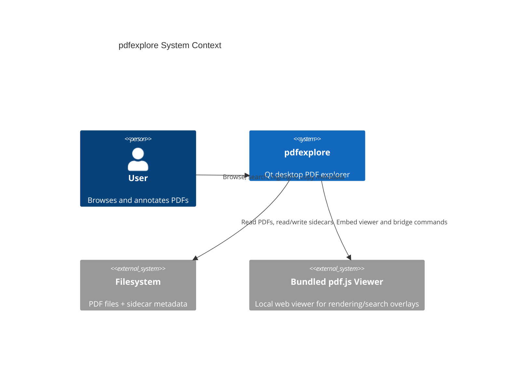
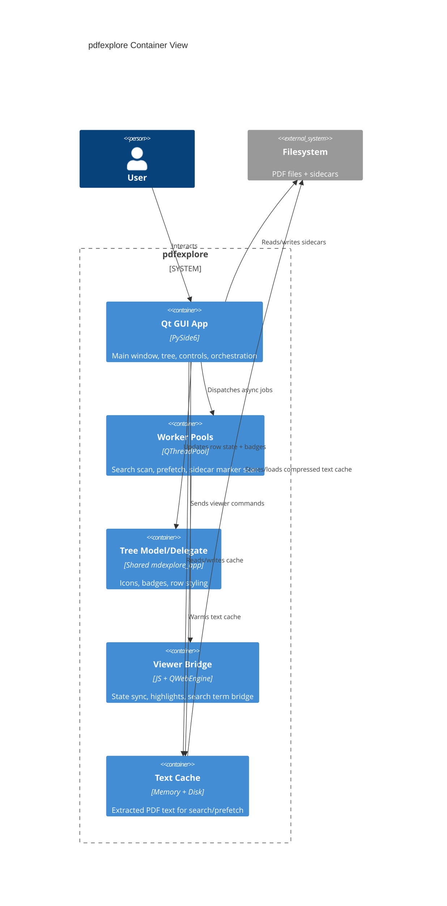
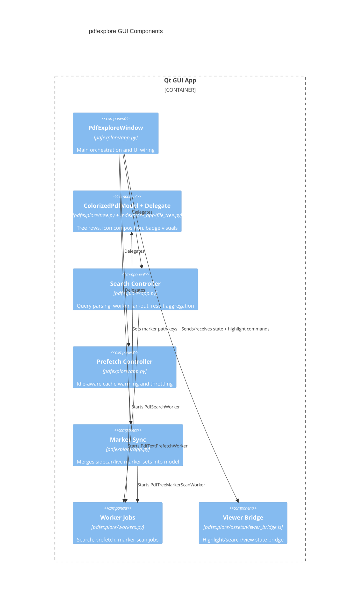

# pdfexplore Notes

## Mission

- Keep `pdfexplore` read-only for source PDFs; persist only sidecar metadata.
- Maintain mdexplore-style interaction contracts where behavior maps cleanly to PDF workflows.
- Keep GUI responsive under medium/large trees by prioritizing user interaction over background cache work.

## Product Narrative

`pdfexplore` exists to make high-volume PDF triage feel as fluid as markdown exploration while preserving strict document safety. The core idea is simple:

- source PDFs are immutable,
- user intent is captured as sidecar metadata,
- expensive work is pushed off the UI thread,
- the interface always favors interaction smoothness over background throughput.

The system should feel predictable under stress: opening a new root, expanding folders, scrolling dense PDFs, and running searches should not cause behavioral surprises (lost markers, stale badges, blocked navigation) even when background workers are active.

## Non-Negotiables

- Never mutate source PDF content.
- Keep bundled `pdf.js` assets isolated under `pdfexplore/vendor/pdfjs/`.
- Sidecar failures must degrade gracefully; malformed JSON must never block browsing.
- Preserve backward compatibility for legacy sidecar payloads where currently supported.

## System Invariants

- UI responsiveness invariant:
    - User interaction has higher priority than prefetch and marker scans.
    - Background jobs may be delayed/canceled but UI actions should remain immediate.
- Metadata durability invariant:
    - Highlight and view metadata must survive file switches, refreshes, and restarts.
    - Missing/invalid sidecars must never crash or block browsing.
- Badge continuity invariant:
    - Cache, view, and highlight badges must remain coherent across search updates,
        tree changes, and document switches.
- Scope correctness invariant:
    - Operations that are scope-dependent (search/copy/highlight actions) must use
        the same effective-scope semantics as the tree model.
- Search-marker interaction invariant:
    - Right-rail search markers should appear progressively during long scans.
    - Newly visible markers should be clickable immediately.
    - Marker build throughput may be reduced or interrupted to preserve click-to-jump responsiveness.
- Viewer-resource invariant:
    - Live per-document `QWebEngineView` pages must remain bounded by the preview
      least-recently-used cache (two by default).
    - Eviction must detach and discard the WebEngine page, not merely remove its
      lookup key while leaving browser memory resident.
- Multi-instance invariant:
    - Independent `pdfexplore` processes may browse the same tree concurrently.
    - Shared config, sidecars, extracted-text cache files, and idle background
      work must use their defined cross-process coordination paths.
    - A process must never delete a stable lock file while another process may
      hold the corresponding inode.

## Key Sidecars

- `.pdfexplore-colors.json`: tree color assignments.
- `.pdfexplore-views.json`: per-document multi-view tab sessions.
- `.pdfexplore-highlighting.json`: persistent in-document text highlight ranges.

## Settings Files

- Global/shared settings: `mdexplore.settings.json`
- pdfexplore-specific settings: `pdfexplore.settings.json`

Rule: keep shared constants in `mdexplore.settings.json`; keep pdfexplore-only
runtime settings in `pdfexplore.settings.json`.

`pdfexplore.settings.json` sections currently include:

- `app`: window/runtime/cache/search/prefetch settings
- `viewer_bridge`: right-rail marker/search behavior tuning
- `tree`: file-tree PDF constants (`.pdfexplore-colors.json`, extension/icon config)

### Sidecar Philosophy

- Sidecars store intent/state, not source transformations.
- Writes should avoid noisy churn (do not persist trivial default state unless required).
- Reads should be permissive:
    - tolerate partial payloads,
    - accept legacy shapes when feasible,
    - sanitize malformed entries instead of failing the pipeline.

## Multi-Instance Coordination Rules

### Sidecars

- Keep generic sidecar coordination in
  `mdexplore_app/file_coordination.py`.
- `.pdfexplore-colors.json`, `.pdfexplore-views.json`, and
  `.pdfexplore-highlighting.json` use stable `<sidecar>.lock` companions and
  process-unique temporary files followed by atomic replacement.
- For an ordinary edit, pass only the changed PDF name to
  `update_files_sidecar`. The helper locks, rereads the latest payload, merges
  that entry, and returns the exact committed mapping so stale per-instance
  caches can be refreshed. Use `None` as a tombstone for only that name.
- Concurrent changes to distinct PDF names must survive. Color and view-session
  changes to the same PDF are last-commit-wins. Persistent-highlight IDs are
  UUIDs, and same-PDF range adds/removes must use
  `transform_files_sidecar_entry` to transform the latest entry under its lock;
  never replace it from a stale complete highlight list.
- A failed transactional highlight commit must restore the viewer/cache from
  the unchanged disk payload and report failure; never display an add/remove
  success message merely because the in-lock transform callback ran.
- Reserve `replace_all=True` for intentional whole-scope clear/replace
  operations. Do not use it for a routine single-document save.

### Config

- Keep recent-root changes as ordered local events, not as an indefinitely
  authoritative in-memory snapshot. Under the config lock, reread disk and
  replay those events over the latest MRU list.
- `default_root` is deliberately last-successful-writer-wins: the process whose
  config commit most recently succeeds writes its current effective root.
- Config locking remains short and non-blocking. Contention skips the save
  without modifying the file; later navigation/shutdown may retry.
- The config advisory-lock path is permanent. Kernel locks disappear when a
  process exits, but the inode must never be unlinked or age-cleaned: a process
  may already have opened it before taking `flock`, and unlinking would split
  callers across independent lock domains.

### Extracted-text cache and idle work

- `.pdfexplore-text-cache.lock` is the stable cache transaction lock. Open and
  identify a cache entry under shared mode, then decompress its retained file
  descriptor after releasing the lock. Use short exclusive transactions for
  commits, metadata repair, corrupt-entry cleanup, and each individual
  trim/GC deletion; never hold one exclusive transaction across a directory
  scan, sort, source-path validation batch, or gzip operation.
- Prepare compressed text and JSON metadata through process-unique temporaries
  and atomic replacement. Compression must check cancellation between bounded
  chunks and again before commit. If a gzip read fails, delete it only after an
  exclusive-lock identity check proves the current device/inode/mtime/size is
  still the file that failed; preserve a newer replacement.
- `.pdfexplore-activity` is a shared heartbeat. Touch it at startup and during
  input through the coalescing dedicated heartbeat worker, throttled by
  `multi_instance_activity_touch_interval_seconds` (`0.25` seconds by default).
  Update local idle/cancellation state before enqueueing it, and never perform
  its cache-directory `mkdir`/`touch` operations on the GUI input path.
  Read its mtime through the separate probe worker at
  `multi_instance_activity_probe_interval_seconds` (`0.5` seconds by default);
  GUI-thread prefetch/GC schedulers must use the cached observation rather than
  synchronously calling `stat()`.
  Prefetch and GC use the minimum of local and shared idle age both before
  starting and in cancellation checks.
- Every successful cache commit atomically refreshes the shared
  `.pdfexplore-trim-dirty` marker. Perform quota scans only during eligible idle
  GC, check cancellation during `scandir`, and take a non-blocking,
  identity-revalidating lock separately for each deletion. Clear the marker
  only when its identity still matches the pre-trim snapshot so a concurrent
  store cannot lose its request.
- Path-stable, hash-striped `.pdfexplore-producer-*.lock` files serialize
  extraction of the same canonical PDF path across processes and file-version
  changes. Waiters must re-stat and recheck memory/disk after acquiring the
  stripe and honor cancellation while waiting.
- `.pdfexplore-background.lock` is a non-blocking exclusive lease shared by
  prefetch and GC. Failure to acquire it means the worker exits quietly, so
  only one instance performs idle extraction/maintenance at a time.
- Running work still stops only at safe cancellation points: between candidate
  files, PDF pages, or GC entries. Never commit partially extracted text.

### Launcher, WebEngine, and refresh

- `pdfexplore.sh` serializes mutable bootstrap work (venv creation/repair,
  requirements installation, runtime import verification) with
  `${XDG_CACHE_HOME:-$HOME/.cache}/pdfexplore/bootstrap.lock` when `flock` is
  available. Release it before starting Qt; it is not an application singleton
  lock.
- Preview pages use Qt's default off-the-record WebEngine profile. Do not add a
  shared persistent profile directory without designing and testing Chromium
  profile ownership across processes. Off-record browser storage does not
  affect intentional app sidecars or extracted-text persistence.
- Cross-process sidecar observation is pull-based. `Refresh`/`F5` invalidates
  color/view/highlight disk snapshots, reloads the current PDF's persisted
  highlights, rebuilds the filesystem model, and starts a fresh marker scan
  while restoring expansion/selection where possible.
- Refresh must not silently replace the currently open document's live tab
  model. Existing tabs remain authoritative until the normal save/switch
  lifecycle; later disk reads see the refreshed sidecar state.

## C4 Context

## C4 Container

## C4 Component (GUI App)

## Runtime Lifecycle (Narrative)

1. Boot

- App resolves startup root.
- Launcher bootstrap serialization has already been released before Qt starts.
- Tree model/delegate are attached.
- Viewer bridge source is loaded through an off-the-record WebEngine profile.
- Timers and worker pools are initialized.
- A shared activity-heartbeat touch is queued off the GUI thread so sibling
  instances defer idle work.

2. Root Activation

- Root path is set in the filesystem model.
- Tree state and marker caches are rebuilt.
- Marker sidecar scan is launched in background.

3. Interactive Work

- User navigates tree, opens PDFs, adds highlights, runs searches.
- Search workers evaluate visible-scope candidates in configured chunks and
  coalesce partial UI publications.
- The enabled-by-default prefetch worker waits for sustained idle, warms one PDF
  off the GUI thread, then observes an inter-batch cooldown.

4. Synchronization

- Marker sync merges scan output with live/in-memory state.
- Tree model receives merged badge sets.
- Viewer bridge applies highlight/search overlays.

5. Shutdown

- Active view state is captured.
- Sidecars/config are persisted.
- No source PDF modifications occur.

## Worker Coordination Rules

- Search workers:
    - should be cancellation-aware by request id,
    - must never manipulate widgets directly,
    - default to one extraction thread, eight candidate PDFs per job, and a
      100 ms partial-result publication interval to reduce GUI churn.
- Prefetch workers:
    - are enabled by default and remain opt-out through `prefetch_enabled`,
    - run low-priority,
    - perform source/cache probes off the GUI thread,
    - wait for 10 seconds of sustained inactivity and one second between batches
      by default,
    - combine native widget filters with the viewer bridge's throttled activity
      sentinel, remove cancelled queued runnables from active bookkeeping, and
      yield running extraction between pages,
    - must not treat the cache-badge path set as a cache-validity index,
    - should prefer current-document warmup before broader scope,
    - must obtain the non-blocking cross-process background lease and observe
      the shared activity heartbeat before and during work.
- Text-cache garbage-collection workers:
    - share the low-priority idle worker pool with prefetch,
    - are offered by an independent 30-second timer only after 10 seconds of
      sustained input idle, including while prefetch is disabled,
    - inspect and delete bounded batches off the GUI thread and stop between
      entries when user/search pressure returns,
    - receive first refusal on the shared idle pool after prefetch completion when
      their independent cadence is overdue,
    - may evict extracted text only after the source path is definitively missing,
    - must not evict on permission or transient filesystem errors,
    - must share the cross-process background lease with prefetch and take the
      exclusive cache transaction lock before disk mutation.
- Marker scan workers:
    - produce sidecar-derived marker sets,
    - must be merged with live state to avoid transient badge regressions.

## Viewer Bridge Marker Rules

- Marker generation in `pdfexplore/assets/viewer_bridge.js` should remain document-key scoped.
- Persistent text highlights must produce clickable left-gutter markers, including
  page-based fallback placement before a target page has rendered.
- Normal and important left-gutter markers must remain visually distinct and use
  the shared mdexplore marker-color settings.
- Per-page extracted text should be cached and reused for repeated searches in the same open PDF.
- Marker generation should run in bounded concurrent batches; partial right-rail
  DOM publications should be coalesced by `search_indicator_publish_interval_ms`
  (90 ms by default).
- Long builds should periodically yield to the event loop so input/paint are not starved.
- Marker click navigation should be allowed to interrupt active marker builds, then resume automatically.
- Do not block marker click handlers on build completion.
- Mutation observation must ignore bridge-owned highlight/rail DOM nodes so
  overlay painting cannot schedule another overlay paint indefinitely.
- Identical persistent-highlight and search payloads must be treated as
  idempotent; do not rebuild indexes, highlight rectangles, or rail markers.
- Delayed view-state restore callbacks must be generation-guarded so entering
  three-up or applying a newer restore invalidates stale retries.
- Ordinary scrolling must not invalidate all page-text indexes, repaint every
  overlay, or scan every page rectangle. Restrict all-page geometry work to
  layouts such as three-up that require a nearest-page calculation.
- Preserve pdf.js `#viewerContainer` as an absolute, overflow-enabled,
  viewport-bounded scroll host; a document-height relative container breaks
  navigation, restoration, and render virtualization.
- Right-gutter search highlights and markers for `NEAR(...)` queries must be
  restricted to qualifying proximity windows, matching shared variadic NEAR semantics.

## UI Performance Guardrails

- Avoid introducing filesystem `resolve()` loops inside frequently called marker-sync paths.
- Keep repaint pressure low during heavy tree mutation.
- Coalesce badge updates where practical.
- Prefer root-scoped filtering before expensive merging.
- Keep the preview widget cache bounded and update its LRU position on reuse;
  returning to an evicted PDF may reload it rather than retaining unbounded
  WebEngine processes/pages.

## Contributor Playbook

When changing any of the following, update both behavior and docs in the same change:

- Search orchestration or query semantics.
- Prefetch scheduling/throttling behavior.
- Sidecar format interpretation.
- Tree badge rendering/priority rules.
- Viewer bridge highlight/search interactions.

Recommended validation sequence:

1. `python -m py_compile` for touched modules.
2. Ensure diagnostics are clean.
3. Manual smoke checks:
    - open root with medium file count,
    - expand/collapse multiple folders,
    - run search and clear search,
    - add/remove highlight, switch files, return,
    - verify cache and marker badges remain coherent.

## Failure Modes to Watch

- Marker disappearance after search or tab switch.
- Prefetch ignoring an explicit opt-out, failing to publish cache badges, or
  running continuously without its idle/cooldown gates.
- Unbounded growth in live WebEngine pages while opening many PDFs.
- Overlay MutationObserver feedback loops or ordinary-scroll full-document scans.
- Excessive UI stalls on root change due to marker merge overhead.
- Crash paths around viewer creation or event/filter hooks.
- Sidecar parse errors cascading into badge/model state resets.
- Lost updates caused by writing a stale whole sidecar for one changed PDF.
- Deleting/recreating a stable lock path while another process holds its old inode.
- Idle prefetch/GC continuing after a sibling instance touches the activity heartbeat.
- Launcher bootstrap locking accidentally extending across the Qt process lifetime.
- Introducing a persistent shared WebEngine profile and Chromium profile-lock contention.

## Change Boundaries

- Keep generic tree rendering logic in shared `mdexplore_app` when possible.
- Keep PDF-specific orchestration in `pdfexplore/app.py` and `pdfexplore/workers.py`.
- Keep viewer bridge-specific behavior in JS bridge surface, not scattered widget callbacks.

## Maintenance Guidance

- Prefer sharing generic behavior through `mdexplore_app` for long-term parity.
- Keep prefetch interaction-first: one file per batch, worker-side cache probes,
  app-wide idle tracking, page-level cancellation, rotating badge validation,
  and an inter-batch cooldown are required.
- Keep extracted-text garbage collection idle-only and bounded. Disk entries use
  atomic `.txt.gz.meta.json` companions to retain their source-PDF path; legacy
  entries remain readable and gain metadata when they are next loaded.
- GC uses its own 30-second cadence timer after 10 seconds of sustained input
  idle across all instances and may share the low-priority worker pool, but it
  must remain independent of the `prefetch_enabled` setting and must not wake
  scope prefetch, traverse the visible tree, or read disk metadata on the
  GUI-thread cache-hit path. Prefetch and GC must retain their shared
  non-blocking background lease and safe-point cancellation checks.
- Keep per-file sidecar updates merge-based and atomic. Preserve the
  recent-root event-replay/default-root conflict policy and stable lock inode
  discipline when changing config or persistence code.
- Treat marker badge continuity as correctness-critical: highlight and cache badges must survive tab switches, searches, and root navigation.
- Treat marker click latency as correctness-critical in the viewer bridge: visual marker speed without click responsiveness is a regression.
- Preserve current UX contracts:
  - scope-aware operations align with visible tree behavior,
  - copy metadata merge semantics match mdexplore expectations,
  - view-tab model remains compatible with existing sidecars,
  - the top-bar `Dark`/`Light` control applies one app-wide, session-only PDF
    color mode across cached and newly loaded preview widgets,
  - preview navigation keeps persistent highlights on the left rail and active
    search hits on the right rail, with both marker types remaining clickable.

## Documentation Contract

Any change to runtime behavior in these areas must be reflected in `pdfexplore/README.md`:

- Sidecar behavior or compatibility.
- Search/prefetch throttling semantics.
- Marker badge derivation/merge behavior.
- User-visible workflow changes in top controls or preview context menu.
